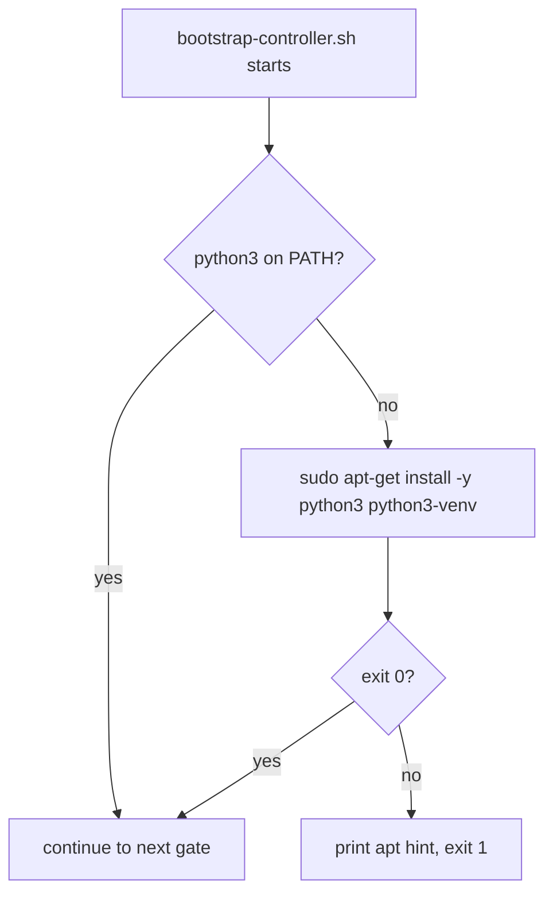
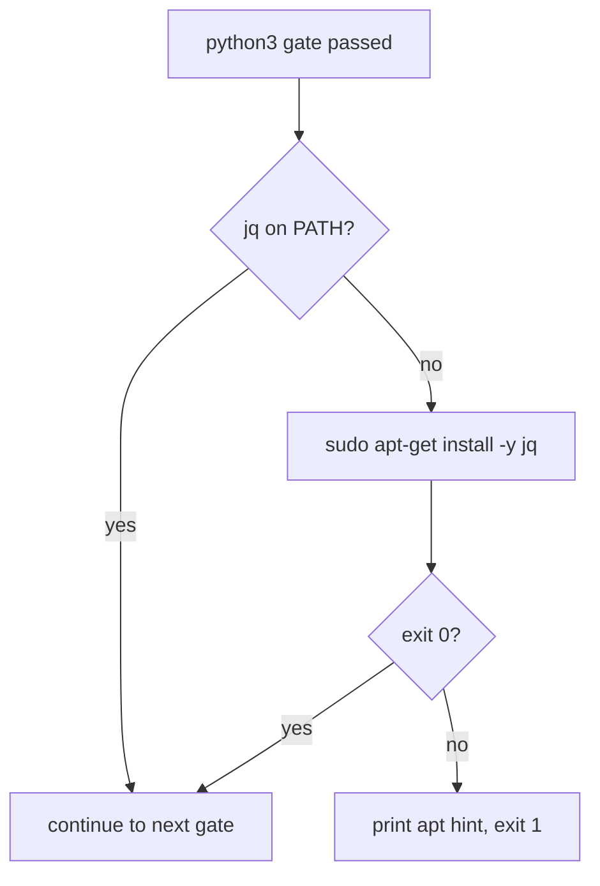
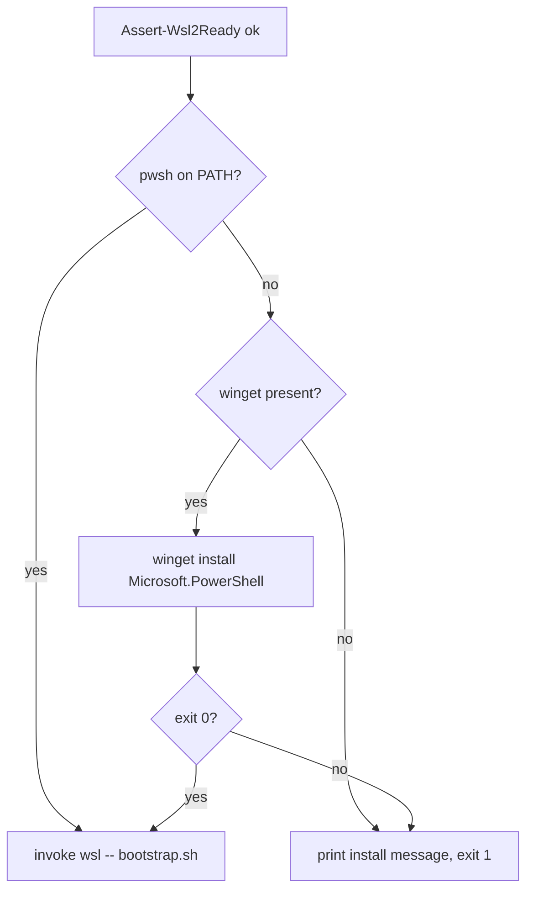

# Plan: Reconcile OS Groups, Users, and Sudoers via Ansible

See [problem.md](problem.md) for context, schema, and rationale.

## Directory layout (revised)

This plan distinguishes two top-level script directories:

- **`ops/`** - operator-facing entry points. Hand-invoked by a human:
  `bootstrap-controller`, `setup-secrets`, `create-users`. Each
  command typically ships as three sibling files - `*.ps1` (or `*.sh`)
  + `*.bat` Explorer launcher.
- **`scripts/`** - dev/test runners and bridge internals. Not
  operator-facing: `run-tests.{ps1,sh,bat}` (delegates to the canonical
  runners in `PowerShell-Common` and `GitHub-Common`), `run-playbook.sh`
  (the bash bridge), `_pwsh_bridge.sh` (sourced helper).

This split matches the GH-Common `ci-bash.yml` convention that labels
`scripts/` as "runner bash" - production operator scripts shouldn't be
lumped in there. Step 2 was originally implemented under `scripts/`;
the revised step 2 below now lists the `ops/` paths, and the first act
of resuming execution is to move the already-shipped files to those
paths (a `git mv` plus internal-reference fixes - not a redo).

## Index

- [Step 1 - Repo scaffolding](#step-1---repo-scaffolding)
- [Step 2 - Controller bootstrap](#step-2---controller-bootstrap)
- [Step 3 - Bash bridge: vault read, extra-vars, inventory, dispatch](#step-3---bash-bridge-vault-read-extra-vars-inventory-dispatch)
- [Step 4 - Bootstrap installs python3](#step-4---bootstrap-installs-python3)
- [Step 5 - Bootstrap installs jq](#step-5---bootstrap-installs-jq)
- [Step 6 - Bootstrap installs PowerShell 7 (pwsh.exe)](#step-6---bootstrap-installs-powershell-7-pwshexe)
- [Step 7 - Vault setup script](#step-7---vault-setup-script)
- [Step 8 - Role: groups](#step-8---role-groups)
- [Step 9 - Role: users](#step-9---role-users)
- [Step 10 - Role: sudoers](#step-10---role-sudoers)
- [Step 11 - Playbook and operator entry point](#step-11---playbook-and-operator-entry-point)
- [Step 12 - Smoke test against a real VM](#step-12---smoke-test-against-a-real-vm)
- [Step 13 - README and per-step docs](#step-13---readme-and-per-step-docs)
- [Step 14 - E2E test layer for the Ansible users path](#step-14---e2e-test-layer-for-the-ansible-users-path)

---

## Step 1 - Repo scaffolding

**Reason:** Get the repo into a state where Ansible can be invoked from
WSL with the conventions every later step depends on, and where CI runs
green from the very first commit. The CI gate ships in the same step as
the substrate it guards — per the "CI alongside features" convention,
no feature lands without the lint coverage that will police it.

**Files**

- `ansible.cfg` (new) - inventory path placeholder, `interpreter_python = auto_silent`, `host_key_checking = False` (the VMs are short-lived and the inventory IPs are vault-controlled, not user-typed).
- `requirements.txt` (new) - one pinned line: `ansible-core==<version>`.
- `requirements.yml` (new) - Galaxy collections: `ansible.posix`, `community.general` pinned to a current version. No third-party collections in v1.
- `inventory/.gitkeep` (new) - placeholder so the dir exists.
- `roles/.gitkeep`, `playbooks/.gitkeep`, `scripts/.gitkeep` (new).
- `README.md` (new) - one-paragraph stub describing the repo's purpose and pointing at this feature folder. Filled out properly in step 13.
- `.github/workflows/ci-yaml.yml` (new) - single-job reusable-workflow caller of [GitHub-Common's `ci-yaml.yml`](../../../../GitHub-Common/.github/workflows/ci-yaml.yml). Four lint jobs run against this repo from day one: `actionlint`, `action-validator`, `yamllint`, `ansible-lint`. `actionlint` and `action-validator` exercise the new `ci.yml` itself; `yamllint` covers `requirements.yml`, `ansible.cfg`, and every YAML file added in later steps; `ansible-lint` auto-skips this commit (no `playbooks/` content yet) and starts gating from step 8 onward when the first role lands.

**Behaviour**

File presence only. Two reproducibility checks tied to this step:

1. `ansible-playbook --version` invoked manually after a venv install (step 2) reports the pinned version from `requirements.txt`.
2. The first CI run on the branch passes all four jobs. `ansible-lint` reports its auto-skip `::notice::` because no Ansible content is committed yet; the other three lint their respective surfaces clean.

**Tests**

The CI run itself is the test - any finding from `yamllint`,
`actionlint`, or `action-validator` against the scaffolded files is
fixed in-line during this step, not relaxed at the workflow layer.
Smoke-level end-to-end coverage of the substrate stays in step 12.

---

## Step 2 - Controller bootstrap

**Reason:** Make it possible for a fresh Windows host to reach the state
where the bash bridge can run. Two scripts because `wsl --install` only
runs from Windows; everything else runs inside WSL.

**Decisions locked**

- WSL detection and install is delegated to `Assert-Wsl2Ready` from
  `PowerShell.Common` (PSGallery). No reimplementation here. The
  `Wsl2NotReady:` catch contract documented in that cmdlet's help is
  used verbatim.
- The Python venv lives at the repo root as `.venv/` (gitignored, see
  `.gitignore`). Re-running the bash bootstrap detects an existing venv
  with the right Python version and skips creation.
- Galaxy collections are installed into a repo-local
  `collections/ansible_collections/` (gitignored). `ansible.cfg` does
  not set a custom collections path; Ansible's default discovery covers
  it because `ansible-playbook` is invoked from the repo root.

**Files**

- `ops/bootstrap-controller.ps1` (new). Imports `PowerShell.Common`, calls `Assert-Wsl2Ready` inside a try/catch with the `Wsl2NotReady:` message-prefix branch documented in that cmdlet, then invokes `wsl -- ./ops/bootstrap-controller.sh` from the repo root. Exits with the bash script's exit code.
- `ops/bootstrap-controller.sh` (new). Idempotent. Verifies `python3` available, creates `.venv` if absent, runs `pip install -r requirements.txt`, runs `ansible-galaxy collection install -r requirements.yml`, runs `which pwsh.exe` and fails with a clear message if absent (the bridge depends on it).
- `ops/bootstrap-controller.bat` (new). Thin Explorer-double-click launcher; invokes `pwsh` against the `.ps1` with `-ExecutionPolicy Bypass` and holds the window open with `pause`. Mirrors the `Infrastructure-E2E/agent/setup-secrets.bat` pattern.
- `Tests/ops/Bootstrap-Controller.Tests.ps1` (new, Pester) - unit tests for the PS side: mocked `Assert-Wsl2Ready`, asserts the try/catch shape and exit code propagation.

**Behaviour (bootstrap-controller.ps1)**

1. `Import-Module PowerShell.Common`.
2. Try `Assert-Wsl2Ready`; catch `Wsl2NotReady:`-prefixed errors, print the reboot message in yellow, exit 0.
3. Invoke `wsl -- ./ops/bootstrap-controller.sh`.
4. Exit with `$LASTEXITCODE`.

**Behaviour (bootstrap-controller.sh)**

1. `set -euo pipefail`.
2. If `.venv/` exists and `.venv/bin/python` reports the expected version (read from a top-of-file constant), skip venv creation; otherwise `python3 -m venv .venv`.
3. `.venv/bin/pip install -r requirements.txt` (idempotent — pip skips already-installed pins).
4. `.venv/bin/ansible-galaxy collection install -r requirements.yml --force-with-deps` (with explicit collection path).
5. `command -v pwsh.exe >/dev/null` — fail with explanatory message if absent.
6. Print summary of versions installed, exit 0.

**Tests (PS, unit, mocked)**

- `Assert-Wsl2Ready` succeeds → script invokes `wsl --` and propagates exit code.
- `Assert-Wsl2Ready` throws `Wsl2NotReady: ...` → script exits 0 after printing the message in yellow; `wsl --` is not invoked.
- `Assert-Wsl2Ready` throws an unrelated error → script rethrows.

**Tests (bash)**

Skipped for v1 — the bash bootstrap is essentially a sequence of shell
commands with no branching logic worth unit-testing in isolation. Step 12
exercises it end-to-end. (Promote to bats if the script grows
conditionals.)

---

## Step 3 - Bash bridge: vault read, extra-vars, inventory, dispatch

**Reason:** The single piece every later workflow depends on. Once this
works against a no-op playbook, every subsequent role and playbook is a
straightforward Ansible task tree on top.

**Decisions locked**

- The bridge reads `VmProvisionerConfig` and `VmUsersConfig` from inside
  WSL by invoking `pwsh.exe` on the Windows host. UTF-8 BOM is stripped
  centrally in the bridge.
- Both the extra-vars file and the generated `hosts.yml` live in a
  single per-invocation `mktemp -d` directory under `$TMPDIR`. A
  `trap 'rm -rf "$tmpdir"' EXIT` removes the whole directory on any
  exit path.
- `chmod 700` on the tmpdir, `chmod 600` on the files. Belt-and-braces
  against a misconfigured tmpfs.

**Files**

- `scripts/run-playbook.sh` (new). Bridge internal - not operator-facing, hence `scripts/` not `ops/`. Takes one positional arg: the playbook path (e.g. `playbooks/create-users.yml`). Additional args are forwarded to `ansible-playbook`.
- `scripts/_pwsh_bridge.sh` (new) - sourced helper, internal. Wraps a single function `read_vault_secret <vault-name> <secret-name>` that invokes `pwsh.exe -NoProfile -NonInteractive -Command "Get-Secret -Vault <vault-name> -Name <secret-name> -AsPlainText | Out-String"`, strips UTF-8 BOM, validates that the result parses as JSON, returns the JSON on stdout.
- `Tests/scripts/run-playbook.bats` (new, bats) - smoke tests against a stubbed `pwsh.exe` (a tiny bash script on `$PATH` that prints fixed JSON). File name mirrors the target script per the `GitHub-Common` bats convention (`<script-name>.bats`).
- `Tests/playbooks/_noop.yml` (new) - a single-host `debug: msg="bridge ok"` task used by the bats smoke test in step 3. Lives under `Tests/` because it is a test fixture, not operator-facing content; the bats setup transplants it into a throwaway repo tree at the path the bridge expects. The step-12 real-VM smoke uses `create-users.yml`, not this fixture.

**Behaviour (run-playbook.sh)**

1. `set -euo pipefail`. Require one playbook-path arg; reject otherwise.
2. Activate `.venv` (`source .venv/bin/activate`).
3. `tmpdir=$(mktemp -d -t vm-ansible.XXXX)`; `chmod 700 "$tmpdir"`; `trap 'rm -rf "$tmpdir"' EXIT`.
4. Source `_pwsh_bridge.sh`.
5. Read `VmProvisionerConfig` from `VmProvisioner` vault. Read `VmUsersConfig` from `VmUsers` vault. Both via `read_vault_secret`.
6. Compose the extra-vars JSON: `{"vm_provisioner_config": <provisioner JSON>, "vm_users_config": <users JSON>}`. Write to `$tmpdir/extra-vars.json` with `chmod 600`.
7. Run a `jq` pipeline against `vm_provisioner_config` to write `$tmpdir/hosts.yml` (shape per problem.md). Use `yq` if available; otherwise emit JSON inventory (Ansible accepts both natively) as `$tmpdir/hosts.json`. Document the format chosen.
8. Invoke `ansible-playbook -i "$tmpdir/hosts.yml" --extra-vars "@$tmpdir/extra-vars.json" "$playbook_path" "$@"`.
9. Exit with the playbook's exit code.

**Behaviour (_pwsh_bridge.sh: read_vault_secret)**

1. `out=$(pwsh.exe -NoProfile -NonInteractive -Command "Get-Secret -Vault '$1' -Name '$2' -AsPlainText | Out-String")` — single subshell.
2. Strip leading UTF-8 BOM (`sed '1s/^\xEF\xBB\xBF//'`).
3. Validate JSON: `echo "$out" | jq empty` — fail loudly with a message naming the vault/secret if invalid.
4. Print on stdout. Caller captures.

**Tests (bats)**

- `pwsh.exe` stub returns valid JSON → bridge writes the expected `extra-vars.json` and `hosts.yml`, invokes the no-op playbook successfully, exits 0, and the tmpdir is gone after exit.
- `pwsh.exe` stub returns malformed JSON → bridge fails loudly naming the vault/secret; tmpdir is still cleaned up.
- `pwsh.exe` stub returns text with a BOM → bridge strips it; downstream `jq` succeeds.
- Bridge invoked with no playbook arg → fails with a usage message; tmpdir never created.
- `pwsh.exe` exits non-zero → bridge surfaces the error and exits non-zero; tmpdir is cleaned up.

**README update**

Add a "Bridge contract" subsection in step-13 README work documenting the
extra-vars shape (`vm_provisioner_config`, `vm_users_config` as top-level
keys), so later playbooks (runners, toolchains) know the input shape.

---

## Step 4 - Bootstrap installs python3

**Reason:** Promote the python3 presence check (today: fail-with-hint
only) to an actual install. python3 plus python3-venv are the
foundation for everything else the bootstrap does; if the operator
has neither, the rest of the bootstrap has nothing to land on.
The fail-with-hint stays as the fallback for the case where the
install itself cannot proceed (no sudo, offline, apt lock).

These three install steps (4, 5, 6) are slotted after step 3 rather
than folded back into step 2 so each install enhancement lands as its
own reviewable commit, and so the history records step 3 as the
moment the jq dep surfaced and motivated lifting all three system
gates from check-only to install-or-hint.

**Files**

- `ops/bootstrap-controller.sh` (modified) - replace the "python3 not found - exit 1" branch with: attempt `sudo apt-get update && sudo apt-get install -y python3 python3-venv`; on success continue, on failure print the existing apt hint and exit 1.
- `Tests/ops/BootstrapController.Tests.bats` (modified) - cases for the install branch.

**Behaviour**

1. If `python3` is on PATH, skip install (no-op).
2. Else attempt `sudo apt-get update && sudo apt-get install -y python3 python3-venv`.
3. On install success, re-check `command -v python3`; proceed.
4. On install failure (sudo missing, network down, apt lock), print the existing apt-get hint and exit 1.

**Tests (bats, stubbed)**

- `python3` present on PATH → install branch never invoked; bootstrap continues to the next gate.
- `python3` absent, stubbed `sudo apt-get` returns 0 and drops a python3 stub onto the synthetic PATH → bootstrap continues past the gate.
- `python3` absent, stubbed `sudo apt-get` returns non-zero → exit 1 with the apt-get hint in output.
- `sudo` absent from PATH → exit 1 with the apt-get hint.



---

## Step 5 - Bootstrap installs jq

**Reason:** Same pattern as step 4 applied to jq, the bash bridge's
hard runtime dep introduced in step 3. Lifts the jq gate from
check-only to install-or-hint with the same fallback shape.

**Files**

- `ops/bootstrap-controller.sh` (modified) - replace the "jq not found - exit 1" branch with the same try-install-fall-back-to-hint shape used in step 4 for python3.
- `Tests/ops/BootstrapController.Tests.bats` (modified) - mirror cases for jq.

**Behaviour**

Identical shape to step 4 with `jq` substituted for `python3 python3-venv`. Install command is `sudo apt-get install -y jq`.

**Tests (bats, stubbed)**

- `jq` present on PATH → install branch never invoked.
- `jq` absent, stubbed `sudo apt-get` returns 0 and drops a jq stub onto PATH → bootstrap continues.
- `jq` absent, stubbed `sudo apt-get` returns non-zero → exit 1 with the apt-get hint.



---

## Step 6 - Bootstrap installs PowerShell 7 (pwsh.exe)

**Reason:** Windows-side counterpart to steps 4 and 5. pwsh.exe lives
on the Windows host (not in WSL), so the install belongs in the
PowerShell stage (`ops/bootstrap-controller.ps1`), not the bash stage.
Lifts the pwsh.exe check from check-only to install-or-hint using
winget.

**Decisions locked**

- Install command: `winget install --id Microsoft.PowerShell --silent --accept-source-agreements --accept-package-agreements`. Pinned id matches the Microsoft Store / winget canonical package; `--silent` + `--accept-*` are required to keep the bootstrap unattended (winget prompts otherwise).
- If `winget` itself is absent (older Windows, no App Installer), fall back to the existing operator-action message. No bootstrapping winget — that is out of scope.

**Files**

- `ops/bootstrap-controller.ps1` (modified) - between the `Assert-Wsl2Ready` block and the `wsl --` invocation, check `Get-Command pwsh -ErrorAction SilentlyContinue`. If absent and `winget` is present, run the pinned install; otherwise (or if the install fails) print the existing "Install PowerShell 7+" message in yellow and exit 1.
- `Tests/ops/Bootstrap-Controller.Tests.ps1` (modified) - cases for the new branch.

**Behaviour**

1. After `Assert-Wsl2Ready` succeeds and before invoking `wsl --`, check for pwsh on PATH.
2. If present → continue.
3. If absent and `winget` is present → run the pinned winget install. On success, re-check; proceed.
4. If absent and `winget` is absent, OR the winget install fails → print the existing operator-action message and exit 1.

**Tests (Pester, mocked)**

- pwsh already present → winget is never called; script proceeds to invoke `wsl`.
- pwsh absent, mocked `winget` returns 0 → winget is invoked with the pinned args; script proceeds.
- pwsh absent, mocked `winget` returns non-zero → script exits 1 with the install-message branch.
- pwsh absent, mocked `Get-Command winget` returns null → script exits 1 with the install-message branch; winget is never invoked.



---

## Step 7 - Vault setup script

**Reason:** Operators need a way to register the `VmUsers` vault and
store `VmUsersConfig` without manually invoking `Set-Secret` calls. The
script lives in this repo (not Vm-Users) per the problem.md decision.

**Decisions locked**

- Schema validation lives in a `Private/Assert-VmUsersConfig.ps1`
  function inside the script (no module yet — v1 is small enough that a
  flat script + dot-sourced validator is right).
- The vault name and secret name are hardcoded: vault `VmUsers`, secret
  `VmUsersConfig`. Matches the existing convention; not parameterised
  to avoid drift.
- Re-running with the same config is a no-op; re-running with a changed
  config overwrites (`Set-Secret` semantics).

**Files**

- `ops/setup-secrets.ps1` (new). Takes `-ConfigFile <path>`. Reads JSON, validates, registers the vault if absent, stores the secret.
- `ops/setup-secrets.bat` (new). Thin Explorer-launcher; same pattern as `ops/bootstrap-controller.bat` - invokes `pwsh` against the `.ps1`, forwards `%~1` as `-ConfigFile`, holds the window with `pause`.
- `ops/Private/Assert-VmUsersConfig.ps1` (new) - dot-sourced validator co-located with its single consumer. Throws on malformed input; returns the parsed object on success.
- `Tests/ops/SetupSecrets.Tests.ps1` (new, Pester) - unit tests for the validator and the orchestration shape (mocked `Set-Secret`/`Get-SecretVault`).

**Behaviour (setup-secrets.ps1)**

1. Read and parse `$ConfigFile` as JSON. Fail with a path-named error if the file is missing or unparseable.
2. Call `Assert-VmUsersConfig` on the parsed object. Fail loudly with the schema path of the first violation.
3. Install `Microsoft.PowerShell.SecretManagement` and `Microsoft.PowerShell.SecretStore` from PSGallery if absent.
4. Register the `VmUsers` vault if not already registered (`Get-SecretVault -Name VmUsers -ErrorAction SilentlyContinue`).
5. `Set-Secret -Vault VmUsers -Name VmUsersConfig -Secret <serialized JSON>`.
6. Print confirmation.

**Behaviour (Assert-VmUsersConfig)**

Validate the schema documented in problem.md:

- Top-level: array of VM objects.
- Each VM object: required `vmName` (string), optional `groups` (array of group objects), required `users` (array of user objects).
- Each group object: required `groupName` (string), optional `gid` (positive int).
- Each user object: required `username` (string), `shell` (absolute path), `homeDir` (absolute path), `groups` (array of strings, may be empty), `sudoersRules` (array of strings, may be empty); optional `password` (non-empty string).
- Strict-unknown: any unrecognised field at any level throws naming the field (catches typos like `versoin`/`groupsName`).
- Empty `users` array is rejected — a VM entry with no users is meaningless and a likely typo.

**Tests (unit, mocked)**

For the validator:

- Empty array, single-VM, multi-VM valid inputs pass.
- Missing required field at each level throws naming the field.
- Unknown sub-field throws naming the field.
- `gid` non-positive / non-integer throws.
- Empty `users` array throws.

For the orchestration:

- Mocked `Get-SecretVault` returns null → `Register-SecretVault` is called.
- Mocked `Get-SecretVault` returns existing vault → `Register-SecretVault` is not called.
- `Set-Secret` is called once with the expected vault/secret/serialised value.
- Invalid JSON file → fails before any vault calls.

---

## Step 8 - Role: groups

**Reason:** Smallest of the three roles; gets the role conventions
(layout, var names, fact-gathering, idempotence reporting) in place.
Later roles copy this shape.

**Files**

- `roles/groups/tasks/main.yml` (new) - one `ansible.builtin.group` task in a loop over `vm_users_config[inventory_hostname].groups | default([])`.
- `roles/groups/meta/main.yml` (new) - empty `dependencies: []` plus role metadata.
- `roles/groups/README.md` (new) - one-paragraph description and the var contract.
- `Tests/roles/groups/molecule/default/` (new) - Molecule scenario with a single-container Docker driver (Ubuntu 24.04). Test cases below.

**Behaviour**

- Iterate `vm_users_config[inventory_hostname].groups | default([])`. For each entry:
  - Pass `name: "{{ item.groupName }}"`.
  - Pass `gid: "{{ item.gid }}"` only when `item.gid is defined`.
  - `state: present`.
- The `ansible.builtin.group` module errors when an existing group's GID doesn't match a requested one — that's the desired "GIDs never silently change" behaviour from problem.md. No extra glue needed.

**Tests (Molecule)**

- Empty `groups` list → no changes, no errors.
- New group without gid → group exists after.
- New group with gid `8000` → group exists with gid 8000.
- Re-run with same input → reports `changed: 0`.
- Existing group with different gid than declared → play fails with a message naming the group.

**README update**

Once this role works, document the var contract in
`roles/groups/README.md` (just the `vm_users_config[*].groups` shape and
what the role does). Per-role READMEs are the source of truth; the
top-level README in step 13 links to them.

---

## Step 9 - Role: users

**Reason:** The substantive role. Encapsulates the password-hash strategy
and the no-move-home invariant.

**Decisions locked**

- Salt for `password_hash('sha512', salt=...)` is `(item.username | hash('md5'))[:16]`. MD5 here is *not* cryptographic — it's a stable bucketing function from username to a 16-char string in the right charset (`[a-f0-9]`, a subset of `[A-Za-z0-9./]`). Documented in the role README with the rationale from problem.md.
- `move_home: no` — the home directory is never relocated on update.
- `update_password: always` — re-runs always re-hash and write; idempotence comes from the deterministic salt.

**Files**

- `roles/users/tasks/main.yml` (new).
- `roles/users/meta/main.yml` (new) - declares dependency on `roles/groups`.
- `roles/users/README.md` (new).
- `Tests/roles/users/molecule/default/` (new).

**Behaviour**

For each entry in `vm_users_config[inventory_hostname].users | default([])`:

1. `ansible.builtin.user` with:
   - `name: "{{ item.username }}"`
   - `shell: "{{ item.shell }}"`
   - `home: "{{ item.homeDir }}"`
   - `groups: "{{ item.groups | default([]) }}"`
   - `append: no` (declared list is authoritative; supplementary-group drift is corrected)
   - `move_home: no`
   - `state: present`
2. When `item.password is defined`:
   - `password: "{{ item.password | password_hash('sha512', salt=(item.username | hash('md5'))[:16]) }}"`
   - `update_password: always`
3. When `item.password is not defined`, the `password` arg is omitted entirely (avoids locking the account).

**Tests (Molecule)**

- New user with `nologin` shell → created; cannot log in interactively.
- New user with bash shell and a password → created; `chage -l` shows the password is set; the stored hash starts with `$6$` and uses the expected 16-char salt.
- Re-run with same input → `changed: 0` (proves deterministic salt).
- Same user, password changed in config → `changed: 1`, new hash in shadow.
- Same user, supplementary group removed from config → `getent group` no longer lists the user.
- Same user, `homeDir` changed in config → user's home in `/etc/passwd` updates, but the on-disk directory at the old path still exists (proves `move_home: no`).

---

## Step 10 - Role: sudoers

**Reason:** The third role, with the visudo-validated atomic write.
Verbatim string contract per problem.md; no parsing.

**Files**

- `roles/sudoers/tasks/main.yml` (new).
- `roles/sudoers/templates/sudoers.j2` (new) - one-line-per-rule template.
- `roles/sudoers/meta/main.yml` (new) - declares dependency on `roles/users`.
- `roles/sudoers/README.md` (new).
- `Tests/roles/sudoers/molecule/default/` (new).

**Behaviour**

For each `user` in `vm_users_config[inventory_hostname].users | default([])`:

- When `user.sudoersRules | length > 0`:
  - `ansible.builtin.template` rendering `sudoers.j2` (just iterates `user.sudoersRules` and writes one line each plus a managed-by header comment) to `/etc/sudoers.d/{{ user.username }}`, `owner=root`, `group=root`, `mode=0440`, `validate: 'visudo -cf %s'`.
- When `user.sudoersRules | length == 0`:
  - `ansible.builtin.file` with `path: /etc/sudoers.d/{{ user.username }}`, `state: absent`.

**Tests (Molecule)**

- User with one rule → file exists, mode 0440, contains the rule.
- User with multiple rules → file exists with all rules in declared order.
- User with empty rules array → file absent (or removed if previously present).
- Re-run with same rules → `changed: 0`.
- Rule with invalid syntax → play fails with `visudo` error; the live file on the VM is unchanged.

---

## Step 11 - Playbook and operator entry point

**Reason:** Glue. After this step the create flow is end-to-end runnable
by an operator.

**Files**

- `playbooks/create-users.yml` (new) - one play targeting `vm_provisioner_hosts`, importing `roles/groups`, `roles/users`, `roles/sudoers` in order; tags `groups`, `users`, `sudoers` on each.
- `ops/create-users.sh` (new) - one-line operator wrapper invoking `./scripts/run-playbook.sh playbooks/create-users.yml "$@"` (run-playbook.sh stays under `scripts/` because it's a bridge internal). The `"$@"` lets operators pass `--tags`, `--limit`, `--check`, etc., without modifying the wrapper.
- `ops/create-users.bat` (new) - Explorer launcher; resolves Git Bash via `GitHub-Common/scripts/_find-bash.bat`, then `exec`s `ops/create-users.sh`. Mirrors `scripts/run-tests.bat`'s sibling-find pattern.

**Behaviour (playbook)**

```yaml
- hosts: vm_provisioner_hosts
  gather_facts: true
  any_errors_fatal: false   # one offline VM does not strand the rest
  roles:
    - { role: groups, tags: groups }
    - { role: users, tags: users }
    - { role: sudoers, tags: sudoers }
```

`gather_facts: true` because the user module benefits from facts when
deciding on home directory defaults; cost is one extra SSH round-trip
per host per run.

**Tests**

Covered by step 12 (smoke test) — the playbook itself has no logic
beyond role ordering.

---

## Step 12 - Smoke test against a real VM

**Reason:** Validates the full chain (PS → WSL → bridge → vault →
ansible-playbook → roles → SSH → VM) against an actual VM provisioned
by `Infrastructure-Vm-Provisioner`. No mock can prove this works.

**Decisions locked**

- Smoke test is **manual** for v1. It is not in CI. It runs once on the
  operator's host against a real VM and the run is captured in
  step-13's README as a recorded transcript. Automating it requires
  either a CI-accessible Hyper-V host or a mocked Ansible target, both
  of which are larger projects than this feature.
- The smoke test runs against a VM that already exists from
  Vm-Provisioner; this feature does not provision its own.

**Files**

- `docs/dev/implementation/02-groups-users-sudoers-creation/smoke-test.md` (new) - the step-by-step procedure and the expected output, captured during the actual run.

**Procedure**

1. Provision one VM via Vm-Provisioner (standard config, no Ansible-managed users yet beyond the cloud-init admin).
2. Author a minimal `VmUsersConfig` for that VM (one group, two users, one user with sudoersRules).
3. Run `pwsh ./ops/setup-secrets.ps1 -ConfigFile <path>`.
4. Run `pwsh ./ops/bootstrap-controller.ps1` (on a fresh host) or skip (on a host where WSL is already set up).
5. Run `wsl ./ops/create-users.sh -v` (verbose for the recorded transcript).
6. SSH to the VM and verify: `getent group`, `getent passwd`, `id`, `cat /etc/sudoers.d/<user>`, `visudo -c`.
7. Re-run step 5; expect `changed: 0` across the board.
8. Edit one field in the config (e.g. add a supplementary group); re-run; expect `changed: 1` on the user and `changed: 0` elsewhere.

**Acceptance criteria**

- Steps 5, 7, and 8 exit 0 with no failed hosts.
- Step 7 reports zero `changed` tasks (true idempotence; proves the salt strategy).
- Step 8 reports exactly the expected change and no collateral.

---

## Step 13 - README and per-step docs

**Reason:** Operator-facing documentation. Until this exists, only the
problem.md and plan.md describe the repo, and neither is the right place
for "how do I use this."

**Files**

- `README.md` (overwrite the stub from step 1).
- Per-role `README.md`s (already created in steps 8-10, finalised here).

**README contents (top-level)**

- One-paragraph purpose.
- Index of feature folders under `docs/dev/implementation/` for design history.
- **Quick start** subsection — the actual operator commands:
  ```
  pwsh ./ops/bootstrap-controller.ps1
  pwsh ./ops/setup-secrets.ps1 -ConfigFile C:\private\vm-users-config.json
  wsl ./ops/create-users.sh
  ```
  Each command also has a sibling `.bat` Explorer launcher under
  `ops/` for double-click use.
- **Config reference** — table of `VmUsersConfig` fields with types and notes.
- **Bridge contract** — the extra-vars shape (`vm_provisioner_config`, `vm_users_config`) so future feature plans (runners, toolchains) know what they consume.
- **Repo structure** tree, mirroring Vm-Provisioner's README style.
- **CI** subsection — documents the `ci-yaml.yml` wired in step 1: it calls [GitHub-Common's `ci-yaml.yml`](../../../../GitHub-Common/.github/workflows/ci-yaml.yml) reusable workflow, which runs `actionlint`, `action-validator`, `yamllint`, and `ansible-lint`. `ansible-lint` auto-detects Ansible content; the other three lint their respective surfaces unconditionally. No repo-local lint configuration files unless a real finding forces one - the shared bar is the bar.

**README contents (per-role)**

Each `roles/<name>/README.md` has:

- Purpose.
- Var contract (the slice of `vm_users_config[*]` the role reads).
- Idempotence guarantees and known non-idempotent edges (e.g. `move_home: no` for users).
- Link back to problem.md sections for rationale.

---

## Step 14 - E2E test layer for the Ansible users path

**Reason:** Closes the loop against real infrastructure. The existing
`Infrastructure-E2E/agent/e2e/vm-users/` layer validates the
`Infrastructure-Vm-Users` PowerShell flow. This step adds the Ansible
flow as a **permanent fork inside that same layer**, selected by a new
`-UsersFlow` parameter that propagates from the agent CLI all the way
down to a dispatch step. No parallel test directory — one layer, one
shared assertion library, one switch in the middle that decides whether
the bespoke PowerShell or the Ansible bridge does the users work.

The fork is intentionally permanent. Both flows are first-class
implementations of the same on-VM contract; the test layer treats them
symmetrically.

**Decisions locked**

- **Flow names.** `custom-powershell` (the existing
  `Infrastructure-Vm-Users` PowerShell path) and `ansible` (the new
  bridge in `Infrastructure-VM-Ansible`). The `custom-powershell` name
  is deliberate — it does not imply "legacy" or "soon-to-be-removed".
  Both flows are kept and validated indefinitely.
- **One test layer, two flows.** `agent/e2e/vm-users/` is **modified**
  (not duplicated) to take a `-UsersFlow` parameter. Default value
  is **`ansible`** — once this feature ships, the Ansible flow is the
  primary path and `custom-powershell` is the opt-in fallback for
  parallel validation of the older code path. Callers that do not pass
  the new parameter pick up the Ansible flow automatically (an
  intentional change from today's behaviour; documented in the
  Infrastructure-E2E README).
- **No capability registry yet.** Feature 02 only forks the
  **create** side. The removal half stays on the existing
  `remove-users.ps1` path for both flows — the Ansible flow's
  teardown calls the same script the `custom-powershell` flow does.
  `remove-users.ps1` is effectively flow-agnostic (it deletes OS
  users by name; it does not care which tool created them), so the
  removal assertions still pass cleanly. Feature 03 introduces the
  remove-side fork (and possibly a capability registry, if by then
  it earns its keep) when there is an actual second implementation
  to fork to. Premature gating with one branch is mechanism for its
  own sake.
- **Parameter propagates up to the agent CLI.**
  `Start-E2EAgent.ps1` gains `-UsersFlow` (default `ansible`)
  flowing through `Invoke-E2EAgentLoop` → `Invoke-RunnerLifecycleTest`
  → `Invoke-VmUsersTest` → the dispatcher.
- **`Infrastructure-Vm-Users` is not touched.** The
  "don't mutate repos being archived" rule still holds. All E2E
  changes are in `Infrastructure-E2E`.
- **Scope is users only.** Toolchains and runners on Ansible are
  separate later migration features with their own E2E coverage.

**Files (in Infrastructure-E2E)**

- `agent/e2e/vm-users/Set-VmUsersForTest.ps1` (new) - the create-side dispatcher. Takes `-UsersFlow`, `-UsersPath`, `-AnsiblePath`, the VM definition, the entry to write. Switches on `-UsersFlow`:
  - `custom-powershell` → invokes `& "$UsersPath/hyper-v/ubuntu/create-users.ps1"` exactly as `Invoke-VmUsersTest` does today.
  - `ansible` → invokes `wsl --cd $AnsiblePath -- ./ops/create-users.sh` and propagates `$LASTEXITCODE`.
  - Any other value throws with the allowed list named.
- `agent/e2e/vm-users/Invoke-VmUsersTest.ps1` (modified) - extract the existing inline `create-users.ps1` invocation into `Set-VmUsersForTest`. Add `[ValidateSet('custom-powershell','ansible')] [string] $UsersFlow = 'ansible'` and `[string] $AnsiblePath` parameters. Because the default flow now requires `AnsiblePath`, the parameter chain validates it at agent startup (see below). The teardown half is **unchanged** — it still calls `remove-users.ps1` regardless of flow. Feature 03 introduces the remove-side fork.
- `agent/e2e/vm-users/Start-VmUsersTest.ps1` (modified) - add `-UsersFlow` and `-AnsiblePath` parameters with the same defaults and forward.
- `agent/e2e/runner-lifecycle/Invoke-RunnerLifecycleTest.ps1` (modified) - same two parameters, forwarded to `Invoke-VmUsersTest` (which it already calls internally). Runner-lifecycle work itself is unchanged. The runner half stays on PowerShell regardless of `UsersFlow`.
- `agent/Start-E2EAgent.ps1` (modified) - add `-UsersFlow` (default `ansible`) and `-AnsiblePath` parameters. `-AnsiblePath` is required when `UsersFlow=ansible` (the default), with a sensible default value pointing at the conventional repo path (`'C:\a_Code\Infrastructure-VM-Ansible'`, matching the convention of the existing `-ProvisionerPath` / `-UsersPath` defaults). Forward through the chain.
- `agent/Invoke-E2EAgentLoop` (modified) - same parameter pass-through. Validates that `AnsiblePath` is set and the directory exists when `UsersFlow=ansible`; fails fast at agent startup.
- `Tests/agent/e2e/vm-users/Set-VmUsersForTest.Tests.ps1` (new, Pester) - unit tests for the create-side dispatcher.
- `Tests/agent/Start-E2EAgent.Tests.ps1` (modified) - new cases for the parameter forwarding and the `AnsiblePath` validation.

**Files (in Infrastructure-VM-Ansible)**

None for this step — the bridge, playbook, and entry script from steps
1-9 are what the dispatcher drives in `ansible` mode.

**Behaviour (Set-VmUsersForTest)**

```powershell
function Set-VmUsersForTest {
    [CmdletBinding()]
    param(
        [Parameter(Mandatory)] [ValidateSet('custom-powershell','ansible')] [string] $UsersFlow,
        [Parameter(Mandatory)] [string] $UsersPath,
        [string] $AnsiblePath,
        [Parameter(Mandatory)] [PSCustomObject] $VmDef,
        [Parameter(Mandatory)] [object] $Entry
    )

    switch ($UsersFlow) {
        'custom-powershell' {
            # Exact invocation that lives inline in Invoke-VmUsersTest today.
            & "$UsersPath\hyper-v\ubuntu\create-users.ps1"
            if ($LASTEXITCODE -ne 0) {
                throw "custom-powershell create-users.ps1 exited $LASTEXITCODE"
            }
        }
        'ansible' {
            if (-not $AnsiblePath) {
                throw "UsersFlow=ansible requires -AnsiblePath"
            }
            & wsl --cd $AnsiblePath -- ./ops/create-users.sh
            if ($LASTEXITCODE -ne 0) {
                throw "Ansible create-users.sh exited $LASTEXITCODE"
            }
        }
    }
}
```

The teardown function is unchanged: it calls `remove-users.ps1` and
runs the removal-side SSH assertions regardless of `UsersFlow`. The
users created by Ansible are normal Linux accounts; the PowerShell
removal script deletes them by name the same way it deletes ones
created by `custom-powershell`, and the assertions pass.

Feature 03 will fork the teardown side (mirror shape to
`Set-VmUsersForTest`) when there is an Ansible `remove-users` playbook
to dispatch to.

**Behaviour (parameter propagation chain)**

```
Start-E2EAgent.ps1
  -UsersFlow custom-powershell|ansible   (default: ansible)
  -AnsiblePath C:\a_Code\Infrastructure-VM-Ansible  (default value; required when UsersFlow=ansible)
      │
      ▼
Invoke-E2EAgentLoop
  - validates AnsiblePath exists when UsersFlow=ansible (fail-fast)
      │
      ▼
Invoke-RunnerLifecycleTest
  - forwards both params
      │
      ▼
Invoke-VmUsersTest
  - forwards both params
  - dispatches the create half via Set-VmUsersForTest
  - teardown calls remove-users.ps1 (unchanged for now)
      │
      ▼
Set-VmUsersForTest
  - switches on UsersFlow
```

Idempotence check: after the first `Set-VmUsersForTest` and assertions pass,
the test calls it a **second time** with the same parameters and
asserts:
- Exit code is 0.
- For `ansible`: the play recap parsed from stdout reports `changed=0`
  across all tasks. `--diff` is used and the captured diff is empty.
- For `custom-powershell`: today's existing idempotence assertion (the
  script's own `ok` reporting per resource).

**Tests (Pester, mocked)**

For `Set-VmUsersForTest`:
- `UsersFlow=custom-powershell` → invokes the PowerShell script; `wsl` is never called.
- `UsersFlow=ansible` with `AnsiblePath` set → invokes `wsl` with the expected args; the PowerShell script is never called.
- `UsersFlow=ansible` without `AnsiblePath` → throws.
- `UsersFlow=anythingelse` → ValidateSet rejects at parse time.
- Either flow exiting non-zero → throws with the exit code in the message.

For the agent's pass-through:
- `Start-E2EAgent.ps1 -UsersFlow ansible -AnsiblePath ...` reaches the dispatcher with the right args.
- `Start-E2EAgent.ps1 -UsersFlow ansible` without `-AnsiblePath` fails at agent startup, not mid-test.
- No flag (default) reaches the dispatcher with `UsersFlow=ansible` and the default `AnsiblePath`. Different from today's behaviour — the default flow has flipped — and that change is captured in the test cases here so a regression that re-flips the default fails the test.
- `UsersFlow=ansible` runs through `Invoke-VmUsersTest` end-to-end: Set-VmUsersForTest dispatches to WSL, assertions pass, teardown calls `remove-users.ps1`, removal assertions pass.

**Real-VM acceptance (manual, captured in smoke-test.md)**

Two recorded runs of `.\agent\e2e\vm-users\Start-VmUsersTest.ps1`:

1. With no extra args (default `ansible`, default `AnsiblePath`). The new default — same on-VM state as flow 2 below.
2. With `-UsersFlow custom-powershell`. Identical output and on-VM state to today's pre-feature-02 baseline — both the create and remove halves still validated against the bespoke PowerShell flow:
   - `getent group e2e-group` returns the group.
   - `getent passwd e2euser` returns the user with the expected shell, home, and supplementary group.
   - `cat /etc/sudoers.d/e2euser` matches the declared rules.
   - `visudo -c` exits 0.
   - Re-run reports `changed=0` (idempotence).
   - Teardown runs `remove-users.ps1`; removal assertions pass (Ansible-created users delete cleanly via PS removal).

**Infrastructure-E2E README update**

- Document the new `-UsersFlow` and `-AnsiblePath` parameters at every
  level they appear (agent, lifecycle, vm-users layer, dispatcher).
- Document the flow names — `custom-powershell` and `ansible` — and
  note that both flows are permanent first-class implementations of
  the same on-VM contract, not transitional artifacts.
- Note that feature 02 only forks the create side. Teardown for both
  flows currently uses `remove-users.ps1`. Feature 03 will introduce
  the symmetric remove-side fork.
- Document the recommended operator pattern: run two agent sessions
  in parallel against separate VMs (e.g. different IPs), one per
  flow. Each session reports independently to GitHub.

**Out of scope (deferred to later features)**

- The remove-side fork. Feature 03 introduces `Remove-VmUsersForTest`
  as a mirror of `Set-VmUsersForTest` when the Ansible `remove-users`
  playbook exists. For feature 02, both flows share the same
  `remove-users.ps1` teardown.
- A flow-capability registry. Worth introducing only when there are
  multiple capabilities to register *and* asymmetric flow coverage to
  gate. Feature 02 has neither — the create fork is the only
  divergence, and both flows currently ship the same removal path.
  Reach for the registry when a real per-feature gap appears.
- Making the GitHub deployment payload carry the `UsersFlow` selector
  (today it is an agent CLI param; payload-driven selection would let
  one agent session route different deployments to different flows).
  Easy to add later — the dispatcher is already in place.
- Forking `runner-lifecycle` itself onto Ansible. Separate later
  migration feature; for now `runner-lifecycle` inherits the
  `UsersFlow` parameter via its existing `Invoke-VmUsersTest` call.
