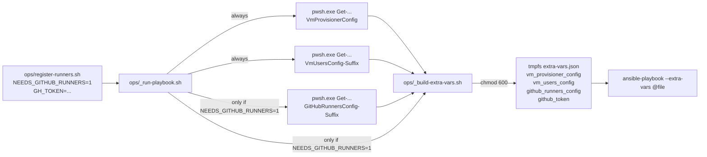
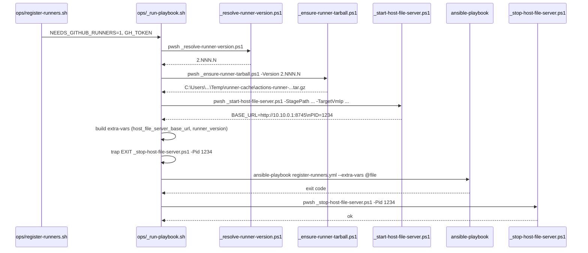
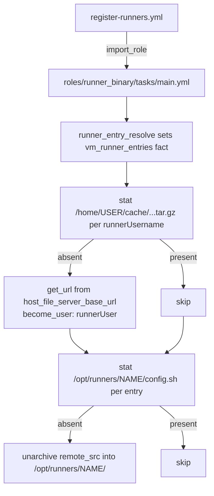
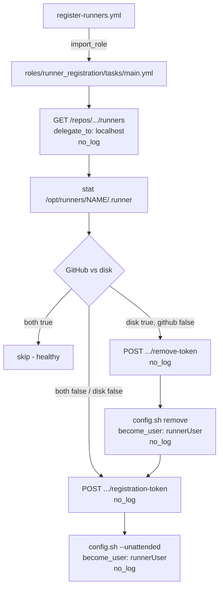
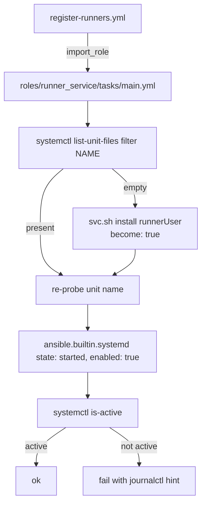
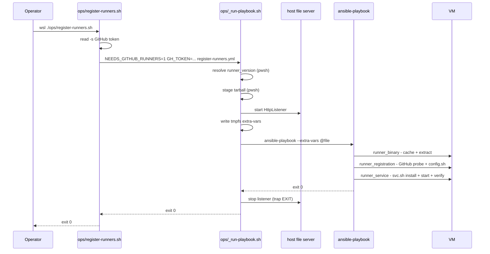
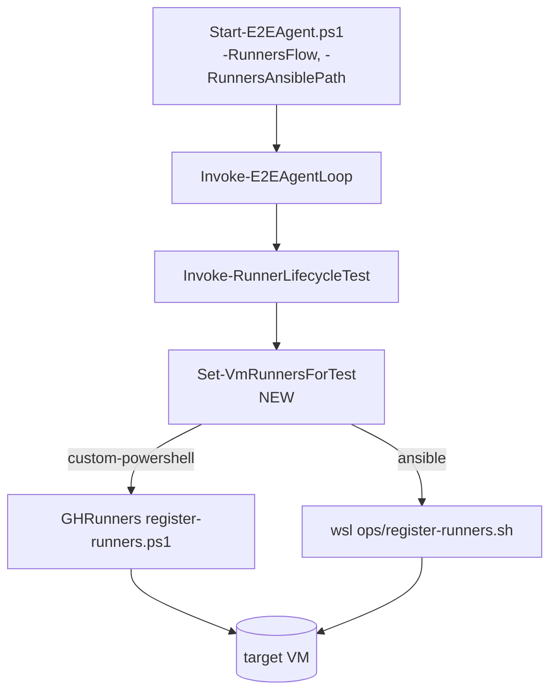

# Plan: Register Self-Hosted GitHub Actions Runners via Ansible

See [problem.md](problem.md) for context, role contracts, and rationale.

## Shape

Three roles, not one. Each maps to one of the three concerns the
PowerShell flow already separates and tests in isolation:

| Role | Reconciles | Maps to today |
|------|------------|---------------|
| `runner_binary` | tarball cache + per-runner extract | `Invoke-RunnerInstall` + `Invoke-RunnerExtract` + `Invoke-RunnerTarballDeploy` |
| `runner_registration` | GitHub registration + on-disk `.runner` marker | `Get-GitHubRunnerRegistration` + `Invoke-RunnerRegistration` (config.sh portion) |
| `runner_service` | systemd unit install + active state | `Invoke-RunnerRegistration` (svc.sh portion) + `Test-RunnerServiceActive` |

Splitting them keeps the GitHub-API surface inside one role, the file-
server / tarball surface inside another, and the systemd surface inside
the third — each role's molecule scenario can stub the others out and
exercise a focused contract.

`tasks/main.yml` per role holds the **register direction only**. The
symmetric deregister direction lives in feature 09 as `tasks/remove.yml`
on the same three roles, following the convention features 02 / 03
established for `groups` / `users` / `sudoers`.

**Meta-dep posture.** No inter-role meta deps between the three. Order
is owned by `register-runners.yml`
(`runner_binary -> runner_registration -> runner_service`). Reason is
the same as feature 03: Ansible's meta deps ignore the caller's
`tasks_from` selector, which the register direction does not abuse
today but feature 09 will, so locking the policy now keeps the two
plans consistent. Role-level molecule scenarios `include_role` their
prerequisites explicitly.

**Token + file-server URL flow.** Both arrive at the playbook as
top-level extra-vars (`github_token`, `host_file_server_base_url`)
written by the bridge into the same tmpfs `chmod 600` file as the
existing `vm_provisioner_config` / `vm_users_config`. Neither is
referenced outside the three roles and the controller-side pre-task;
both are tagged `no_log: true` at every use site.

Per-role README sections gain a "Register direction" subsection so the
contract for both directions has a home from day one. Top-level README
gains an `ops/register-runners.sh` row in the operator surface table and
a new "Register runners" section after "Remove users".

Resolved open questions (problem.md / Solution approach + Bridge):

1. **Token entry point**: prompted in `ops/register-runners.sh` (bash
   `read -s`), not in the bridge. `GH_TOKEN` env var is the
   escape hatch for unattended callers (E2E). Bridge stays
   playbook-agnostic; the prompt belongs at the operator edge.
2. **Third-vault-read gating**: `NEEDS_GITHUB_RUNNERS=1` env var set
   by `ops/register-runners.sh` only. Create-users / remove-users
   entry points stay free of the extra `pwsh.exe` round-trip.
3. **Re-register branch** (`.runner` present, GitHub registration
   absent): explicit `config.sh remove --token <removal>` followed by
   `config.sh --unattended`. Locked in problem.md. Removal token is
   minted controller-side from the same PAT.
4. **File server bind IP**: preserved 1:1 from
   `Invoke-WithVmFileServer` today — the host-side IP on the Hyper-V
   internal switch that the first reachable VM's `ipAddress` belongs
   to. No alternate-bind logic in v1.

## Index

- [Step 1 - Bridge extension: GitHubRunners vault read and token plumbing](#step-1---bridge-extension-githubrunners-vault-read-and-token-plumbing)
- [Step 2 - Bridge extension: host file server helpers](#step-2---bridge-extension-host-file-server-helpers)
- [Step 3 - Role: runner_binary](#step-3---role-runner_binary)
- [Step 4 - Role: runner_registration](#step-4---role-runner_registration)
- [Step 5 - Role: runner_service](#step-5---role-runner_service)
- [Step 6 - register-runners playbook and operator entry](#step-6---register-runners-playbook-and-operator-entry)
- [Step 7 - E2E register-side fork](#step-7---e2e-register-side-fork)

---

## Step 1 - Bridge extension: GitHubRunners vault read and token plumbing

**Reason:** The three roles need `github_runners_config` and
`github_token` to exist as extra-vars before any of them is useful.
Landing the bridge plumbing first lets every subsequent step exercise
itself against a real extra-vars file. Gating the third vault read by
env var (`NEEDS_GITHUB_RUNNERS=1`) keeps the create-users /
remove-users entry points from paying a `pwsh.exe` round-trip they do
not need.

**Files**

- `ops/_run-playbook.sh` (modified) - after the existing two
  `_read-vault-config.sh` calls, gate a third on
  `${NEEDS_GITHUB_RUNNERS:-0}` being `1`. Vault name `GitHubRunners`,
  secret name `GitHubRunnersConfig-${SECRET_SUFFIX}`. Result written
  to a third tmpfs file under the same `mktemp -d` tree, `chmod 600`,
  cleaned by the existing `trap EXIT`. New key `github_runners_config`
  added by `_build-extra-vars.sh`. `github_token` is pulled from the
  `GH_TOKEN` env var that `ops/register-runners.sh` is expected to set
  (the bridge does not prompt — that is the entry script's job).
  Both new extras are written only when `NEEDS_GITHUB_RUNNERS=1` so
  the bridge stays generic.
- `ops/_build-extra-vars.sh` (modified) - accepts two new optional
  args: `--runners-config <file>` and `--github-token <value>`. When
  present, emits `github_runners_config` and `github_token` as
  top-level keys alongside the existing two. Token path-vs-value:
  unlike configs (file paths, to keep secrets out of argv), the
  token is passed by value because the entry script holds it in a
  shell variable already and `mktemp`-ing it just to immediately read
  it back has no security upside (subshell argv is private to the
  current process tree, and `ps` cannot see env vars or stdin args of
  another user's process on Linux unless `--ptrace_scope=0` which
  Ubuntu defaults off). Validation: token non-empty if provided.
- `ops/_read-vault-config.sh` (no change needed) - already takes
  `<VaultName> <SecretName>` and shells out to `pwsh.exe`; the
  GitHubRunners vault read is just another call.
- `Tests/ops/_run-playbook.bats` (modified) - new cases:
  - `NEEDS_GITHUB_RUNNERS=1` unset -> two vault reads, no
    `github_runners_config` / `github_token` keys in the captured
    extra-vars file. Existing cases unchanged.
  - `NEEDS_GITHUB_RUNNERS=1` + `GH_TOKEN=...` set -> three vault
    reads, all three keys present.
  - `NEEDS_GITHUB_RUNNERS=1` + `GH_TOKEN` unset -> bridge exits
    non-zero with a clear message (the bridge itself does not prompt).
- `Tests/ops/_build-extra-vars.bats` (modified) - new cases for the
  new args; token-empty -> non-zero exit; token-value-with-special-
  chars -> emitted verbatim, not shell-expanded.

**Behaviour (sketch, _run-playbook.sh)**

```bash
# ... existing reads ...
_read-vault-config.sh VmProvisioner   VmProvisionerConfig          > "$tmp/provisioner.json"
_read-vault-config.sh VmUsers         "VmUsersConfig-$SECRET_SUFFIX" > "$tmp/users.json"

extra_vars_args=(
  --provisioner-config "$tmp/provisioner.json"
  --users-config       "$tmp/users.json"
)

if [[ "${NEEDS_GITHUB_RUNNERS:-0}" == "1" ]]; then
  [[ -n "${GH_TOKEN:-}" ]] || {
    echo "_run-playbook.sh: NEEDS_GITHUB_RUNNERS=1 requires GH_TOKEN env var" >&2
    exit 2
  }
  _read-vault-config.sh GitHubRunners "GitHubRunnersConfig-$SECRET_SUFFIX" \
    > "$tmp/runners.json"
  extra_vars_args+=( --runners-config "$tmp/runners.json"
                     --github-token   "$GH_TOKEN" )
  unset GH_TOKEN   # belt-and-braces: not in ansible-playbook's env
fi

_build-extra-vars.sh "${extra_vars_args[@]}" > "$tmp/extra-vars.json"
ansible-playbook ... --extra-vars "@$tmp/extra-vars.json" "$@"
```

**Tests (bats)**

- See `Tests/ops/` modifications above. No new test files: existing
  per-helper suites just gain cases.

**Diagram**



---

## Step 2 - Bridge extension: host file server helpers

**Reason:** The runner tarball download is the measured NAT-bypass win
that drove the file-server hop into the existing PowerShell. Lifting it
into a Windows-side helper invoked by the bridge keeps the contract
verbatim (problem.md / Bridge extension) and lets steps 3-5 assume
`host_file_server_base_url` is a working URL. Landing the helpers
before the playbook means step 6 has nothing left to do but compose.

**Files**

- `ops/_start-host-file-server.ps1` (new) - takes `-StagePath` (a
  pre-fetched tarball), `-TargetVmIp` (used to derive which switch
  IP to bind to). Opens an `HttpListener` on a free port, serves the
  staged file by basename, prints `BASE_URL=http://<ip>:<port>` on
  stdout, then `PID=<pid>` on a second line so the bridge can pass
  the pid to the stop helper. Keeps listening until killed. Lifts the
  body of `Infrastructure-GitHubRunners/.../Invoke-WithVmFileServer`
  + `Add-VmFileServerFile` with no behaviour change — same bind
  algorithm, same single-file serving, same port-selection logic.
  PowerShell because the host-side switch IP discovery and
  `HttpListener` both live cleanest on the Windows side; the bridge
  already calls `pwsh.exe` for vault reads.
- `ops/_stop-host-file-server.ps1` (new) - takes `-Pid`. `Stop-Process
  -Id $Pid -Force` then waits for exit. Idempotent: a missing process
  is logged and treated as success (the listener already died from
  whatever caused the bridge trap to fire).
- `ops/_run-playbook.sh` (modified) - when `NEEDS_GITHUB_RUNNERS=1`,
  resolve the runner version once via a pre-bridge `pwsh.exe`
  one-liner (or defer to the controller-side pre-task — see
  decision below), fetch the tarball to a Windows-side cache
  directory, then invoke `_start-host-file-server.ps1` and capture
  `BASE_URL` / `PID`. The captured `BASE_URL` becomes a new
  `--host-base-url <url>` arg to `_build-extra-vars.sh` which emits
  `host_file_server_base_url`. Register a second `trap EXIT` that
  invokes `_stop-host-file-server.ps1 -Pid $PID` so the listener
  always stops, even on `ansible-playbook` failure.
- `ops/_build-extra-vars.sh` (modified again from step 1) - accepts
  `--host-base-url <url>` and emits `host_file_server_base_url`.
- `ops/_resolve-runner-version.ps1` (new) - small helper, single
  responsibility: GET `repos/actions/runner/releases/latest` with the
  `GH_TOKEN`, return the version string without the leading `v`. The
  bridge needs this to know what to download and stage. Mirrors
  `Resolve-RunnerVersion.ps1` in Infrastructure-GitHubRunners. Lives
  here (not in a role) because the staging happens on the Windows
  side before any `ansible-playbook` task runs.
- `ops/_ensure-runner-tarball.ps1` (new) - small helper: given a
  version, ensure the tarball exists at
  `$env:LOCALAPPDATA\Temp\runner-cache\actions-runner-linux-x64-<ver>.tar.gz`,
  downloading it from `github.com` if missing. Cached across runs.
  Mirrors `Invoke-RunnerTarballEnsure.ps1`.
- `Tests/ops/_start-host-file-server.Tests.ps1` (new, Pester) -
  unit-tests `_resolve-runner-version`, `_ensure-runner-tarball`,
  and the start/stop helpers against mocked GitHub HTTP responses
  and a temp file. Lives at `Tests/ops/` next to existing helpers.

  Why Pester (not bats) for these four: each helper is single-file
  PowerShell calling `Invoke-RestMethod` / `HttpListener` /
  `Get-NetIPAddress`; bats would have to spawn `pwsh.exe`
  per assertion which is slower and harder to mock. The bash bats
  suite still owns `_run-playbook.sh`'s orchestration coverage and
  stubs the four PS helpers as boundaries.
- `Tests/ops/_run-playbook.bats` (modified again from step 1) - new
  case: `NEEDS_GITHUB_RUNNERS=1` exercise stubs `_start-host-file-
  server.ps1` to print `BASE_URL=http://1.2.3.4:8745` + `PID=1234`;
  asserts that the URL ends up in extra-vars and that `_stop-host-
  file-server.ps1` is invoked with the captured PID on exit (both
  clean exit and forced failure).

**Decision: runner-version resolution split between bridge and play**

Two consumers need the version. The bridge needs it before it can
fetch the tarball; the play needs it inside the `runner_binary` role
to compose paths. Two clean options:

| Option | Trade-off |
|--------|-----------|
| Resolve once in the bridge (`_resolve-runner-version.ps1`), pass to the play as `runner_version` extra-var | One API call per invocation. Bridge does extra work. Play has the value before any task runs. |
| Resolve in the play as a `delegate_to: localhost` + `run_once: true` pre-task | Symmetric with the GitHub Runners API existence probe in step 4. But the bridge still needs the version to stage the tarball — would require a second resolve. |

**Choice: bridge resolves once, plays receive `runner_version` as an
extra-var.** Single source of truth per invocation; the play does not
re-resolve. The role still defaults `runner_version` to the
`releases/latest` shape when the extra-var is absent, so the role can
be invoked standalone for molecule scenarios.

**Tests (bats + Pester)**

- `_resolve-runner-version.ps1`: mocked GitHub response with
  `tag_name=v2.999.0` -> returns `2.999.0`. 401 -> throws with token
  hint. Network error -> throws with retry hint.
- `_ensure-runner-tarball.ps1`: cache hit -> no download, returns
  existing path. Cache miss -> downloads, verifies file size > 0,
  returns path. Re-run with same version -> cache hit.
- `_start-host-file-server.ps1`: stubs `HttpListener` to a free port;
  asserts `BASE_URL=<url>` + `PID=<pid>` printed; a `curl`-equivalent
  PS web request against the URL returns the staged file bytes.
- `_stop-host-file-server.ps1`: live process -> killed and exits 0;
  already-dead pid -> exits 0 with a notice; no pid arg -> exits 2.
- Bridge bats: orchestration only — see modification above.

**Diagram**



---

## Step 3 - Role: runner_binary

**Reason:** First of the three roles to land because it has no GitHub-
API surface and no systemd surface — purely `get_url` + `unarchive`
against `host_file_server_base_url`. Smallest role; establishes the
convention the next two copy.

**Files**

- `roles/runner_binary/tasks/main.yml` (new) - register direction.
  Loops over the per-host slice of `github_runners_config`
  (`vm_runner_entries` fact built by `runner_entry_resolve` — see
  next bullet). Two task groups:
  1. **Tarball cache** — one `get_url` per distinct `runnerUsername`
     on the host, downloaded as that user via `become: true` +
     `become_user`. URL `{{ host_file_server_base_url }}/actions-
     runner-linux-x64-{{ runner_version }}.tar.gz`. Destination
     `/home/{{ runner_user }}/cache/`. Mode `0644`. `creates`-style
     guard via `stat` + `when not stat.stat.exists`.
  2. **Per-runner extract** — one `unarchive` per entry. Source =
     the cached tarball (same path), `remote_src: true`, dest
     `/opt/runners/{{ runner_name }}/`, owner/group `{{ runner_user }}`,
     mode `0755` (matches today's chown). Guarded by
     `stat /opt/runners/{{ runner_name }}/config.sh` so re-runs are
     no-ops.
- `roles/runner_binary/meta/main.yml` (new) - one dep:
  `runner_entry_resolve` (the per-host selector fact role, mirroring
  `vm_users_entry`). Built in this step alongside the role itself
  because it has no other place to land — see next bullet.
- `roles/runner_entry_resolve/tasks/main.yml` (new) - repo-internal
  helper role analogous to `vm_users_entry` from feature 02. Sets
  the host-scoped fact `vm_runner_entries` =
  `github_runners_config | selectattr('vmName', '==',
  inventory_hostname) | list`. Pulled in via meta-dep by all three
  runner roles so the lookup lives in one file instead of three.
- `roles/runner_binary/defaults/main.yml` (new) - `runner_version`
  default of the literal string `latest` so molecule scenarios can
  exercise the role without the bridge pre-task; production runs
  always receive the resolved version from step 2.
- `roles/runner_binary/README.md` (new) - "Register direction"
  section documenting inputs (`vm_runner_entries`,
  `host_file_server_base_url`, `runner_version`), outputs
  (`/home/<user>/cache/...`, `/opt/runners/<name>/`), and idempotence
  guarantees.
- `Tests/molecule/runner_binary/default/` (new) - molecule scenario.
  `prepare` seeds a fake tarball + a python `http.server` on a high
  port; converge invokes the role with
  `host_file_server_base_url` pointed at the local server; verify
  asserts cache + extract present, ownership correct.
- `Tests/molecule/runner_entry_resolve/default/` (new) - tiny
  scenario that asserts the fact shape for a host with 0 / 1 / 2
  entries.
- `README.md` (modified) - new bullet under "Roles" listing
  `runner_binary` and `runner_entry_resolve`, mirroring the existing
  `groups` / `users` / `sudoers` entries.

**Behaviour (sketch)**

```yaml
- name: Stat the runner tarball cache (one per runner_user on this host)
  ansible.builtin.stat:
    path: "/home/{{ item }}/cache/actions-runner-linux-x64-{{ runner_version }}.tar.gz"
  loop: "{{ vm_runner_entries | map(attribute='runnerUsername') | unique | list }}"
  loop_control:
    label: "{{ item }}"
  register: cache_stats

- name: Download runner tarball from host file server
  ansible.builtin.get_url:
    url:  "{{ host_file_server_base_url }}/actions-runner-linux-x64-{{ runner_version }}.tar.gz"
    dest: "/home/{{ item.item }}/cache/"
    mode: "0644"
    owner: "{{ item.item }}"
    group: "{{ item.item }}"
  become: true
  become_user: "{{ item.item }}"
  loop: "{{ cache_stats.results }}"
  loop_control:
    label: "{{ item.item }}"
  when: not item.stat.exists

- name: Stat per-runner extract dir
  ansible.builtin.stat:
    path: "/opt/runners/{{ item.runnerName }}/config.sh"
  loop: "{{ vm_runner_entries }}"
  loop_control:
    label: "{{ item.runnerName }}"
  register: extract_stats

- name: Extract runner tarball into per-runner directory
  ansible.builtin.unarchive:
    src:  "/home/{{ item.item.runnerUsername }}/cache/actions-runner-linux-x64-{{ runner_version }}.tar.gz"
    dest: "/opt/runners/{{ item.item.runnerName }}/"
    remote_src: true
    owner: "{{ item.item.runnerUsername }}"
    group: "{{ item.item.runnerUsername }}"
    mode:  "0755"
  become: true
  loop: "{{ extract_stats.results }}"
  loop_control:
    label: "{{ item.item.runnerName }}"
  when: not item.stat.exists
```

**Tests (Molecule)**

- Empty `vm_runner_entries` -> no tasks, no errors.
- One entry, tarball absent -> download + extract; cache present,
  `/opt/runners/<name>/config.sh` present, owned by `runner_user`.
- Two entries on the same VM with the same `runnerUsername` -> one
  cache download, two extracts.
- Two entries on the same VM with different `runnerUsername` -> two
  cache downloads (one per user), two extracts.
- Re-converge -> `changed: 0` across both task groups.
- `host_file_server_base_url` points at a non-existent host -> the
  get_url task fails per-host with a clear error (not a hidden
  silent skip).

**Diagram**



---

## Step 4 - Role: runner_registration

**Reason:** Mid of three. Has no on-VM mutation beyond `config.sh`;
the heavy lift is the three-way reconcile against GitHub + the local
`.runner` marker (problem.md / reconcile branches). Owns all token
hygiene for the feature — every task here is `no_log: true`.

**Files**

- `roles/runner_registration/tasks/main.yml` (new) - register
  direction. Per entry:
  1. **Existence probe** — controller-side `ansible.builtin.uri`,
     `delegate_to: localhost`, `run_once: false` (per entry, not per
     play, because the runner list differs per repo). GET
     `https://api.github.com/repos/{{ owner }}/{{ repo }}/actions/runners`
     with `Authorization: token {{ github_token }}` in `headers`.
     Parse JSON, set fact `runner_registered_on_github` (boolean per
     entry).
  2. **On-disk probe** — `stat /opt/runners/{{ runnerName }}/.runner`.
     Set fact `runner_registered_on_disk`.
  3. **Reconcile switch**:
     - (a) both true -> set fact `runner_should_register=false`.
     - (b) both false / disk false -> set fact `runner_should_register=true`,
       `runner_should_remove_first=false`.
     - (c) disk true, GitHub false -> set fact
       `runner_should_register=true`, `runner_should_remove_first=true`
       (re-register branch from problem.md).
  4. **Mint registration token (controller)** — `ansible.builtin.uri`
     POST to `repos/{{ owner }}/{{ repo }}/actions/runners/
     registration-token`, only when `runner_should_register`. Fact
     `runner_registration_token`. `no_log: true`.
  5. **Mint removal token (controller)** — POST to `.../runners/
     remove-token`, only when `runner_should_remove_first`. Fact
     `runner_removal_token`. `no_log: true`.
  6. **config.sh remove** — `ansible.builtin.command` as
     `become_user: {{ runnerUsername }}`, only when
     `runner_should_remove_first`. Argv-style (not shell-string) so
     the token never appears in any shell history. `no_log: true`.
  7. **config.sh --unattended** — `ansible.builtin.command` as
     `become_user: {{ runnerUsername }}`, only when
     `runner_should_register`. Argv with `--url`, `--token`,
     `--name`, `--labels`. `no_log: true`.
- `roles/runner_registration/meta/main.yml` (new) - one dep:
  `runner_entry_resolve`.
- `roles/runner_registration/defaults/main.yml` (new) - empty (all
  inputs are required and the role asserts them).
- `roles/runner_registration/README.md` (new) - "Register direction"
  section documenting the three reconcile branches, the
  token-mint-vs-use boundaries, and the `no_log` posture.
- `Tests/molecule/runner_registration/default/` (new) - molecule
  scenario with a mocked GitHub API. `prepare` stands up a tiny
  python HTTP server that returns canned JSON for `GET /runners`
  and `POST /registration-token` / `remove-token`; converge runs
  the role against three pre-seeded entries (healthy, fresh,
  re-register); verify asserts the correct branch ran by inspecting
  the mock server's recorded request log.
- `README.md` (modified) - new bullet under "Roles" listing
  `runner_registration`.

**Behaviour (sketch, the reconcile decision)**

```yaml
- name: Probe GitHub for existing runner registration
  ansible.builtin.uri:
    url: "https://api.github.com/repos/{{ owner }}/{{ repo }}/actions/runners?per_page=100"
    headers:
      Authorization: "token {{ github_token }}"
      Accept:        "application/vnd.github+json"
    return_content: true
  delegate_to: localhost
  register: runners_resp
  no_log: true

- name: Record per-runner registration state
  ansible.builtin.set_fact:
    runner_registered_on_github: >-
      {{ (runners_resp.json.runners
          | default([])
          | selectattr('name', 'equalto', item.runnerName)
          | list | length) > 0 }}
  loop: "{{ vm_runner_entries }}"
  loop_control:
    label: "{{ item.runnerName }}"
```

The full reconcile switch is implemented as a per-entry
`include_tasks` so each entry's facts stay scoped; the file is short
enough to keep readable. Token-bearing tasks are all `no_log: true`
and never printed even at `-vvv`.

**Tests (Molecule)**

- Entry not registered on GitHub, `.runner` absent -> registration
  token minted, `config.sh --unattended` runs; mock records
  `--name <runnerName>`, `--labels <csv>`, `--url <githubUrl>`.
- Entry registered on GitHub, `.runner` present -> no token mint,
  no `config.sh` call.
- Entry registered on GitHub, `.runner` absent -> registration
  token minted, `config.sh --unattended` runs (the "lost local
  state" case).
- Entry not registered on GitHub, `.runner` present -> removal
  token + registration token both minted; `config.sh remove` runs
  first, then `config.sh --unattended`.
- `github_token` empty / missing -> role's input assert fails fast
  before any GitHub call.
- A play run with `-vvv` -> token values do not appear in stdout
  (asserted by grep against the captured log).

**Diagram**



---

## Step 5 - Role: runner_service

**Reason:** Last of the three roles. Pure systemd: `svc.sh install`,
state via `ansible.builtin.systemd`, and an explicit `is-active`
re-check that mirrors today's `Test-RunnerServiceActive`. Lands after
`runner_registration` because the runner directory must already
contain `config.sh` + `.runner` for `svc.sh install` to succeed.

**Files**

- `roles/runner_service/tasks/main.yml` (new) - register direction.
  Per entry:
  1. **Unit probe** — `ansible.builtin.shell` for
     `systemctl list-unit-files 'actions.runner.*.service' --no-pager`
     filtered to the runner's name (the unit name pattern is
     `actions.runner.<owner>-<repo>.<runnerName>.service`). Capture
     unit name into `runner_service_unit`.
  2. **Install branch** — when `runner_service_unit` is empty,
     `command: cd {{ runner_dir }} && ./svc.sh install {{ runnerUsername }}`
     with `become: true` (root). `args.chdir` instead of inline `cd`
     for cleaner module use.
  3. **Active state** — `ansible.builtin.systemd` with
     `name: "{{ runner_service_unit }}"`, `state: started`,
     `enabled: true`. Captures `changed` flag.
  4. **Active re-check** — `ansible.builtin.command:
     systemctl is-active {{ runner_service_unit }}`,
     `failed_when: result.stdout != 'active'`,
     `changed_when: false`. Failure message includes the
     `journalctl -u <unit>` hint.
- `roles/runner_service/meta/main.yml` (new) - one dep:
  `runner_entry_resolve`.
- `roles/runner_service/defaults/main.yml` (new) - empty.
- `roles/runner_service/README.md` (new) - "Register direction"
  section documenting the unit-name probe, the install vs.
  already-installed branches, and the explicit re-check.
- `Tests/molecule/runner_service/default/` (new) - molecule
  scenario. `prepare` seeds a fake `/opt/runners/<name>/` with a
  stub `svc.sh` that installs a stub systemd unit (a one-shot
  `/bin/true` ExecStart so the unit can be active without doing
  anything). Verify asserts the unit exists, is active, and a
  re-converge is `changed: 0`.
- `README.md` (modified) - new bullet under "Roles" listing
  `runner_service`.

**Behaviour (sketch)**

```yaml
- name: Probe for the systemd unit file
  ansible.builtin.shell: >-
    systemctl list-unit-files
      --type=service --no-pager --no-legend
      'actions.runner.*{{ item.runnerName }}.service'
    | awk '{print $1}' | head -n1
  loop: "{{ vm_runner_entries }}"
  loop_control:
    label: "{{ item.runnerName }}"
  register: unit_probes
  changed_when: false

- name: Install the runner service when unit is absent
  ansible.builtin.command:
    cmd:   "./svc.sh install {{ item.item.runnerUsername }}"
    chdir: "/opt/runners/{{ item.item.runnerName }}"
  become: true
  loop: "{{ unit_probes.results }}"
  loop_control:
    label: "{{ item.item.runnerName }}"
  when: item.stdout == ''
  register: svc_installs

# Re-probe so the systemd task below has the unit name even on
# the install-branch path.
- name: Re-probe unit file after potential install
  ansible.builtin.shell: >-
    systemctl list-unit-files
      --type=service --no-pager --no-legend
      'actions.runner.*{{ item.runnerName }}.service'
    | awk '{print $1}' | head -n1
  loop: "{{ vm_runner_entries }}"
  loop_control:
    label: "{{ item.runnerName }}"
  register: unit_probes_after
  changed_when: false

- name: Ensure the runner service is enabled and started
  ansible.builtin.systemd:
    name:    "{{ item.stdout }}"
    state:   started
    enabled: true
  become: true
  loop: "{{ unit_probes_after.results }}"
  loop_control:
    label: "{{ item.item.runnerName }}"

- name: Verify the runner service reached active state
  ansible.builtin.command:
    cmd: "systemctl is-active {{ item.stdout }}"
  loop: "{{ unit_probes_after.results }}"
  loop_control:
    label: "{{ item.item.runnerName }}"
  register: active_checks
  changed_when: false
  failed_when: active_checks.results
               | rejectattr('stdout', 'equalto', 'active')
               | list | length > 0
```

**Tests (Molecule)**

- Unit absent + runner directory present -> `svc.sh install` runs,
  unit becomes active.
- Unit present + active -> install task skips, systemd task
  reports `changed: 0`.
- Unit present + stopped -> install skips, systemd task starts the
  service, re-check passes.
- Unit installed but ExecStart fails immediately -> systemd task
  reports `changed: true`, re-check fails with the
  `journalctl -u <unit>` hint in the error message.
- Re-converge -> `changed: 0`.

**Diagram**



---

## Step 6 - register-runners playbook and operator entry

**Reason:** Wires the three roles into a playbook and gives operators
a single command to invoke it. After this step the register flow is
end-to-end runnable against a real VM.

**Files**

- `playbooks/register-runners.yml` (new) - single play targeting
  `vm_provisioner_hosts`, importing roles in
  `runner_binary -> runner_registration -> runner_service` order via
  `ansible.builtin.import_role`. Same `gather_facts: true`,
  `any_errors_fatal: false` posture as `create-users.yml`. Each
  role tagged with its own name.
- `ops/register-runners.sh` (new) - operator entry. Prompts for the
  GitHub token via `read -s -p 'GitHub token: '` when `GH_TOKEN` is
  unset; exports it; sets `NEEDS_GITHUB_RUNNERS=1`; invokes
  `./ops/_run-playbook.sh playbooks/register-runners.yml "$@"`.
  Args after the playbook are forwarded verbatim to
  `ansible-playbook` (so `--tags`, `--limit`, `--check`, `-v`
  work unchanged).
- `ops/register-runners.bat` (new) - Explorer launcher; resolves
  Git Bash via `GitHub-Common/scripts/_find-bash.bat`, then `exec`s
  `ops/register-runners.sh`. Mirrors the existing `create-users.bat`
  / `remove-users.bat` find-bash pattern.
- `ops/setup-runners-secrets.ps1` (new) - thin wrapper. Forwards
  `-ConfigFile` / `-ConfigJson` / `-RequireVaultPassword` /
  `-SecretSuffix` to `Infrastructure-GitHubRunners/hyper-v/
  ubuntu/setup-secrets.ps1` (expected as a sibling checkout, same
  convention as `ops/setup-secrets.ps1` for Vm-Users). Same
  cross-repo wrapping rationale as feature 02
  ([[feedback_call_cross_repo_before_forking]]): the vault contract
  has not diverged; forking the writer would just create a second
  place to keep in lock-step.
- `ops/setup-runners-secrets.bat` (new) - Explorer drop-target;
  forwards a dropped JSON file to the `.ps1` as `-ConfigFile`.
- `README.md` (modified) - new section "Register runners" after
  "Remove users", mirroring those two sections' shape: one-line
  command, `.bat` equivalent, the operator-knob list
  (`--check`, `--tags`, `--limit`, `-v`), and the two contracts
  worth highlighting (token never stored; file-server hop is
  bridge-internal). New row in the operator surface table for
  `ops/register-runners.sh`.
- `ops/_run-playbook.sh` (no further change beyond steps 1-2).

**Behaviour (playbook)**

```yaml
- name: Register self-hosted GitHub Actions runners on provisioned VMs
  hosts: vm_provisioner_hosts
  gather_facts: true
  any_errors_fatal: false
  tasks:
    - ansible.builtin.import_role:
        name: runner_binary
      tags: runner_binary

    - ansible.builtin.import_role:
        name: runner_registration
      tags: runner_registration

    - ansible.builtin.import_role:
        name: runner_service
      tags: runner_service
```

**Behaviour (ops/register-runners.sh)**

```bash
#!/usr/bin/env bash
set -euo pipefail

if [[ -z "${GH_TOKEN:-}" ]]; then
    read -rsp 'GitHub token: ' GH_TOKEN
    echo
    [[ -n "$GH_TOKEN" ]] || { echo 'GitHub token required' >&2; exit 2; }
fi
export GH_TOKEN
export NEEDS_GITHUB_RUNNERS=1

exec "$(dirname "$0")/_run-playbook.sh" \
    playbooks/register-runners.yml "$@"
```

**Tests**

- Playbook itself has no logic beyond role ordering; covered
  end-to-end by step 7 (E2E fork).
- `ops/register-runners.sh` (bats, new file
  `Tests/ops/register-runners.bats`):
  - `GH_TOKEN` already set -> no prompt; bridge invoked with
    `NEEDS_GITHUB_RUNNERS=1` and the token exported.
  - `GH_TOKEN` unset, prompt accepts a value -> bridge invoked
    with the value as `GH_TOKEN`.
  - `GH_TOKEN` unset, prompt rejected (empty) -> exit code 2,
    bridge never invoked.
  - Extra args (`--tags runner_binary`, `--check`) forwarded
    verbatim.
- `ops/setup-runners-secrets.ps1` (Pester,
  `Tests/ops/setup-runners-secrets.Tests.ps1`):
  - Missing sibling checkout -> throws with a clear pointer.
  - Sibling present, `-ConfigFile` valid -> delegated
    invocation captured; arg-splat correct.

**Diagram**



---

## Step 7 - E2E register-side fork

**Reason:** Symmetric counterpart to feature 02's `Set-VmUsersForTest`
and feature 03's `Remove-VmUsersForTest`. Until this step lands the
runner-lifecycle E2E test still drives `Infrastructure-GitHubRunners/
hyper-v/ubuntu/register-runners.ps1` directly, so the Ansible path has
no merge gate from day one. Landing this step puts the Ansible flow
behind the same E2E gate the create-users / remove-users flows already
have.

**Decisions locked**

- **Flow names mirror the users side.** `custom-powershell` and
  `ansible`. Same `[ValidateSet]` shape as `Set-VmUsersForTest` /
  `Remove-VmUsersForTest`.
- **Default flow stays `custom-powershell` for one full release
  cycle.** Reason: features 02 / 03 flipped `UsersFlow=ansible` after
  validating the Ansible path on real hardware; the runners path
  earns its default-flip in a follow-up bump, not in the same PR
  that ships the dispatcher. Operators (and CI) opt into the
  Ansible path with `-RunnersFlow ansible` explicitly until then.
- **`Infrastructure-GitHubRunners` is not modified by this feature.**
  Mirrors the create-side posture toward Vm-Users
  ([[feedback_dont_mutate_repos_being_archived]]). Marking GHRunners
  superseded happens at the end of feature 09, paired with the
  deregister-side fork.
- **One layer, two flows.** Dispatcher `Set-VmRunnersForTest`; the
  existing inline call to `register-runners.ps1` inside
  `Invoke-RunnerLifecycleTest` is extracted into it.
- **Parameter chain unchanged.** `Start-E2EAgent.ps1` gains
  `-RunnersFlow` / `-RunnersPath` (the path to
  `Infrastructure-VM-Ansible` for the Ansible flow); both propagate
  via `$Config` to `Invoke-RunnerLifecycleTest`. `WslDistro` is
  reused from the users-side dispatcher — the same trap
  ([[feedback_check_wsl_default_first]]) applies and the same fix
  works unchanged.
- **Token handover.** The E2E agent already holds a GitHub PAT for
  the GitHubRunners workflow; the dispatcher passes it as
  `GH_TOKEN=...` to the `wsl` invocation, matching the bridge's
  unattended path. Token never appears in `Start-Process` arg
  arrays, never in PowerShell history, never in CI logs.

**Files (in Infrastructure-E2E)**

- `agent/e2e/runners/Set-VmRunnersForTest.ps1` (new) - dispatcher
  mirroring `Set-VmUsersForTest.ps1`'s shape. Parameters:
  `-RunnersFlow` (`custom-powershell` / `ansible`), `-RunnersPath`
  (Infrastructure-GitHubRunners checkout for the PS flow), `-AnsiblePath`
  (Infrastructure-VM-Ansible checkout for the ansible flow), `-WslDistro`,
  `-Token`, `-SecretSuffix`. Switches on `-RunnersFlow`:
  - `custom-powershell` -> `& "$RunnersPath\hyper-v\ubuntu\register-runners.ps1"
    -Token $Token -SecretSuffix $SecretSuffix`. Same arg shape the test
    uses today.
  - `ansible` -> `Push-Location $AnsiblePath` then
    `$env:GH_TOKEN = $Token; & wsl -d $WslDistro -- ./ops/register-runners.sh
    2>&1 | Out-Host`. Anchored cwd, native-stdout `Out-Host`
    ([[feedback_ps_subexpr_swallows_native_output]]),
    propagated `$LASTEXITCODE`. `Remove-Item Env:GH_TOKEN` in `finally`
    so the token never lingers in the agent process env.
- `agent/e2e/runners/Invoke-RunnerLifecycleTest.ps1` (modified) -
  dot-source the new dispatcher; replace the inline
  `register-runners.ps1` call with
  `Set-VmRunnersForTest -RunnersFlow $Config.RunnersFlow ...`. No
  signature change on `Invoke-RunnerLifecycleTest` — the caller
  already supplies `$Config`.
- `agent/Start-E2EAgent.ps1` (modified) - two new parameters:
  `-RunnersFlow` (`ValidateSet('custom-powershell','ansible')`,
  default `custom-powershell`) and `-RunnersAnsiblePath` (string,
  path to the Infrastructure-VM-Ansible checkout). Propagated into
  `$Config` next to the existing `UsersFlow` / `AnsiblePath` /
  `WslDistro` keys.
- `agent/e2e/Get-E2EConfig.ps1` (modified) - reads the same two new
  values from the `E2EConfig` SecretStore vault so workstations can
  carry the operator default in the vault rather than at every
  invocation.
- `Tests/Set-VmRunnersForTest.Tests.ps1` (new, Pester) - mirrors
  `Set-VmUsersForTest.Tests.ps1` shape. Cases:
  - `RunnersFlow=custom-powershell` -> PS script invoked with the
    expected args; `wsl` never called; non-zero exit -> throws.
  - `RunnersFlow=ansible` with both paths + distro -> `wsl -d`
    invoked from `$AnsiblePath` cwd with `GH_TOKEN` in env; PS
    script never called; token cleared from env in `finally` even
    on throw.
  - `ansible` flow with `-AnsiblePath` missing -> throws
    `*requires -AnsiblePath*`.
  - `ansible` flow with `-WslDistro` missing -> throws
    `*requires -WslDistro*`.
  - Unknown `RunnersFlow` -> rejected at parameter binding
    (`ValidateSet`).
  - `-vvv`-equivalent forwarded arg present -> token still not in
    any captured stdout (asserted by grep of the test transcript).

**Files (in Infrastructure-VM-Ansible)**

- `README.md` (modified, "Tests and lint" section) - add a row to
  the table noting the E2E gate now drives this repo's
  `ops/register-runners.sh` when `RunnersFlow=ansible`. Mirrors the
  existing UsersFlow gate row.

**Behaviour (Set-VmRunnersForTest)**

```powershell
function Set-VmRunnersForTest {
    [CmdletBinding()]
    param(
        [Parameter(Mandatory)] [ValidateSet('custom-powershell','ansible')] [string] $RunnersFlow,
        [Parameter(Mandatory)] [string]         $RunnersPath,
        [string]                                $AnsiblePath,
        [string]                                $WslDistro,
        [Parameter(Mandatory)] [string]         $Token,
        [Parameter(Mandatory)] [string]         $SecretSuffix,
        [Parameter(Mandatory)] [PSCustomObject] $VmDef,
        [Parameter(Mandatory)] [object]         $Entry
    )

    switch ($RunnersFlow) {
        'custom-powershell' {
            & "$RunnersPath\hyper-v\ubuntu\register-runners.ps1" `
                -Token $Token -SecretSuffix $SecretSuffix
            if ($LASTEXITCODE -ne 0) {
                throw "custom-powershell register-runners.ps1 exited $LASTEXITCODE"
            }
        }
        'ansible' {
            if (-not $AnsiblePath) { throw 'RunnersFlow=ansible requires -AnsiblePath' }
            if (-not $WslDistro)   { throw 'RunnersFlow=ansible requires -WslDistro' }
            Push-Location $AnsiblePath
            $env:GH_TOKEN = $Token
            try {
                & wsl -d $WslDistro -- ./ops/register-runners.sh 2>&1 | Out-Host
            }
            finally {
                Remove-Item Env:GH_TOKEN -ErrorAction SilentlyContinue
                Pop-Location
            }
            if ($LASTEXITCODE -ne 0) {
                throw "Ansible register-runners.sh exited $LASTEXITCODE"
            }
        }
    }
}
```

**Tests (Pester, mocked)**

See file list above.

**Infrastructure-E2E README update**

- Document `Set-VmRunnersForTest` in the same section that already
  covers `Set-VmUsersForTest` / `Remove-VmUsersForTest`. Note the
  `custom-powershell` default and the explicit-opt-in for the
  Ansible flow during the first validation cycle.
- Note the symmetric cross-compat: an `ansible` create-users can be
  paired with a `custom-powershell` register-runners and vice versa
  — the on-VM contract is the same regardless of which side did
  which step.

**Diagram**


