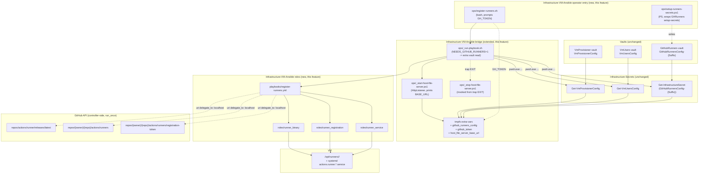
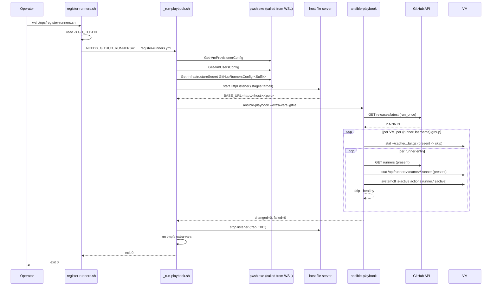

# Problem: Register Self-Hosted GitHub Actions Runners via Ansible

## Index

- [Context](#context)
- [Solution approach](#solution-approach)
- [What Is Changing](#what-is-changing)
  - [Inputs (consumed, not redefined)](#inputs-consumed-not-redefined)
  - [GitHubRunners vault entry (consumed)](#githubrunners-vault-entry-consumed)
  - [Bridge extension: GitHub token + host file server](#bridge-extension-github-token--host-file-server)
  - [Role: runner_binary](#role-runner_binary)
  - [Role: runner_registration](#role-runner_registration)
  - [Role: runner_service](#role-runner_service)
  - [Entry point: register-runners playbook](#entry-point-register-runners-playbook)
  - [Operator entry point and vault setup in this repo](#operator-entry-point-and-vault-setup-in-this-repo)
- [Why Now](#why-now)
- [Affected Components](#affected-components)
- [Out of Scope](#out-of-scope)

---

## Context

`Infrastructure-GitHubRunners/hyper-v/ubuntu/register-runners.ps1` opens
an SSH connection per VM (via `Renci.SshNet`) and reconciles one or more
self-hosted GitHub Actions runners against a `GitHubRunnersConfig` JSON
array. For each VM it:

1. Resolves the latest `actions/runner` release once (controller-side
   GitHub API call).
2. Pre-fetches the tarball to the Windows host and launches an HTTP file
   server on the Hyper-V internal switch so every VM pulls from the host
   instead of github.com over NAT (~116 KB/s otherwise — a measured win
   that survives unchanged in this feature).
3. SSHes as the deploy user (`deployUsername`, e.g. `u-runner-deploy`),
   groups runners by the runner service user (`runnerUsername`, e.g.
   `u-actions-runner`) so the tarball is downloaded once per user, then
   per runner:
   - checks GitHub for an existing registration and the local systemd
     unit for activity,
   - **healthy** (registered + service active) -> skip,
   - **registered + service stopped** -> restart service only,
   - **registered + unit missing** -> install service only (rare: a
     previous run crashed between `config.sh` and `svc.sh install`),
   - **not registered** -> fetch a short-lived registration token,
     `config.sh --unattended`, `svc.sh install <runnerUser>`,
     `svc.sh start`, verify active.

The logic is idempotent and well-tested but the implementation builds
its own SSH transport, its own retry semantics, and its own "install or
reconcile" branching. Every leaf operation maps cleanly to a stock
Ansible module: `get_url` for the tarball, `unarchive` for the extract,
`command` (or `shell`) for `config.sh` / `svc.sh`, `systemd` for service
state, and `uri` (controller-side) for the GitHub API. The migration
deletes the SSH-transport scaffolding and the imperative reconcile
branching.

This is the third concrete workload on the controller pattern shipped by
feature 02 and extended by feature 03 — the substrate (bridge, vault
reads, inventory generation, CI gates, E2E gate) is unchanged; only new
inputs (the GitHubRunners vault, the GitHub token, the file server URL)
and new roles are added.

The vault contract on the Infrastructure-GitHubRunners side is unchanged:
`GitHubRunnersConfig-<Suffix>` keeps its current shape, and the
`GitHubRunners` SecretStore vault remains the source of truth for runner
entries. Consumer of the deploy passwords is still the same `VmUsers`
vault read that feature 02 already wired up.

---

## Solution approach

Survey of off-the-shelf candidates:

| Candidate | Source / license | Maint. | Fit |
|---|---|---|---|
| [monolithprojects.github_actions_runner](https://galaxy.ansible.com/ui/standalone/roles/monolithprojects/github_actions_runner/) | OSS, Apache-2.0, Galaxy | active | Covers download / extract / `config.sh --unattended` / `svc.sh install+start` / deregister. Variables: `runner_user`, `github_owner`, `github_repo`, `access_token`, `runner_labels`, `runner_name`. Idempotent. |
| [gantsign.github-actions-runner](https://galaxy.ansible.com/ui/standalone/roles/gantsign/github-actions-runner/) | OSS, MIT, Galaxy | quieter (last release ~2 yrs) | Similar surface; supports labels and a `state: absent` for deregister. |
| [actions/runner](https://github.com/actions/runner) raw | OSS, MIT | active | Authoritative tarball + scripts. Not Ansible. |
| Port the existing PowerShell to Ansible roles | n/a | n/a | Full fidelity with today's contract. |

Two contracts in the existing code do not survive adoption of either
Galaxy role and we refuse to regress them:

1. **Host file server for the runner tarball.** The current pipeline
   pre-fetches the tarball to the Windows host once per run and serves
   it to every VM over the Hyper-V internal switch. Direct fetches from
   github.com inside VMs are bottlenecked at ~116 KB/s by the NAT path
   (measured). Neither Galaxy role exposes a "fetch from this URL
   instead of github" hook of the right shape.
2. **Deploy-user vs runner-service-user split.** The SSH connection is
   the deploy user (sudoers scoped to runner operations); `config.sh`
   runs as the runner service user via `sudo -u`, and `svc.sh install`
   runs as root. The Galaxy roles model "one runner user, become it"
   and bridging that to two distinct accounts per VM is more friction
   than a port.

**Direction chosen: custom port, with monolithprojects naming.** Three
small roles (`runner_binary`, `runner_registration`, `runner_service`)
reusing the bridge from features 02/03, lifting variable names and
idempotence checks (`config/.runner` presence, `systemctl is-active`)
from monolithprojects so the conventions are not invented from scratch.

---

## What Is Changing

### Inputs (consumed, not redefined)

- **`VmProvisionerConfig`** (existing vault, existing bridge read) —
  inventory source. No change.
- **`VmUsersConfig`** (existing vault, existing bridge read) — deploy
  user passwords keyed by `username`. `run-playbook.sh` already emits
  these into extra-vars under `vm_users_config`. No change.
- **`GitHubRunnersConfig-<Suffix>`** (existing vault on the
  Infrastructure-GitHubRunners side; **newly consumed** by this repo) —
  runner entries keyed by `vmName` + `runnerName`. The bridge gains a
  third vault read for this secret and emits it under
  `github_runners_config`.
- **GitHub token** — prompted at runtime by the operator script,
  exported into the bridge environment, never written to disk, never
  logged. Required scope `repo` (private repos) or `public_repo`
  (public). Used controller-side only — for the GitHub Releases API
  (latest runner version), the GitHub Runners API (existence check),
  and the registration-token mint (`POST .../registration-token`).

### GitHubRunners vault entry (consumed)

Shape unchanged from Infrastructure-GitHubRunners — one entry per runner
process; multiple entries on the same `vmName` are valid and expected
for multi-repo / multi-purpose hosts.

```jsonc
[
  {
    "vmName":         "ubuntu-01-ci",      // matches VmProvisionerConfig
    "ipAddress":      "192.168.1.101",
    "deployUsername": "u-runner-deploy",   // SSH user
    "runnerUsername": "u-actions-runner",  // service user that owns runner files
    "githubUrl":      "https://github.com/user/repo-a",
    "runnerName":     "ubuntu-01-ci",      // unique on GitHub
    "runnerLabels":   ["self-hosted", "ubuntu", "x64"]
  }
]
```

`deployPassword` is intentionally absent — joined in at runtime from the
`VmUsers` vault by `deployUsername`. Entries whose `deployUsername` has
no matching password in `VmUsersConfig` are skipped with a warning,
matching today's `Join-RunnerDeployCredentials` behaviour.

### Bridge extension: GitHub token + host file server

The bridge from feature 02 (`ops/_run-playbook.sh` plus the
`_read-vault-config.sh` / `_build-inventory.sh` / `_build-extra-vars.sh`
helpers) gains two additions, both per-invocation and both confined to
the orchestrator:

| Addition | Decision |
|----------|----------|
| Third vault read | `_run-playbook.sh` invokes `_read-vault-config.sh GitHubRunners GitHubRunnersConfig-$SECRET_SUFFIX` after the existing two reads, when the playbook entry declares it needs runner config. Declared per-entry-point script (a `NEEDS_GITHUB_RUNNERS=1` env var that `_run-playbook.sh` honours), keeping the create-users / remove-users entry points free of an unused vault read. |
| Extra-vars key | Parsed JSON written under `github_runners_config` alongside the existing `vm_provisioner_config` and `vm_users_config` keys. Tmpfs file, `chmod 600`, deleted via `trap EXIT`. |
| GitHub token | `ops/register-runners.sh` prompts (`read -s -p "GitHub token: "`) when `GH_TOKEN` is not already set in the environment; the bridge stuffs the value into the same per-invocation extra-vars file under `github_token` and clears the env variable from the bridge subshell before `ansible-playbook` runs. Never echoed, never logged, never written outside the `chmod 600` tmpfs file. The `-Token` parameter on the existing PowerShell entry has a direct analogue: an explicit `GH_TOKEN=...` environment variable, which is the unattended path used by E2E. |
| Host file server | A new bridge helper, `ops/_start-host-file-server.ps1`, launches a small HTTP listener on a free port (`System.Net.HttpListener`) bound to the Hyper-V internal switch IP, serves a single staged file (the runner tarball), and prints `BASE_URL=http://<ip>:<port>` on stdout. The bridge captures the URL into the extra-vars file (`host_file_server_base_url`), and the matching `_stop-host-file-server.ps1` is invoked from the bridge's `trap EXIT` so the listener stops on failure too. The current PowerShell `Invoke-WithVmFileServer` / `Add-VmFileServerFile` logic moves here behind a minimal Windows-side helper; no SSH.NET dependency travels with it (Ansible's stock SSH connection replaces `Renci.SshNet`). |
| Failure surface | Non-zero exit if any vault read fails, the token prompt is cancelled, the file server cannot bind, or the playbook fails. Inner exit code is propagated. |

The bridge contract documented in the top-level README — *"the extra-vars
document has exactly two top-level keys (`vm_provisioner_config`,
`vm_users_config`); the inventory has one group `vm_provisioner_hosts`
keyed by `vmName`"* — gets three additive entries: `github_runners_config`,
`github_token`, `host_file_server_base_url`. The inventory shape does not
change.

### Role: runner_binary

Reconciles the runner tarball and per-runner extracted directory on the
VM. Maps 1:1 to `Invoke-RunnerInstall` + `Invoke-RunnerExtract` +
`Invoke-RunnerTarballDeploy` today.

| Decision | Value |
|----------|-------|
| Tarball cache | `/home/{{ runner_user }}/cache/actions-runner-linux-x64-{{ runner_version }}.tar.gz`, downloaded once per `runner_user` per VM via `ansible.builtin.get_url` from `{{ host_file_server_base_url }}/actions-runner-linux-x64-<version>.tar.gz`. The role becomes the `runner_user` for the download so cache ownership matches the runner files. |
| Per-runner extract | `/opt/runners/{{ runner_name }}/` via `ansible.builtin.unarchive` with `remote_src: true`, owner/group `{{ runner_user }}`, only when the destination is absent (`creates:` semantics via `stat` + `when`). Matches today's "extract only if absent" guarantee. |
| Version source | Controller-side `ansible.builtin.uri` to the GitHub Releases API for `actions/runner/releases/latest`, run once per play in a pre-task with `delegate_to: localhost` + `run_once: true`. Authenticated with `{{ github_token }}` (5000/hr rate limit instead of 60/hr). |
| Grouping | Inventory loop key is `(vmName, runnerUsername)` — the playbook drives the cache install once per group, then iterates entries inside the group for the extract. Same shape as the PowerShell `Group-Object { $_.Entry.runnerUsername }`. |

### Role: runner_registration

Reconciles a runner's registration state on GitHub and on disk. Maps 1:1
to `Invoke-RunnerRegistration` (without `-SkipConfig`) and the three-way
reconcile in `Invoke-VmRunnerGroup` today.

| Decision | Value |
|----------|-------|
| Existence probe | `ansible.builtin.uri` (delegated to localhost) hits `GET /repos/{owner}/{repo}/actions/runners` and filters by `runnerName`. Cached per-runner in a fact for the role to consume. Token never appears in the URL — passed via `headers`. |
| On-disk probe | `ansible.builtin.stat` against `{{ runner_dir }}/.runner` — present means `config.sh` already ran (the marker file monolithprojects uses too). |
| Reconcile branches | (a) `.runner` present + GitHub registration present -> skip the `config.sh` task. (b) `.runner` absent or GitHub registration absent -> mint a fresh registration token (`POST .../registration-token`, controller-side, run-time only — never persisted, never logged) and invoke `config.sh --unattended --url --token --name --labels` via `ansible.builtin.command`, `become_user: {{ runner_user }}`. (c) `.runner` present + GitHub registration absent -> *re-register*: explicit `config.sh remove --token` followed by `config.sh --unattended` (matches the implicit behaviour today where a stale local registration forces a clean re-register). |
| Token hygiene | `no_log: true` on every task that touches the registration token or PAT; `ansible-vault`-free because the values live only in the tmpfs extra-vars file the bridge wrote (`chmod 600`, trap-cleaned). Logs only `vm_name`, `runner_name`, `deploy_username`. |
| Removal vs install | This feature is **register-only**. The `config.sh remove` invocation in the re-register branch is the only "remove" verb the role knows; the dedicated deregister path is feature 09's scope. |

### Role: runner_service

Reconciles the systemd unit for a runner. Maps 1:1 to
`Invoke-RunnerRegistration`'s `svc.sh install` + `svc.sh start` plus
`Test-RunnerServiceActive` today, including the "registered but unit
missing" branch that monolithprojects collapses away.

| Decision | Value |
|----------|-------|
| Unit name probe | `ansible.builtin.shell` for `systemctl list-unit-files 'actions.runner.*.service'` filtered by runner name, capturing the unit file path. Idempotent and read-only. |
| Install branch | Unit absent -> `cd {{ runner_dir }} && sudo ./svc.sh install {{ runner_user }}`. `become: true` (root). |
| Start / restart | `ansible.builtin.systemd` with `state: started` (or `state: restarted` when the previous reconcile step changed the unit file). |
| Active verification | `ansible.builtin.command` for `systemctl is-active 'actions.runner.*.service'` after the start task; matches today's explicit re-check (svc.sh start can exit 0 while ExecStart fails immediately). A non-active result raises a per-host failure with the recommended `journalctl -u 'actions.runner.*'` hint, mirroring the existing `Write-Error` message. |

### Entry point: register-runners playbook

`playbooks/register-runners.yml` targets `vm_provisioner_hosts` and
composes the three roles in order:
`runner_binary -> runner_registration -> runner_service`. Each role is
tagged with its own name (`--tags runner_registration` works the same as
the existing `--tags users` etc.).

The per-VM loop iterates the entries in `github_runners_config` whose
`vmName` matches `inventory_hostname` and whose `deployUsername` is
present in `vm_users_config[*].users`. `any_errors_fatal: false` matches
the create-users / remove-users posture — one offline VM does not
strand the rest.

A pre-task issues the controller-side latest-version resolution
(`run_once: true`, `delegate_to: localhost`), so every host receives the
same `runner_version` fact.

Hosts that are unreachable are skipped with a warning, not a failure —
same posture as features 02 and 03.

### Operator entry point and vault setup in this repo

Same pattern as feature 02 — bash entry point under `ops/`, no
PowerShell wrapper around the runtime path, and a Windows-side helper
only for the SecretStore write and the file server (both inherently
Windows-bound):

| New script | Lang | Purpose |
|------------|------|---------|
| `ops/register-runners.sh` | bash | One-line wrapper invoking `./ops/_run-playbook.sh playbooks/register-runners.yml` with `NEEDS_GITHUB_RUNNERS=1`. Prompts for the GitHub token unless `GH_TOKEN` is set. Operators run it from inside WSL, or from Windows as `wsl ./ops/register-runners.sh`. |
| `ops/register-runners.bat` | cmd | Explorer-click launcher; mirrors the existing `create-users.bat` / `remove-users.bat` find-bash pattern. |
| `ops/setup-runners-secrets.ps1` | PowerShell | Stores `GitHubRunnersConfig-<Suffix>` in the local `GitHubRunners` vault. **Thin wrapper** that delegates to `Infrastructure-GitHubRunners/hyper-v/ubuntu/setup-secrets.ps1` — same posture as feature 02's `setup-secrets.ps1` wrapping `Infrastructure-Vm-Users`. Forking the writer before the vault contract diverges would just create a second place to keep in lock-step; the wrapper buys discoverability without that cost. |
| `ops/setup-runners-secrets.bat` | cmd | Explorer drop-target; forwards a dropped JSON file to the `.ps1` as `-ConfigFile`. |
| `ops/_start-host-file-server.ps1` | PowerShell | Bridge-internal. Spawns the `HttpListener` on the Hyper-V switch IP, prints the base URL, holds the listener open until killed by `_stop-host-file-server.ps1` (which the bridge invokes from its `trap EXIT`). Lifts the existing `Invoke-WithVmFileServer` / `Add-VmFileServerFile` logic from Infrastructure-GitHubRunners with no behaviour change. |

`Infrastructure-GitHubRunners` is **not touched** by this feature. Its
scripts keep working in parallel — same posture as feature 02 toward
Infrastructure-Vm-Users. Operators can validate the Ansible path against
the existing PowerShell path on the same VM during rollout, and the E2E
suite continues to drive the PowerShell path until a deliberate switch
lands (E2E flow flip is the symmetric counterpart to feature 02 / step
13's `UsersFlow=ansible` flip, and lives in this feature's plan, not
here).

The `GitHubRunners` vault remains the single source of truth for runner
entries regardless of which entry point the operator runs. The
`SecretSuffix` discriminator (`Production`, plus ephemeral labels for
parallel E2E fixtures) is preserved verbatim — neither vault layout nor
the suffix convention changes.

---

## Why Now

- Features 02 and 03 left the controller pattern validated end-to-end on
  the simplest workload (users reconcile). Runners is the **next migration
  target** named in feature 02's "Why Now" rationale; deferring it
  further would leave Infrastructure-GitHubRunners as the lone PowerShell
  SSH transport in the migration plan.
- Every leaf operation in the existing PowerShell maps cleanly to a
  stock Ansible module — there is almost no custom Ansible to write.
  The value is the deletion of the SSH.NET dependency, the per-script
  module bootstrap, and the bespoke reconcile branching.
- E2E coverage already exists (the workstation polling agent runs the
  full runner lifecycle against a real Hyper-V VM). Migrating now gives
  the Ansible flow the same gate from day one — no period during which
  the runners path lacks the existing safety net.
- The host file server contract (the measured NAT-bypass) is at risk if
  we wait too long and someone reaches for a community role on autopilot
  during a future audit. Codifying the bridge extension now locks the
  contract in place under the same test surface as the rest of `ops/`.

---

## Affected Components



Sequence on a re-run against an already-healthy runner (expected steady
state):



---

## Out of Scope

- **Runner deregistration.** The symmetric tear-down path
  (`deregister-runners.ps1` today, `Invoke-VmDeregisterGroup` plus the
  `down/` tree under `registration/`) is **feature 09**. Split for the
  same reason create/remove was split between features 02 and 03 —
  destructive semantics on top of a freshly-extended bridge is a worse
  design surface than destructive semantics on top of a settled one.
  The wrappers and the GitHub-side delete-runner API call land in 09.
- **Archiving or modifying Infrastructure-GitHubRunners.** That repo
  stays runtime-live through this feature and feature 09. Archive is a
  later step gated on both register and deregister flows being green in
  E2E. No piecemeal deletion of GHRunners files in between
  ([[feedback_dont_mutate_repos_being_archived]]).
- **E2E flow flip to the Ansible path.** Feature 02 ships
  `UsersFlow=ansible`; the runners-side counterpart (a `RunnersFlow`
  switch in `Infrastructure-E2E/agent/Start-E2EAgent.ps1`) is decided
  in this feature's plan, not its problem. Until that flip, E2E keeps
  invoking the PowerShell register-runners.
- **Token storage.** The GitHub PAT is runtime-only. Saving it to the
  SecretStore vault, or to a `.netrc`, or to any disk location, is out
  of scope and stays out of scope. Operators paste it at the prompt; the
  E2E agent injects `GH_TOKEN` from its existing secret-management path
  (no new vault entry).
- **Per-VM file server overrides** (custom port, alternate bind IP, IPv6).
  v1 picks a free port on the first reachable VM's switch IP — same
  logic the PowerShell path uses today. Deviations are a later feature.
- **Pinning the runner version.** Today's behaviour resolves
  `actions/runner/releases/latest` on every run; this feature keeps that.
  Pinning to a known-good version is desirable but is a separate input
  decision (config field? bridge env? CLI flag?) and is deferred.
- **Org-level runners.** GitHub repo-level runners only — same scope as
  Infrastructure-GitHubRunners today. Org runners would touch the vault
  schema and the token scopes; not in this feature.
- **Custom Python inventory plugin** — still deferred to
  [05 - python inventory plugin](../05-python-inventory-plugin/notes.md);
  the YAML inventory regenerated by the bridge is sufficient for the
  runners workload too.
- **Replacing the host file server with a non-Windows alternative**
  (a daemonised file server inside WSL, or a generic local registry
  cache). The Windows-side `HttpListener` is the smallest behaviour-
  preserving lift from the existing PowerShell. A WSL-internal server
  would also work but introduces a new long-running process boundary on
  the controller; deferred.
