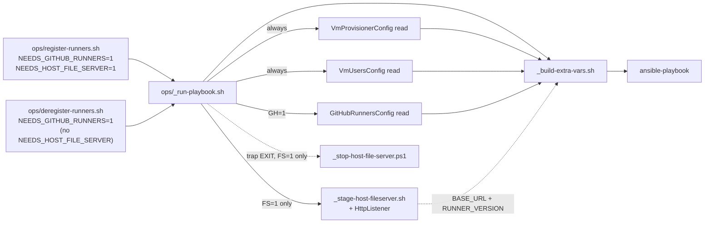
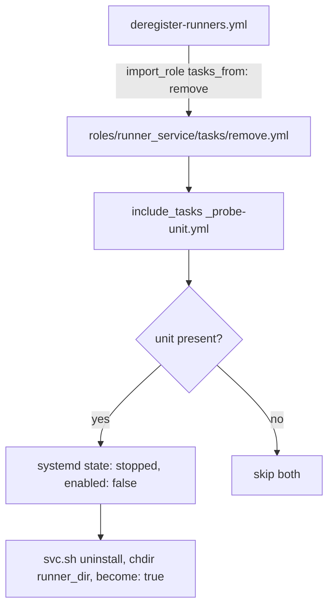
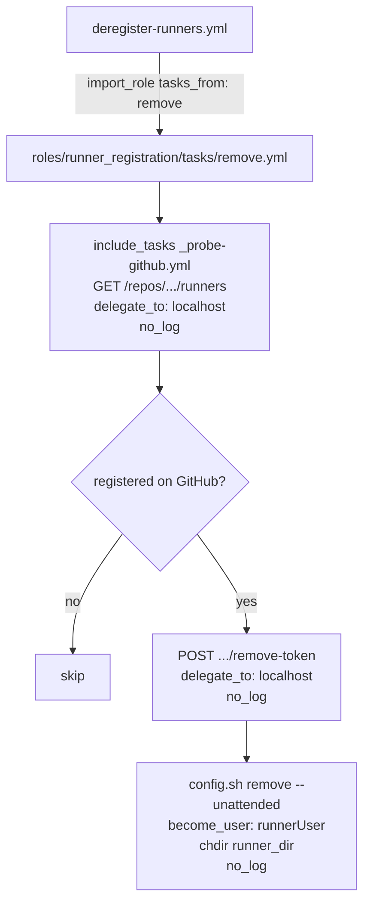
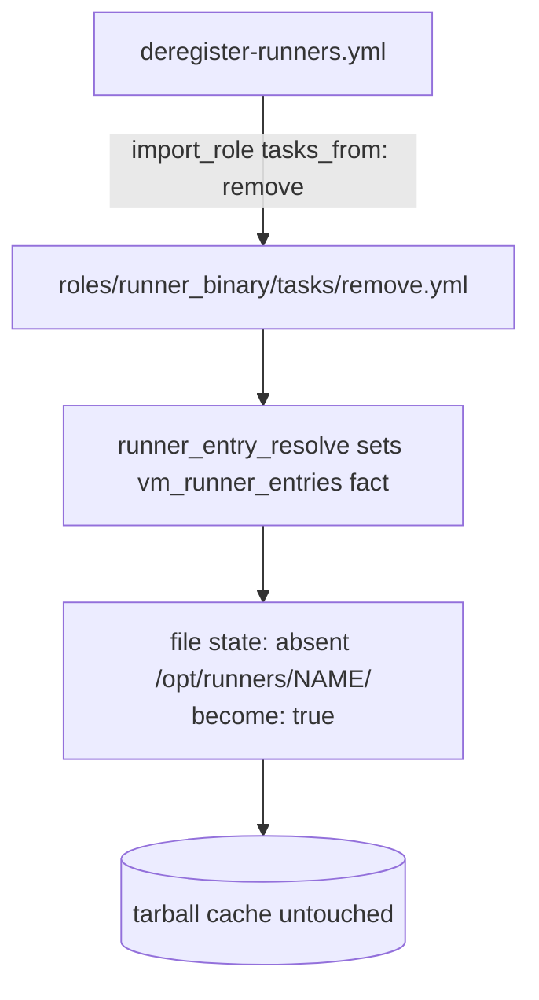
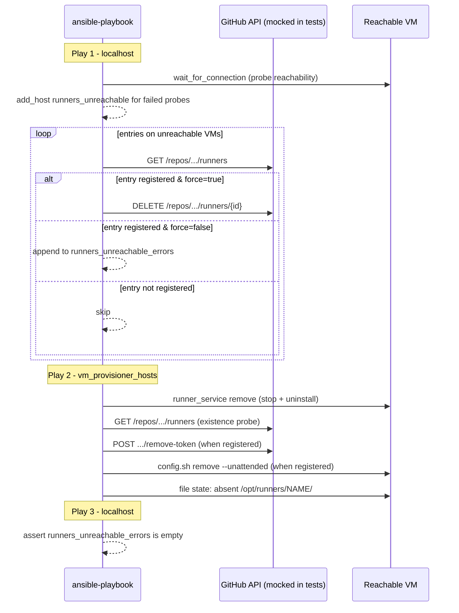
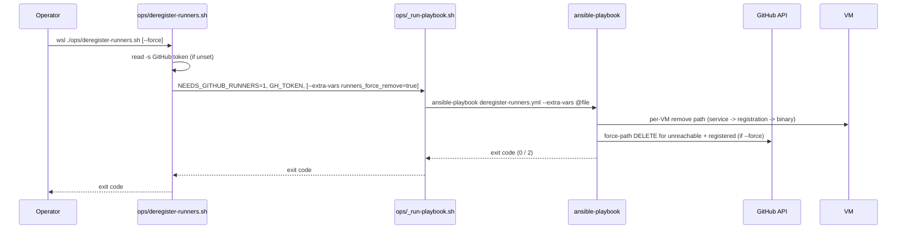
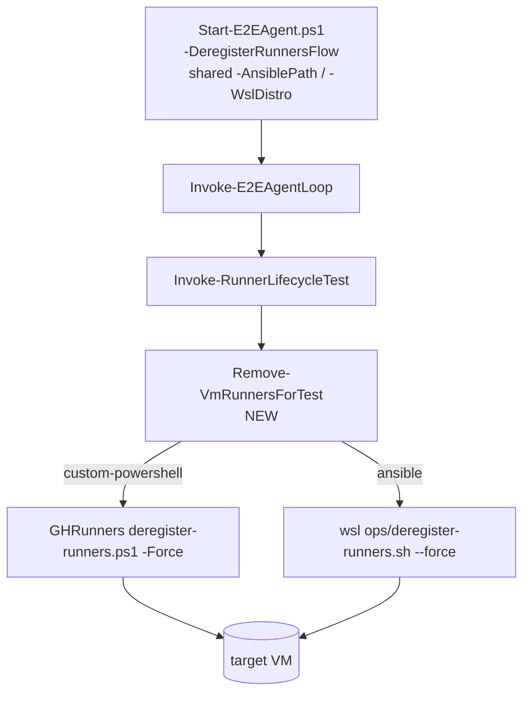
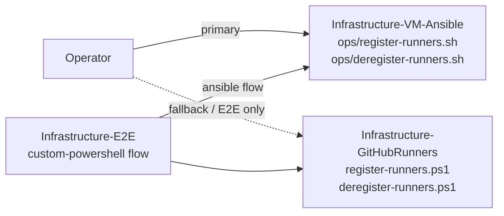

# Plan: Deregister Self-Hosted GitHub Actions Runners via Ansible

See [problem.md](problem.md) for context, role contracts, and rationale.

## Shape

Feature 08 left three roles (`runner_binary`, `runner_registration`,
`runner_service`) with a `tasks/main.yml` each that drives the register
direction. Feature 09 adds a sibling `tasks/remove.yml` per role. The new
`deregister-runners.yml` playbook imports each role with
`tasks_from: remove` in the reversed order
(`runner_service -> runner_registration -> runner_binary`). Two reasons
for the per-role split rather than a `state` parameter switch inside
`tasks/main.yml`:

- Each direction has its own glue (e.g. the controller-side force path
  in the remove direction, the tarball/file-server flow in the register
  direction) and its own test surface. Keeping them in separate files
  keeps each file small and grep-friendly.
- `import_role { name, tasks_from }` is a stock Ansible pattern; no
  custom dispatch needed.

This is the convention features 02 / 03 established for `groups` /
`users` / `sudoers` and that feature 08's plan explicitly promised
this feature would copy.

Per-role README sections gain a "Remove direction" subsection so the
contract for both directions lives next to the role. Top-level README
gains an `ops/deregister-runners.sh` line in the operator surface table
and a new "Deregister runners" section after "Register runners".

**Meta-dep posture.** Same as feature 03's resolution. Each role's
existing `meta/main.yml` keeps only its direction-neutral
`runner_entry_resolve` dep. No inter-role meta deps in either
direction: Ansible's meta dependencies always run the dep's
`tasks/main.yml` and ignore the entry role's `tasks_from` selector,
so `import_role { name: runner_service, tasks_from: remove }` with a
meta dep on `runner_registration` would silently re-run
`runner_registration/main.yml` first, re-registering the very runner
this play is trying to remove. The playbook is the single source of
truth for role order: `register-runners.yml` lists
`runner_binary -> runner_registration -> runner_service`;
`deregister-runners.yml` lists
`runner_service -> runner_registration -> runner_binary`. Role-level
molecule scenarios that exercise a remove path in isolation
`include_role` their prerequisites (the role's own `main.yml`) in
`prepare.yml`.

**Force-path layering.** The controller-side `DELETE .../runners/{id}`
fan-out for unreachable VMs lives on a `hosts: localhost` play in
`deregister-runners.yml`, not inside any role. Two reasons: (a) it has
no per-VM tasks — it iterates entries whose VMs already failed the
reachability probe — so a per-host role would have nothing to run on;
(b) the end-of-run assert that surfaces unreachable-with-registration
errors must run after every per-VM play, which is naturally a final
localhost play.

**Token flow.** Unchanged from feature 08. `github_token` arrives via
the bridge into the tmpfs extra-vars file; every uri / command task
that touches it is `no_log: true`. The host-file-server URL is **not**
threaded through on this path — the new `NEEDS_HOST_FILE_SERVER` gate
defaults to `0` and the deregister entry point leaves it unset.

Resolved open questions (problem.md / Solution approach + Bridge):

1. **Force toggle**: `runners_force_remove` extra-var, default `false`.
   `ops/deregister-runners.sh --force` flips it to `true`. Mirrors
   today's PowerShell `-Force` switch one-for-one.
2. **File-server skip**: `NEEDS_HOST_FILE_SERVER` env var, default
   `0` in `_run-playbook.sh`. The register entry point sets it to
   `1` (step 1); the deregister entry point leaves it unset.
3. **Unit-name probe reuse**: extract feature 08's probe into
   `roles/runner_service/tasks/_probe-unit.yml` and `include_tasks`
   from both `tasks/main.yml` and `tasks/remove.yml`. Lives in one
   file, avoids drift.
4. **Unreachable-VM posture**: not silently skipped on this path. The
   localhost pre-task per-entry decides force vs. error. Documented
   in problem.md / Entry point.

## Index

- [Step 1 - Bridge extension: file-server skip on the down path](#step-1---bridge-extension-file-server-skip-on-the-down-path)
- [Step 2 - Role: runner_service (remove direction)](#step-2---role-runner_service-remove-direction)
- [Step 3 - Role: runner_registration (remove direction)](#step-3---role-runner_registration-remove-direction)
- [Step 4 - Role: runner_binary (remove direction)](#step-4---role-runner_binary-remove-direction)
- [Step 5 - deregister-runners playbook with controller-side force path](#step-5---deregister-runners-playbook-with-controller-side-force-path)
- [Step 6 - Operator entry: ops/deregister-runners.sh + .bat](#step-6---operator-entry-opsderegister-runnerssh--bat)
- [Step 7 - E2E deregister-side fork](#step-7---e2e-deregister-side-fork)
- [Step 8 - Mark Infrastructure-GitHubRunners superseded](#step-8---mark-infrastructure-githubrunners-superseded)

---

## Step 1 - Bridge extension: file-server skip on the down path

**Reason:** The deregister flow needs `github_runners_config` +
`github_token` (already gated on `NEEDS_GITHUB_RUNNERS=1` by feature 08)
but **not** the host file server. Spawning an `HttpListener` for a
flow that fetches nothing wastes a port and adds a failure surface
(port-in-use, switch IP absent) the down path does not need. Landing
the gate first means every subsequent step can be exercised by an
entry point that explicitly opts out.

**Files**

- `ops/_run-playbook.sh` (modified) - wrap feature 08's
  `_stage-host-fileserver.sh` invocation in
  `if [[ "${NEEDS_HOST_FILE_SERVER:-0}" == "1" ]]; then ... fi`. The
  trap-EXIT cleanup is conditional on a `pid_captured` flag that the
  `if` block sets, so the EXIT handler is a no-op when the file server
  was never started. `NEEDS_HOST_FILE_SERVER` is independent of
  `NEEDS_GITHUB_RUNNERS`: register sets both, deregister sets only the
  latter. The `--host-base-url` and `--runner-version` args to
  `_build-extra-vars.sh` are also gated on `NEEDS_HOST_FILE_SERVER=1`
  so the extra-vars file genuinely omits `host_file_server_base_url`
  and `runner_version` on the down path (absence beats empty string).
- `ops/_build-extra-vars.sh` (modified) - the joint-required rule from
  feature 08 step 2 (all four runners flags together or none) is
  relaxed into two groups: `--runners-config` + `--github-token` must
  arrive together; `--host-base-url` + `--runner-version` must arrive
  together; the second pair is now optional even when the first pair
  is present. Rejecting partial flags within each group still applies.
- `ops/_build-extra-vars-runners.sh` (modified) - `--host-base-url`
  and `--runner-version` move from required to optional. When absent,
  the helper emits only `github_runners_config` + `github_token`;
  when both present, it also emits `host_file_server_base_url` +
  `runner_version`, same as today. The partial-subset error message
  still fires when one of the two is present without the other.
- `ops/register-runners.sh` (modified) - one-line addition:
  `export NEEDS_HOST_FILE_SERVER=1`. Existing
  `export NEEDS_GITHUB_RUNNERS=1` unchanged.
- `Tests/ops/_run-playbook.bats` (modified) - new cases:
  - `NEEDS_GITHUB_RUNNERS=1` + `NEEDS_HOST_FILE_SERVER` unset ->
    third vault read fires, `_stage-host-fileserver.sh` never invoked,
    extra-vars file contains `github_runners_config` + `github_token`
    but no `host_file_server_base_url` / `runner_version` keys.
  - `NEEDS_GITHUB_RUNNERS=1` + `NEEDS_HOST_FILE_SERVER=1` -> existing
    feature-08 behaviour, unchanged.
  - `NEEDS_HOST_FILE_SERVER=1` + `NEEDS_GITHUB_RUNNERS` unset ->
    rejected with a clear message (the file server has no purpose
    without the runners config).
  - EXIT trap on the down path is a no-op (stop helper never
    invoked).
- `Tests/ops/_build-extra-vars.bats` (modified) - new cases for the
  relaxed joint-required rule:
  - `--runners-config` + `--github-token` present, neither
    `--host-base-url` nor `--runner-version` -> accepted; emitted JSON
    has exactly `github_runners_config` + `github_token` from the
    runners helper.
  - `--runners-config` + `--github-token` + `--host-base-url` without
    `--runner-version` -> rejected.
  - `--runners-config` + `--github-token` + `--runner-version` without
    `--host-base-url` -> rejected.
- `Tests/ops/_build-extra-vars-runners.bats` (modified) - new cases
  for optional file-server-pair: emits two keys when absent, four keys
  when both present, error when one is present without the other.

**Behaviour (sketch, _run-playbook.sh)**

```bash
# ... existing vault reads + NEEDS_GITHUB_RUNNERS block ...

pid_captured=0
if [[ "${NEEDS_HOST_FILE_SERVER:-0}" == "1" ]]; then
  [[ "${NEEDS_GITHUB_RUNNERS:-0}" == "1" ]] || {
    echo "_run-playbook.sh: NEEDS_HOST_FILE_SERVER=1 requires NEEDS_GITHUB_RUNNERS=1" >&2
    exit 2
  }

  staging_out=$("$script_dir/_stage-host-fileserver.sh" \
      --provisioner-config "$tmp/provisioner.json" \
      --github-token       "$GH_TOKEN" \
      --listener-log       "$tmp/fileserver.out")
  runner_version=$(awk -F= '/^RUNNER_VERSION=/ { print $2 }' <<<"$staging_out")
  base_url=$(awk -F= '/^BASE_URL=/         { print $2 }' <<<"$staging_out")
  listener_pid=$(awk -F= '/^PID=/          { print $2 }' <<<"$staging_out")
  pid_captured=1

  extra_vars_args+=( --host-base-url "$base_url"
                     --runner-version "$runner_version" )
fi

cleanup() {
  if (( pid_captured )); then
    pwsh.exe -File "$script_dir/_stop-host-file-server.ps1" -ProcessId "$listener_pid" || true
  fi
  rm -rf "$tmp"
}
trap cleanup EXIT
```

**Tests (bats)**

- See `Tests/ops/` files above.

**Diagram**



---

## Step 2 - Role: runner_service (remove direction)

**Reason:** First of the three remove paths. Stops the systemd unit and
uninstalls it. Lands first because the deregister playbook runs roles in
`runner_service -> runner_registration -> runner_binary` order: a
running runner process can hold `.credentials` open and race
`config.sh remove`, so the unit must be quiesced before the registration
step touches anything. Also the smallest of the three; establishes the
`tasks/remove.yml` convention the next two steps copy.

**Files**

- `roles/runner_service/tasks/_probe-unit.yml` (new) - the unit-name
  probe extracted from `tasks/main.yml`. One `ansible.builtin.shell`
  per entry, `set -o pipefail; { systemctl list-unit-files
  --type=service --no-pager --no-legend
  'actions.runner.*{{ item.runnerName }}.service' || true; } | awk
  'NR==1 { print $1; exit }'`, `args: { executable: /bin/bash }`,
  `changed_when: false`, `register: runner_service_unit_probes`.
  Three shell-shape constraints the body has to satisfy:
  - `executable: /bin/bash`. `/bin/sh` on Debian / Ubuntu is `dash`,
    which does not understand `set -o pipefail` and would syntax-error.
  - `awk 'NR==1 { print $1; exit }'` instead of `awk '{print $1}' |
    head -n1`. `head` closes its stdin after one line; under pipefail
    that propagates SIGPIPE rc=141 from the upstream `systemctl`.
    The pure-awk form has the same first-line semantics without the
    pipe-close.
  - `{ systemctl ... || true; }`. Modern systemd returns rc=1 when
    the glob matches no unit files - the legitimate "this entry is
    not installed" path both directions consume. `|| true` collapses
    that into rc=0 + empty stdout; pipefail still catches a genuine
    awk failure.
  - All continuation lines stay at the base indent of the folded
    scalar (`>-`). More-indented continuation lines are preserved
    verbatim under YAML folding semantics, which the bash `-c`
    parser then sees as real line breaks and fails on (the second
    `--type=service` token is parsed as a fresh command).

  The role-prefixed register name is what ansible-lint's
  `var-naming[no-role-prefix]` enforces under the production profile
  (and matches the existing `runner_service_unit_probes_after` name
  the role's main.yml used pre-extraction). Loops over
  `vm_runner_entries`. Both directions and both call sites within the
  register direction `include_tasks` this file; the shared register
  overwrites between calls, so the install branch consumes the
  pre-install snapshot before the re-probe overwrites it.
- `roles/runner_service/tasks/main.yml` (modified) - replace both
  inline probe sites with `include_tasks: _probe-unit.yml`. Downstream
  consumers read the single `runner_service_unit_probes` register
  (post-install snapshot for the systemd / is-active tasks; pre-install
  snapshot for the install branch, which sits between the two
  includes). No external behaviour change.
- `roles/runner_service/tasks/remove.yml` (new) - remove direction.
  Per entry:
  1. `include_tasks: _probe-unit.yml` -> populates
     `runner_service_unit_probes`.
  2. **Stop branch** — `ansible.builtin.systemd` with
     `name: "{{ item.stdout | trim }}"`, `state: stopped`,
     `enabled: false`, `become: true`. Looped over
     `runner_service_unit_probes.results`, guarded by
     `when: (item.stdout | trim) | length > 0`. Already-stopped /
     already-disabled is a no-op via stock module idempotence.
  3. **Uninstall branch** — `ansible.builtin.command` with
     `cmd: "./svc.sh uninstall"`,
     `chdir: "/opt/runners/{{ item.item.runnerName }}"`, `become:
     true`. Same `length > 0` guard. svc.sh resolves the runner root
     via `$(pwd)`, so `chdir` is the contract — same as feature 08's
     install branch. No inline `sudo` because `become: true` already
     provides root; the install branch in main.yml mirrors this shape.
- `roles/runner_service/README.md` (modified) - add a **Remove
  direction** subsection documenting the new `tasks_from: remove`
  entry point: inputs (`vm_runner_entries`), behaviour (probe ->
  stop -> uninstall), idempotence (absent unit / inactive service
  is a silent no-op).
- `Tests/molecule/runner_service/remove/Dockerfile` (new) and
  `Tests/molecule/runner_service/default/Dockerfile` (new) - shared-shape
  systemd-in-docker image. The bare `docker.io/library/ubuntu:24.04`
  base image no longer ships systemd or any `/sbin/init` binary, so
  `command: /sbin/init` against the bare base fails at container
  create with `stat /sbin/init: no such file or directory` before
  molecule's prepare step gets a chance to apt-install anything.
  The Dockerfile layers `systemd + systemd-sysv + sudo + python3` on
  top of the base (the bare image also ships without python3 under
  `--no-install-recommends`, which Ansible needs for the AnsiballZ
  Python interpreter). `STOPSIGNAL SIGRTMIN+3` is the systemd-as-PID-1
  contract for clean shutdown. Build once via
  `docker build -t infrastructure-vm-ansible/runner-service-systemd:24.04
  -f Tests/molecule/runner_service/<scenario>/Dockerfile <ctx>`; the
  scenarios consume the tag via `pre_build_image: true`, bypassing
  the `community.docker.docker_image` build path which on this
  workstation tries the Docker Desktop Windows-side credential helper
  and fails inside WSL with `OSError: [Errno 8] Exec format error:
  '/usr/bin/docker-credential-desktop.exe'`.
- `Tests/molecule/runner_service/default/molecule.yml` (modified) -
  switch the platform image to the pre-built tag (same shape as the
  remove scenario), move `roles_path` from
  `config_options.defaults.roles_path` to
  `provisioner.env.ANSIBLE_ROLES_PATH:
  "${MOLECULE_PROJECT_DIRECTORY}/../../../roles"`. The ansible.cfg
  relative `roles_path:` is resolved against the directory the cfg
  lives in - molecule writes that under `/home/<user>/.ansible/tmp/
  molecule.<id>.<scenario>/`, so the relative path bottoms out under
  `/home`, never under the repo. The env-var form respects
  `MOLECULE_PROJECT_DIRECTORY` (the molecule cwd, anchored at the
  role's `Tests/molecule/<role>/` dir by the `wsl-task` wrapper),
  three levels up is the repo root, then `roles/` is the standard
  path. Default-scenario `prepare.yml` also drops the
  `apt install sudo + systemd` task (both are now baked into the
  image).
- `Tests/molecule/runner_service/remove/` (new) - dedicated scenario,
  same `molecule.yml` shape as the default scenario (pre-built image
  tag, env-var `ANSIBLE_ROLES_PATH`, privileged + cgroup + tmpfs).
  `prepare.yml` seeds three runner directories with a stub `svc.sh`
  that implements both `install` (mirrored from the default scenario)
  and `uninstall` (unconditional + idempotent: `systemctl disable
  '${unit}' 2>/dev/null || true; rm -f '/etc/systemd/system/${unit}';
  systemctl daemon-reload`). Unconditional because the obvious guard
  form (`if systemctl list-unit-files ... | awk 'NF{exit 0}
  END{exit 1}'`) has an awk-semantics trap - the main block's
  `exit 0` still runs the END block, so the END's `exit 1` overrides
  and the guard is always false. The three entries cover the three
  teardown branches:
  - `runner-active` - unit pre-installed and started -> stop
    transitions inactive, uninstall removes the file.
  - `runner-stopped` - unit pre-installed, never started -> stop is
    a no-op, uninstall removes the file.
  - `runner-absent` - probe stdout empty -> both branches skip.
  A fourth entry (`runner-leak`, `vmName: other-host`) covers the
  selector-negative case symmetric to the default scenario.
  Converge invokes the role via `include_role` with
  `tasks_from: remove` - not `import_role`: `import_role` resolves at
  parse-time against the syntax-check inventory's roles search path,
  which does not honour molecule's relative `roles_path` override,
  so the syntax step fails before converge runs. `include_role`
  defers resolution to runtime when the override is in effect.
  The default scenario uses `include_role` for the same reason; the
  deregister playbook (step 5) uses `import_role` because it runs
  against the real repo layout where `roles/` sits on the standard
  search path. Verify asserts:
  - both previously-installed unit files are absent under
    `/etc/systemd/system`,
  - `systemctl is-active` returns a non-active state for both (the
    is-active task itself uses `failed_when: false` because is-active
    against an absent unit returns rc=3),
  - `runner-absent` never produced a unit file,
  - the leak entry's unit did not land on `instance`,
  - `systemctl list-unit-files 'actions.runner.*'` returns zero
    matches after the remove (the task itself uses `failed_when:
    false` for the same systemd-no-match-returns-rc=1 reason the
    probe handles via `|| true`).
  Lives outside `Tests/roles/` for the same reason as the existing
  register scenarios (ansible-lint's `var-naming[no-role-prefix]`
  would otherwise scan verify.yml).

**Image build (one-shot, scenario prerequisite)**

```bash
docker build \
    -t infrastructure-vm-ansible/runner-service-systemd:24.04 \
    -f Tests/molecule/runner_service/default/Dockerfile \
    Tests/molecule/runner_service/default
```

The remove scenario's `Dockerfile` produces the same image; either
context works. The tag is shared across both scenarios so a single
build serves the inner loop for both.

**Behaviour (sketch)**

```yaml
- name: Probe for the systemd unit file (per runner)
  ansible.builtin.include_tasks: _probe-unit.yml

- name: Stop and disable the runner service
  ansible.builtin.systemd:
    name:    "{{ item.stdout | trim }}"
    state:   stopped
    enabled: false
  become: true
  loop: "{{ runner_service_unit_probes.results }}"
  loop_control:
    label: "{{ item.item.runnerName }}"
  when: (item.stdout | trim) | length > 0

- name: Uninstall the runner systemd unit
  ansible.builtin.command:
    cmd:   "./svc.sh uninstall"
    chdir: "/opt/runners/{{ item.item.runnerName }}"
  become: true
  loop: "{{ runner_service_unit_probes.results }}"
  loop_control:
    label: "{{ item.item.runnerName }}"
  when: (item.stdout | trim) | length > 0
  changed_when: true
```

**Tests (Molecule)**

- Empty `vm_runner_entries` -> no tasks, no errors.
- One entry, unit present + active -> stop + uninstall; final state
  is `list-unit-files` returns no match for that runner name.
- One entry, unit present + inactive -> stop is no-op; uninstall
  runs.
- One entry, unit absent (probe stdout empty) -> both tasks skip
  cleanly.
- Two entries, both present -> two stop tasks, two uninstall tasks,
  both end with no matching unit file.
- Re-converge -> probe returns empty, both task groups skip,
  `changed: 0`.

**Diagram**



---

## Step 3 - Role: runner_registration (remove direction)

**Reason:** Mid of three. Owns all token hygiene for the down path —
every task here is `no_log: true`. Has the only branching logic in the
deregister flow (registered-on-GitHub vs not) because the local marker
files are owned by the next role. Lands after `runner_service` so the
unit is already stopped before `config.sh remove` touches credentials.

**Files**

- `roles/runner_registration/tasks/remove.yml` (new) - remove direction.
  Per entry, structured as a per-entry `include_tasks` so the existence
  fact stays scoped:
  1. **Existence probe** — `ansible.builtin.uri`, `delegate_to:
     localhost`, `GET https://api.github.com/repos/{{ owner }}/{{ repo
     }}/actions/runners?per_page=100`. Auth via `Authorization: token
     {{ github_token }}` in `headers`. `no_log: true`. Parse JSON, set
     fact `runner_registered_on_github` per entry. Identical task to
     the existence probe in `tasks/main.yml` — extracted into
     `tasks/_probe-github.yml` and `include_tasks`'d from both files
     to keep the probe in one place.
  2. **Skip branch** — entry not on GitHub -> the rest of the role is
     a no-op for that entry. Local marker files (`.runner`,
     `.credentials`) are cleared by `runner_binary`'s remove
     direction when it deletes the runner dir, so this role does not
     need a "remove local credentials but not GitHub" branch.
  3. **Removal-token mint** — only when registered. `ansible.builtin.uri`,
     `delegate_to: localhost`, `POST .../actions/runners/remove-token`.
     `no_log: true`. Fact `runner_removal_token`. Removal token
     expires in 1 hour — minted immediately before use, matching
     today's PowerShell behaviour.
  4. **config.sh remove** — `ansible.builtin.command` with argv-style
     `cmd: ['./config.sh', 'remove', '--token', '{{ runner_removal_token }}',
     '--unattended']` and `chdir: "/opt/runners/{{ item.runnerName }}"`,
     `become: true`, `become_user: "{{ item.runnerUsername }}"`. Argv
     (not shell-string) so the token never lands in a shell history
     or in any quoting boundary. `no_log: true`.
- `roles/runner_registration/tasks/_probe-github.yml` (new) - the
  existence probe extracted from `tasks/main.yml`. Same task body,
  same fact name. Both directions `include_tasks` this file.
- `roles/runner_registration/tasks/main.yml` (modified) - replace
  the inline existence probe with `include_tasks: _probe-github.yml`.
  No behaviour change.
- `roles/runner_registration/README.md` (modified) - add a **Remove
  direction** subsection documenting the two-branch shape (skip when
  GitHub-side absent; mint removal token + config.sh remove when
  present), the `no_log` posture, and the "local marker files are
  owned by runner_binary's remove direction" note.
- `Tests/molecule/runner_registration/remove/` (new) - dedicated
  scenario with a mocked GitHub API. `prepare.yml` stands up a tiny
  python HTTP server returning canned JSON for `GET /runners` and
  `POST /remove-token`, seeds two pre-configured runners on the
  target (one whose name is in the mock's registered list, one whose
  name is not). Converge invokes the role with `tasks_from: remove`.
  Verify asserts the mock server's request log shows:
  - one GET to `/runners` (for the host),
  - one POST to `/remove-token` (only for the registered runner),
  - one `config.sh remove` invocation on the VM (only for the
    registered runner),
  - no `/remove-token` POST or `config.sh remove` for the
    not-registered runner.

**Behaviour (sketch)**

```yaml
- name: Probe GitHub for existing runner registrations
  ansible.builtin.include_tasks: _probe-github.yml

- name: Deregister runners that are still on GitHub
  ansible.builtin.include_tasks: _remove-one.yml
  loop: "{{ vm_runner_entries }}"
  loop_control:
    label: "{{ item.runnerName }}"
  when: runner_registered_on_github[item.runnerName] | default(false)
```

`_remove-one.yml` (mints the removal token + runs `config.sh remove`):

```yaml
- name: Mint a short-lived removal token
  ansible.builtin.uri:
    url: >-
      https://api.github.com/repos/{{ item.githubUrl
      | regex_search('github.com/([^/]+/[^/]+)', '\\1') | first
      }}/actions/runners/remove-token
    method: POST
    headers:
      Authorization: "token {{ github_token }}"
      Accept:        "application/vnd.github+json"
    status_code: 201
    return_content: true
  delegate_to: localhost
  register: remove_token_resp
  no_log: true

- name: Run config.sh remove as the runner service user
  ansible.builtin.command:
    argv:
      - "./config.sh"
      - "remove"
      - "--token"
      - "{{ remove_token_resp.json.token }}"
      - "--unattended"
    chdir: "/opt/runners/{{ item.runnerName }}"
  become: true
  become_user: "{{ item.runnerUsername }}"
  no_log: true
```

**Tests (Molecule)**

- Entry registered on GitHub -> remove token minted, `config.sh
  remove --unattended` runs with the token argument the mock
  generated. Token does not appear in stdout even at `-vvv`.
- Entry not registered on GitHub -> neither the remove-token POST
  nor the `config.sh remove` task runs.
- Two entries on the same VM, one registered + one not -> exactly
  one of each token mint + config.sh remove fires.
- A play run with `-vvv` -> token values do not appear in stdout
  (asserted by grep against the captured log).
- Mock returns 404 for `GET /runners` (repo / token mismatch) ->
  role surfaces a clear error rather than silently treating every
  entry as not-registered.
- Mock returns 401 for `POST /remove-token` -> role surfaces a
  token-shaped hint.

**Diagram**



---

## Step 4 - Role: runner_binary (remove direction)

**Reason:** Last of the three remove paths. Pure filesystem: deletes
`/opt/runners/<name>/`. Lands last because the previous two roles need
the directory to still exist (`svc.sh` invokes `./svc.sh` from inside
it; `config.sh remove` reads `.credentials` from it). Smallest of the
three remove paths.

**Files**

- `roles/runner_binary/tasks/remove.yml` (new) - remove direction.
  One `ansible.builtin.file` task with `state: absent`, `path:
  "/opt/runners/{{ item.runnerName }}"`, `become: true`, looping
  over `vm_runner_entries`. Absent directory is not an error (stock
  module behaviour). The tarball cache at `~/cache/actions-runner-*`
  is intentionally **not** removed — it is shared across runners on
  the same VM and the next register run reuses it.
- `roles/runner_binary/README.md` (modified) - add a **Remove
  direction** subsection documenting:
  - inputs (`vm_runner_entries`),
  - what is removed (`/opt/runners/<name>/`),
  - what is **not** removed (the tarball cache, the
    `runnerUsername` home directory, the runner service user
    account — the last is owned by `users`/`groups` removal in
    feature 03),
  - idempotence (re-running on an absent dir is a no-op).
- `Tests/molecule/runner_binary/remove/` (new) - dedicated scenario.
  `prepare.yml` runs the role's `tasks/main.yml` against a seeded
  tarball (same setup as feature 08's register scenario) so a real
  `/opt/runners/<name>/` exists. Converge invokes the role with
  `tasks_from: remove`. Verify asserts:
  - `/opt/runners/<name>/` is absent,
  - the tarball cache at `/home/<runnerUser>/cache/actions-runner-...tar.gz`
    is still present (the explicit "do not touch the cache"
    contract),
  - re-converge reports `changed: 0`.

**Behaviour (sketch)**

```yaml
- name: Remove the per-runner extract directory
  ansible.builtin.file:
    path:  "/opt/runners/{{ item.runnerName }}"
    state: absent
  become: true
  loop: "{{ vm_runner_entries }}"
  loop_control:
    label: "{{ item.runnerName }}"
```

**Tests (Molecule)**

- One entry, dir present -> dir absent after converge; tarball
  cache still present.
- One entry, dir already absent -> no error, `changed: 0`.
- Two entries on the same VM, both dirs present -> both removed,
  cache still present.
- Re-converge -> `changed: 0`.

**Diagram**



---

## Step 5 - deregister-runners playbook with controller-side force path

**Reason:** Wires the three remove paths into a playbook and adds the
controller-side force path for unreachable VMs (the one piece of glue
that has no role-level home). After this step the deregister flow is
end-to-end runnable; only the operator entry script (step 6) remains.

**Files**

- `playbooks/deregister-runners.yml` (new) - three plays:
  1. **`hosts: localhost`** (reachability split + force fan-out):
     - `ansible.builtin.wait_for_connection` per VM via a
       `delegate_to: "{{ item.vmName }}"` loop, `timeout: 10`,
       `failed_when: false`, `register: reachability`. Hosts whose
       probe failed are added to a `runners_unreachable` group via
       `add_host`.
     - For each entry whose `vmName` is in `runners_unreachable`,
       `include_tasks: _handle-unreachable-entry.yml` (single source
       of the GET runners + force-or-error switch).
     - The included file mints the existence check
       (`include_tasks: roles/runner_registration/tasks/_probe-github.yml`
       on `localhost`, so the same probe code runs in both contexts).
       When the entry is on GitHub:
       - if `runners_force_remove | default(false)` is true ->
         `ansible.builtin.uri` `DELETE
         .../runners/{{ runner_id }}`, `status_code: [200, 204, 404]`,
         `no_log: true`.
       - else -> append `"{{ entry.vmName }}/{{ entry.runnerName }}"`
         to a `runners_unreachable_errors` list via `set_fact`.
       When the entry is not on GitHub -> skip silently.
  2. **`hosts: vm_provisioner_hosts`** (per-VM remove path):
     - `any_errors_fatal: false`.
     - Three `ansible.builtin.import_role` calls in order, each with
       `tasks_from: remove` and a `tags:` matching the role name:
       `runner_service`, then `runner_registration`, then
       `runner_binary`.
  3. **`hosts: localhost`** (end-of-run assert):
     - `ansible.builtin.assert`:
       `that: runners_unreachable_errors | default([]) | length == 0`,
       `fail_msg: "Unreachable VMs still have GitHub-registered
       runners: {{ runners_unreachable_errors | join(', ') }}.
       Re-run with --force to remove them via the GitHub API, or
       repair the VMs."`. Surfaces the accumulated errors as a single
       non-zero exit code. Preserves today's "process reachable first,
       surface unreachable-with-registration as one exit 1" contract.
- `playbooks/_handle-unreachable-entry.yml` (new) - included by
  play 1 to keep the per-entry branching legible. Sets host-scoped
  facts inside `set_fact` so a partial run is debuggable via
  `--diff`.
- `roles/runner_registration/tasks/_probe-github.yml` (extended
  from step 3) - already lives in step 3; no further change needed.
  Reused by play 1 with the per-entry `owner` / `repo` derived from
  `item.githubUrl`.
- `Tests/ansible/test-deregister-runners-playbook.yml` (new) - a
  controller-only smoke playbook with a stub inventory of one
  reachable + one unreachable host, run via
  `ansible-playbook --check --diff` in CI to assert:
  - the three plays are in the right order,
  - the assert fires when `runners_force_remove=false` and the mock
    GitHub API returns the unreachable runner as registered,
  - the assert passes when `runners_force_remove=true` (the DELETE
    task runs and the unreachable_errors list stays empty),
  - the per-VM play is tagged so `--tags runner_binary` etc.
    isolate it.
  Mock GitHub responses are served by a tiny localhost HTTP stub
  (same pattern as the molecule registration scenario, lifted into
  the test playbook).
- `README.md` (modified) - mention the new playbook under the
  "Playbooks" section. Operator-facing documentation lives in
  step 6.

**Behaviour (sketch, play 1)**

```yaml
- name: Reachability split and controller-side force fan-out
  hosts: localhost
  connection: local
  gather_facts: false
  vars:
    runners_unreachable_errors: []
  tasks:
    - name: Probe reachability of each VM
      ansible.builtin.wait_for_connection:
        timeout: 10
      delegate_to: "{{ item.vmName }}"
      loop: "{{ github_runners_config | map(attribute='vmName') | unique | list }}"
      loop_control:
        label: "{{ item.vmName }}"
      register: reachability
      failed_when: false

    - name: Mark unreachable VMs
      ansible.builtin.add_host:
        name:   "{{ item.item.vmName }}"
        groups: runners_unreachable
      loop: "{{ reachability.results }}"
      loop_control:
        label: "{{ item.item.vmName }}"
      when: item.failed | default(false)
      changed_when: false

    - name: Decide force-or-error for each entry on an unreachable VM
      ansible.builtin.include_tasks: _handle-unreachable-entry.yml
      loop: "{{ github_runners_config }}"
      loop_control:
        label: "{{ entry.vmName }}/{{ entry.runnerName }}"
        loop_var: entry
      when: entry.vmName in groups['runners_unreachable'] | default([])
```

**Behaviour (sketch, play 2 — per-VM)**

```yaml
- name: Deregister self-hosted GitHub Actions runners on provisioned VMs
  hosts: vm_provisioner_hosts
  gather_facts: true
  any_errors_fatal: false
  tasks:
    - ansible.builtin.import_role:
        name: runner_service
        tasks_from: remove
      tags: runner_service

    - ansible.builtin.import_role:
        name: runner_registration
        tasks_from: remove
      tags: runner_registration

    - ansible.builtin.import_role:
        name: runner_binary
        tasks_from: remove
      tags: runner_binary
```

**Tests (Ansible check-mode playbook + Pester for any PS helpers)**

- See `Tests/ansible/test-deregister-runners-playbook.yml` above.
  Mocked GitHub stub asserts the DELETE is called in force mode and
  the assert fires in normal mode.

**Diagram**



---

## Step 6 - Operator entry: ops/deregister-runners.sh + .bat

**Reason:** Single command for operators to invoke the playbook. Mirrors
`ops/register-runners.sh` shape verbatim except for the `--force` flag
and the absence of `NEEDS_HOST_FILE_SERVER=1`.

**Files**

- `ops/deregister-runners.sh` (new) - bash entry. Accepts `--force`
  as its only owned flag (forwarded to ansible-playbook as
  `--extra-vars runners_force_remove=true`); every other arg is
  forwarded verbatim. Prompts for `GH_TOKEN` via `read -rsp` when
  unset; exports it. Sets `NEEDS_GITHUB_RUNNERS=1`; does **not** set
  `NEEDS_HOST_FILE_SERVER`. `exec`s `./ops/_run-playbook.sh
  playbooks/deregister-runners.yml "${forwarded[@]}"`.
- `ops/deregister-runners.bat` (new) - Explorer launcher; resolves
  Git Bash via `GitHub-Common/scripts/_find-bash.bat`, then `exec`s
  `ops/deregister-runners.sh`. A `--force` arg passed at invocation
  is forwarded verbatim. Mirrors `ops/register-runners.bat`.
- `README.md` (modified) - new section "Deregister runners" after
  "Register runners", same shape as the existing register section:
  one-line command (`wsl ./ops/deregister-runners.sh`), `.bat`
  equivalent, the operator-knob list (`--force`, `--tags`,
  `--limit`, `--check`, `-v`), and the two contracts worth
  highlighting (force path runs controller-side via the GitHub
  REST API; token never stored).
- `Tests/ops/deregister-runners.bats` (new) - per-script:
  - `GH_TOKEN` already set -> no prompt; bridge invoked with
    `NEEDS_GITHUB_RUNNERS=1`, no `NEEDS_HOST_FILE_SERVER`, no
    `runners_force_remove` extra-var.
  - `GH_TOKEN` unset, prompt accepts a value -> bridge invoked with
    the value as `GH_TOKEN`.
  - `GH_TOKEN` unset, prompt rejected (empty) -> exit code 2,
    bridge never invoked.
  - `--force` consumed by the wrapper, translated to
    `--extra-vars runners_force_remove=true`, not forwarded
    verbatim as `--force` (ansible-playbook does not have a
    `--force` flag).
  - Other args (`--tags runner_binary`, `--check`, `-v`) forwarded
    verbatim.
  - `--force` plus extra args -> both `runners_force_remove=true`
    and the extra args appear on the bridge invocation line.

**Behaviour (sketch)**

```bash
#!/usr/bin/env bash
set -euo pipefail

force=0
forwarded=()
while (( $# )); do
  case "$1" in
    --force) force=1 ;;
    *)       forwarded+=( "$1" ) ;;
  esac
  shift
done

if [[ -z "${GH_TOKEN:-}" ]]; then
  read -rsp 'GitHub token: ' GH_TOKEN
  echo
  [[ -n "$GH_TOKEN" ]] || { echo 'GitHub token required' >&2; exit 2; }
fi
export GH_TOKEN
export NEEDS_GITHUB_RUNNERS=1

if (( force )); then
  forwarded+=( --extra-vars 'runners_force_remove=true' )
fi

exec "$(dirname "$0")/_run-playbook.sh" \
    playbooks/deregister-runners.yml "${forwarded[@]}"
```

**Tests (bats)**

- See `Tests/ops/deregister-runners.bats` above.

**Diagram**



---

## Step 7 - E2E deregister-side fork

**Reason:** Symmetric counterpart to feature 03's `Remove-VmUsersForTest`
and feature 08's `Set-VmRunnersForTest`. Until this step lands the
runner-lifecycle E2E test still drives the PowerShell
`deregister-runners.ps1` directly even when the register half ran
through Ansible — the Ansible deregister path would have no merge gate.
Landing this step puts the Ansible deregister flow behind the same gate
the register / create-users / remove-users flows already have.

**Decisions locked**

- **Flow names mirror feature 08.** `custom-powershell` and `ansible`.
  Same `ValidateSet` shape as `Set-VmRunnersForTest`.
- **Default flow stays `custom-powershell` for one full release cycle**
  for the same reason feature 08 documented. Operators (and CI) opt
  into the Ansible deregister path with `-DeregisterRunnersFlow ansible`
  explicitly until then.
- **Parameter chain shared with the register dispatcher.** No new
  `-AnsiblePath` / `-WslDistro` — they were added by feature 08 step 7
  for the register side and the same Infrastructure-VM-Ansible
  checkout / WSL distro serves the deregister flow.
- **`Infrastructure-GitHubRunners` is not modified by this feature.**
  Mirrors feature 08's posture
  ([[feedback_dont_mutate_repos_being_archived]]).
- **One layer, two flows.** Dispatcher `Remove-VmRunnersForTest`,
  named symmetrically with `Set-VmRunnersForTest`.
- **Token + force handover.** The E2E agent passes the GitHub PAT to
  the `wsl` invocation as `GH_TOKEN=...` in env, matching feature 08.
  The dispatcher always passes `--force` because E2E tears down its
  ephemeral VMs at end of test and the registration must be cleared
  regardless of whether the VM survived to be SSHed.

**Files (in Infrastructure-E2E)**

- `agent/e2e/runner-lifecycle/Remove-VmRunnersForTest.ps1` (new) -
  dispatcher placed next to `Set-VmRunnersForTest.ps1`. Parameters
  mirror `Set-VmRunnersForTest`: `-DeregisterRunnersFlow`
  (`custom-powershell` / `ansible`), `-RunnersPath`, `-AnsiblePath`,
  `-WslDistro`, `-Token`, `-SecretSuffix`, `-VmDef`, `-Entry`.
  Switches on `-DeregisterRunnersFlow`:
  - `custom-powershell` -> `& "$RunnersPath\hyper-v\ubuntu\deregister-runners.ps1"
    -Token $Token -SecretSuffix $SecretSuffix -Force`. Same arg shape
    the test uses today; `-Force` is unconditional because the E2E
    VM is ephemeral.
  - `ansible` -> `Push-Location $AnsiblePath`; `$env:GH_TOKEN = $Token`;
    `& wsl -d $WslDistro -- ./ops/deregister-runners.sh --force 2>&1 | Out-Host`.
    Anchored cwd, native-stdout `Out-Host`
    ([[feedback_ps_subexpr_swallows_native_output]]),
    propagated `$LASTEXITCODE`. `Remove-Item Env:GH_TOKEN` in
    `finally` so the token never lingers in the agent process env.
- `agent/e2e/runner-lifecycle/Invoke-RunnerLifecycleTest.ps1`
  (modified) - dot-source the new dispatcher; replace the existing
  inline `deregister-runners.ps1` call with
  `Remove-VmRunnersForTest -DeregisterRunnersFlow $Config.DeregisterRunnersFlow ...`.
  No signature change on `Invoke-RunnerLifecycleTest`.
- `agent/Start-E2EAgent.ps1` (modified) - one new parameter,
  `-DeregisterRunnersFlow` (`ValidateSet('custom-powershell','ansible')`,
  default `custom-powershell`). `-AnsiblePath` and `-WslDistro`
  reused from features 02 / 08. The fail-fast check extended to fire
  when any of `UsersFlow=ansible`, `RunnersFlow=ansible`, or
  `DeregisterRunnersFlow=ansible`. The `DeregisterRunnersFlow` value
  is read from the `E2EConfig` vault payload (optional key, guarded
  property access) and propagated into `$Config`.
- `Tests/Remove-VmRunnersForTest.Tests.ps1` (new, Pester) - mirrors
  `Set-VmRunnersForTest.Tests.ps1`. Cases:
  - `DeregisterRunnersFlow=custom-powershell` -> PS script invoked
    with `-Force`; `wsl` never called; non-zero exit -> throws.
  - `DeregisterRunnersFlow=ansible` with both paths + distro ->
    `wsl -d` invoked from `$AnsiblePath` cwd with `GH_TOKEN` in env
    and the `--force` arg; PS script never called.
  - Two cases pin the env-cleanup contract: `GH_TOKEN` cleared after
    success; `GH_TOKEN` cleared even when the bridge throws.
  - `ansible` flow with `-AnsiblePath` missing -> throws
    `*requires -AnsiblePath*`.
  - `ansible` flow with `-WslDistro` missing -> throws
    `*requires -WslDistro*`.
  - Unknown `DeregisterRunnersFlow` -> rejected at parameter binding
    (`ValidateSet`).

**Files (in Infrastructure-VM-Ansible)**

- `README.md` (modified, "Tests and lint" section) - add a row to
  the gate table noting the E2E gate now drives this repo's
  `ops/deregister-runners.sh` when `DeregisterRunnersFlow=ansible`.

**Behaviour (Remove-VmRunnersForTest)**

```powershell
function Remove-VmRunnersForTest {
    [CmdletBinding()]
    param(
        [Parameter(Mandatory)] [ValidateSet('custom-powershell','ansible')] [string] $DeregisterRunnersFlow,
        [Parameter(Mandatory)] [string]         $RunnersPath,
        [string]                                $AnsiblePath,
        [string]                                $WslDistro,
        [Parameter(Mandatory)] [string]         $Token,
        [Parameter(Mandatory)] [string]         $SecretSuffix,
        [Parameter(Mandatory)] [PSCustomObject] $VmDef,
        [Parameter(Mandatory)] [object]         $Entry
    )

    switch ($DeregisterRunnersFlow) {
        'custom-powershell' {
            & "$RunnersPath\hyper-v\ubuntu\deregister-runners.ps1" `
                -Token $Token -SecretSuffix $SecretSuffix -Force
            if ($LASTEXITCODE -ne 0) {
                throw "custom-powershell deregister-runners.ps1 exited $LASTEXITCODE"
            }
        }
        'ansible' {
            if (-not $AnsiblePath) { throw 'DeregisterRunnersFlow=ansible requires -AnsiblePath' }
            if (-not $WslDistro)   { throw 'DeregisterRunnersFlow=ansible requires -WslDistro' }
            Push-Location $AnsiblePath
            $env:GH_TOKEN = $Token
            try {
                & wsl -d $WslDistro -- ./ops/deregister-runners.sh --force 2>&1 | Out-Host
            }
            finally {
                Remove-Item Env:GH_TOKEN -ErrorAction SilentlyContinue
                Pop-Location
            }
            if ($LASTEXITCODE -ne 0) {
                throw "Ansible deregister-runners.sh exited $LASTEXITCODE"
            }
        }
    }
}
```

**Tests (Pester, mocked)**

See file list above.

**Infrastructure-E2E README update**

- Document `Remove-VmRunnersForTest` in the same section that already
  covers `Set-VmUsersForTest` / `Remove-VmUsersForTest` /
  `Set-VmRunnersForTest`. Note the `custom-powershell` default and
  the explicit-opt-in for the Ansible flow during the first
  validation cycle. Note that `--force` is hard-coded by the
  dispatcher because the E2E VM is ephemeral.

**Diagram**



---

## Step 8 - Mark Infrastructure-GitHubRunners superseded

**Reason:** Symmetric to feature 03 step 6
(`Mark Infrastructure-Vm-Users superseded`). Lands only after the
deregister Ansible flow has been validated against real hardware by
the E2E agent for one cycle, mirroring feature 03's "after the new
removal path is validated" gate
([[feedback_dont_mutate_repos_being_archived]]).

GHRunners is **not** retired by this step. Its `register-runners.ps1`
and `deregister-runners.ps1` keep running through the E2E
`custom-powershell` flow as a permanent non-primary implementation,
in line with feature 03's posture toward Vm-Users.

**Files**

- `Infrastructure-GitHubRunners/README.md` (modified) - short banner
  at the top, mirroring the Vm-Users banner from feature 03:
  - one-line statement that this repo is no longer the operator
    default; primary entry points live in
    `Infrastructure-VM-Ansible`,
  - link to `Infrastructure-VM-Ansible/ops/register-runners.sh` and
    `ops/deregister-runners.sh`,
  - note that the PowerShell scripts in this repo remain callable
    via the E2E `custom-powershell` flow and are kept runtime-live.
  Nothing else in the file is rewritten. No code deletion. No
  archival. The banner change is the entire step.

**Tests**

- No automated tests for this step. It is a documentation pointer.
  The merge gate is the E2E suite green on `DeregisterRunnersFlow=ansible`
  + `RunnersFlow=ansible` for one full cycle (asserted by the
  symmetric `custom-powershell` gate row in this repo's README,
  already in place from steps 6 and 7).

**Diagram**


