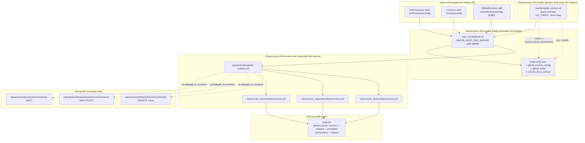
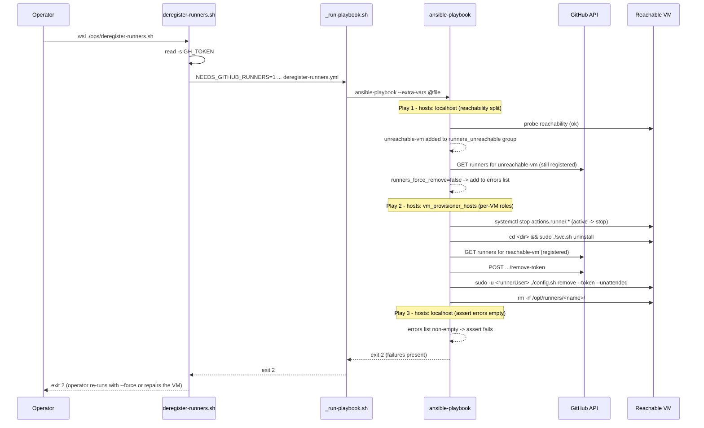
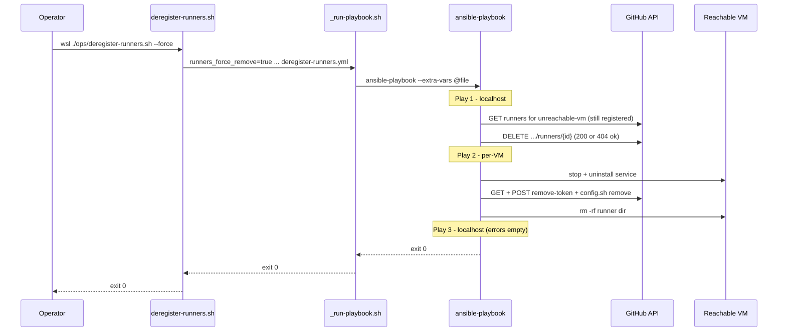

# Problem: Deregister Self-Hosted GitHub Actions Runners via Ansible

## Index

- [Context](#context)
- [Solution approach](#solution-approach)
- [What Is Changing](#what-is-changing)
  - [Inputs (consumed, not redefined)](#inputs-consumed-not-redefined)
  - [Bridge extension: opt out of the host file server](#bridge-extension-opt-out-of-the-host-file-server)
  - [Role: runner_service (remove direction)](#role-runner_service-remove-direction)
  - [Role: runner_registration (remove direction)](#role-runner_registration-remove-direction)
  - [Role: runner_binary (remove direction)](#role-runner_binary-remove-direction)
  - [Controller-side force path: unreachable VMs](#controller-side-force-path-unreachable-vms)
  - [Entry point: deregister-runners playbook](#entry-point-deregister-runners-playbook)
  - [Operator entry point in this repo](#operator-entry-point-in-this-repo)
- [Why Now](#why-now)
- [Affected Components](#affected-components)
- [Out of Scope](#out-of-scope)

---

## Context

`Infrastructure-GitHubRunners/hyper-v/ubuntu/deregister-runners.ps1`
is the symmetric tear-down for the register flow that feature 08 ported.
For each VM in `GitHubRunnersConfig-<Suffix>` it:

1. Joins the runner entries to deploy passwords from `VmUsersConfig` (same
   `Join-RunnerDeployCredentials` helper as the register path).
2. Pings each VM. Splits the set into **reachable** and **unreachable**.
3. For each reachable VM, SSHes in as the deploy user and per runner entry:
   - `Remove-RunnerService` — stop the systemd unit if active, then
     `svc.sh uninstall` from the runner directory (idempotent at each
     step; absent unit / inactive service is a silent no-op).
   - `Get-GitHubRunnerRegistration` — probe GitHub for the registration.
   - `Invoke-RunnerConfigRemove` — only when the GitHub registration
     exists: mint a short-lived removal token, then
     `sudo -u <runnerUser> ./config.sh remove --unattended` from the
     runner directory.
   - `Remove-RunnerFiles` — `sudo rm -rf <runnerDir>` always (cleans up
     leftover files from partial installs even when GitHub side was
     already empty).
4. For each unreachable VM, per runner entry:
   - probe GitHub. If absent, skip.
   - if `-Force`, `DELETE /repos/{owner}/{repo}/actions/runners/{id}`
     directly from the controller. 404 is treated as success.
   - otherwise, collect an error and continue.
5. At end of run, if any errors collected, print them and exit 1.

The vault contract is unchanged from feature 08 — same
`GitHubRunnersConfig-<Suffix>` entries, same `VmUsersConfig` join, same
runtime-only `GH_TOKEN`. The host file server is **not** used on the
down path: nothing is fetched, only stopped and removed.

This feature is the destructive counterpart to feature 08 in the same
way feature 03 is to feature 02 — the substrate (bridge, vault reads,
inventory generation, CI gates, E2E gate) was extended for the register
path; this feature lands the destructive semantics on top of a now-settled
extension rather than co-designing them ([[feedback_bundle_substrate_with_first_consumer]]
applies in reverse: substrate is already in place, this feature adds the
second consumer).

---

## Solution approach

Survey of off-the-shelf candidates:

| Candidate | Source / license | Maint. | Fit |
|---|---|---|---|
| [monolithprojects.github_actions_runner](https://galaxy.ansible.com/ui/standalone/roles/monolithprojects/github_actions_runner/) | OSS, Apache-2.0, Galaxy | active | Exposes `state: absent` — `config.sh remove`, service uninstall, directory delete. Single runner-user model — same constraint that ruled it out in feature 08. No "host unreachable, remove from GitHub anyway" mode. |
| [gantsign.github-actions-runner](https://galaxy.ansible.com/ui/standalone/roles/gantsign/github-actions-runner/) | OSS, MIT | quieter | Same `state: absent` story, same single-user limitation, same lack of force path. |
| Symmetric custom port of feature 08 (`tasks/remove.yml` on the existing three roles) | n/a | n/a | Reuses the bridge from feature 08 (vault reads, `GH_TOKEN`, extra-vars). No new bridge surface beyond a flag to skip the host file server on the down path. Follows the per-role `tasks/main.yml` + `tasks/remove.yml` split features 02 / 03 established for `groups` / `users` / `sudoers`. |

Three contracts already rule out the Galaxy roles, two inherited from
feature 08 and one specific to this feature:

1. **Deploy-user vs runner-service-user split.** Same as feature 08:
   SSH connection is the deploy user, `config.sh remove` runs as the
   runner service user via `sudo -u`, `svc.sh uninstall` runs as root.
   Galaxy roles model one runner user and `become` it.
2. **Force mode for unreachable VMs.** Today's `-Force` flag deletes
   GitHub-side registrations via the REST API when the VM cannot be
   SSHed. Galaxy roles do not model this — they assume the host is
   reachable. Anything we adopt would still need a custom controller-
   side delegate path.
3. **End-of-run error aggregation.** Today's PS script collects errors
   from unreachable-without-force VMs and surfaces them as a single
   non-zero exit at the end of the run. Galaxy roles fail-fast per host.

**Direction chosen: custom port, symmetric to feature 08.** Each of the
three roles from feature 08 (`runner_binary`, `runner_registration`,
`runner_service`) grows a sibling `tasks/remove.yml`; a new
`deregister-runners.yml` playbook imports each with
`tasks_from: remove` in the reversed order; a new `ops/deregister-runners.sh`
wrapper matches the register entry point with a `--force` flag. Per-role
split rather than a `state` parameter switch inside `tasks/main.yml` for
the same reasons feature 03 already documented: each direction has its
own glue and its own test surface, and `import_role { name, tasks_from }`
is a stock Ansible pattern with no custom dispatch. The bridge from
feature 08 is reused; the only bridge extension is a `NEEDS_HOST_FILE_SERVER`
gate (defaults to `1` for register, `0` for deregister) so the deregister
entry point does not spawn the HttpListener for nothing.

---

## What Is Changing

### Inputs (consumed, not redefined)

Same inputs as feature 08, all read by the existing bridge:

- **`VmProvisionerConfig`** — inventory source. No change.
- **`VmUsersConfig`** — deploy user passwords, joined to runner entries
  by `deployUsername`. No change.
- **`GitHubRunnersConfig-<Suffix>`** — runner entries to deregister.
  Same JSON shape as feature 08; this feature reinterprets the same
  declared state as "deregister the entries listed here" — exactly the
  semantics today's `deregister-runners.ps1` carries, and the same
  posture feature 03 took on `VmUsersConfig` for the user removal path.
- **GitHub token (`GH_TOKEN`)** — runtime-only, same prompt/env path as
  feature 08. Required scope `repo` / `public_repo`. Used controller-side
  for the GitHub Runners API (existence check), the removal-token mint
  (`POST .../remove-token`), and — in force mode — `DELETE .../runners/{id}`.

No new vault entries. No new schema fields.

### Bridge extension: opt out of the host file server

The down path does not fetch the runner tarball, so the host file server
introduced in feature 08 is not needed. Spawning it for nothing wastes
a port and adds an avoidable failure surface (port-in-use, switch IP
absent).

| Addition | Decision |
|----------|----------|
| File-server gate | `_run-playbook.sh` honours `NEEDS_HOST_FILE_SERVER` (defaults to `0`). The register entry point sets `NEEDS_HOST_FILE_SERVER=1` alongside the existing `NEEDS_GITHUB_RUNNERS=1`; the deregister entry point sets only `NEEDS_GITHUB_RUNNERS=1`. When the gate is `0`, `_start-host-file-server.ps1` is not invoked and the trap-EXIT counterpart short-circuits to a no-op. The extra-vars file omits `host_file_server_base_url` entirely on the down path — the down roles never reference it, so absence is correct rather than empty. |
| Inventory shape | Unchanged. |
| Vault reads | Unchanged — `NEEDS_GITHUB_RUNNERS=1` still triggers the third vault read for the GitHubRunners config. |
| Failure surface | Unchanged — same exit-code propagation as feature 08. |

### Role: runner_service (remove direction)

`roles/runner_service/tasks/remove.yml` reconciles the systemd unit
toward absent. Maps 1:1 to `Remove-RunnerService` today (stop-if-active,
then svc.sh uninstall).

| Decision | Value |
|----------|-------|
| Unit name probe | `ansible.builtin.shell` for `systemctl list-unit-files 'actions.runner.*.service'` filtered by runner name. Same probe as `tasks/main.yml` in this role — extracted into `tasks/_probe-unit.yml` and `include_tasks`'d from both directions so the probe lives in one place. |
| Stop branch | Unit present and active -> `ansible.builtin.systemd` with `state: stopped`. Already-stopped is a no-op. |
| Uninstall branch | Unit present (regardless of active state) -> `ansible.builtin.shell` for `cd '{{ runner_dir }}' && sudo ./svc.sh uninstall`. `become: true` (root), matching today. svc.sh resolves the runner root via `$(pwd)` so the working directory must be the runner dir. |
| Absence | Both branches are guarded by the probe; an absent unit is a silent skip. Matches today's per-step independent guards. |
| Order | Runs **first**. Stopping the unit before deregistration prevents `config.sh remove` from racing with an active runner process touching `.credentials`. |

### Role: runner_registration (remove direction)

`roles/runner_registration/tasks/remove.yml` reconciles the runner's
GitHub registration toward absent and removes the local `.runner` /
`.credentials` marker files. Maps 1:1 to `Invoke-RunnerConfigRemove`
plus the GitHub-side check in `Invoke-VmDeregisterGroup` today.

| Decision | Value |
|----------|-------|
| Existence probe | `ansible.builtin.uri` (delegated to localhost) hits `GET /repos/{owner}/{repo}/actions/runners` and filters by `runnerName`. Token passed via `headers`, never in the URL. Result cached per-runner in a fact. |
| Removal-token mint | When the existence probe finds the runner: `ansible.builtin.uri` (delegated to localhost) `POST /repos/{owner}/{repo}/actions/runners/remove-token`. `no_log: true`. Token never persisted, never logged. Removal token expires in 1 hour, fetched immediately before use to match today. |
| Deregister | `ansible.builtin.command` for `'{{ runner_dir }}/config.sh' remove --token <removeToken> --unattended`, `become_user: {{ runner_user }}` (via the existing sudoers grant for the deploy user). `no_log: true`. |
| Skip branch | Existence probe shows the runner is **not** on GitHub -> the `config.sh remove` task is skipped. Matches today's "only call `Invoke-RunnerConfigRemove` when confirmed registered" guard. The local marker files (`.runner`, `.credentials`) are still removed by `runner_binary`'s remove direction when it deletes the runner directory — so we do not need a separate "remove local credentials but not GitHub" branch in this role. |
| Order | Runs **second**, after the service is stopped. |

### Role: runner_binary (remove direction)

`roles/runner_binary/tasks/remove.yml` reconciles the runner directory
toward absent. Maps 1:1 to `Remove-RunnerFiles` today.

| Decision | Value |
|----------|-------|
| Probe | `ansible.builtin.stat` against `{{ runner_dir }}`. |
| Remove | `ansible.builtin.file` with `state: absent`, `path: '{{ runner_dir }}'`, `become: true`. Equivalent to `sudo rm -rf` and matches today's "always run regardless of GitHub state" guarantee — partial installs may leave directories that block re-use of the same runner name. |
| Tarball cache | `~/cache/actions-runner-linux-x64-*.tar.gz` is **not** removed. It is shared across runners on the same VM and the next register-runners run reuses it. Today's behaviour matches — only `<runnerDir>` is rm'd. |
| Order | Runs **last**. Reversal vs. feature 08's `runner_binary -> runner_registration -> runner_service` order is deliberate: same dependency-direction logic feature 03 used (sudoers, users, groups in reverse to features 02's create order). Service file references the runner dir, GitHub-side registration references the runner identity established by `config.sh`, runner dir is the substrate underneath both. |

### Controller-side force path: unreachable VMs

Today's `-Force` path runs entirely controller-side and does not depend
on any role — it is a fan-out of `DELETE /repos/.../runners/{id}` calls
gated by the existence probe. The natural Ansible shape is a single
**pre-task block on `hosts: localhost`** in the playbook, run before
the per-VM plays:

| Decision | Value |
|----------|-------|
| Reachability split | Existing `ansible.builtin.wait_for_connection` (or the same SSH probe feature 08 uses for the register path) marks hosts unreachable. Unreachable hosts are added to a `runners_unreachable` group via `add_host` during a pre-task. |
| Existence probe | For every entry whose `vmName` falls in `runners_unreachable`, `ansible.builtin.uri` (delegated to localhost) checks `GET /repos/{owner}/{repo}/actions/runners`. Same module call as `runner_registration`'s remove-direction probe. |
| Force branch | When `runners_force_remove` (extra-var) is true and the entry is still registered -> `ansible.builtin.uri` `DELETE /repos/{owner}/{repo}/actions/runners/{id}`, 404 mapped to success via `status_code: [200, 204, 404]`. |
| Report-and-fail branch | When `runners_force_remove` is false and the entry is still registered -> accumulate into a `runners_unreachable_errors` list via `set_fact`. After the per-VM plays complete, a final `assert` fails the play if the list is non-empty, printing each entry. Preserves today's "process reachable VMs first, then surface the unreachable-with-registration set as a single end-of-run failure". |
| Default | `runners_force_remove` defaults to `false`. Operators opt in via `ops/deregister-runners.sh --force` (which the bridge translates to `runners_force_remove=true` in extra-vars). Mirrors today's `-Force` switch one-for-one. |
| Token hygiene | Same as feature 08 — `no_log: true` on every uri task that carries the token; headers, never URLs. |

### Entry point: deregister-runners playbook

`playbooks/deregister-runners.yml` is structured as three plays:

1. **`hosts: localhost`** — reachability split + force-branch fan-out
   (see above). Runs `run_once: true` semantics naturally since it is a
   single-host play.
2. **`hosts: vm_provisioner_hosts`** with the three roles imported via
   `tasks_from: remove` in the reversed order:
   `runner_service -> runner_registration -> runner_binary`. Each
   import is tagged with the role name (`--tags runner_binary` works
   the same as the existing `--tags users` etc.). `any_errors_fatal: false`
   matches the create/remove posture — one stuck VM does not strand the rest.
   Meta-dep posture follows feature 03's resolution exactly: no
   inter-role meta deps, because Ansible meta deps ignore the entry
   role's `tasks_from` selector and would re-run the role's
   `tasks/main.yml` (re-installing the very runner this play is
   trying to remove). Role order lives in the playbook, not in
   `meta/main.yml`.
3. **`hosts: localhost`** — the end-of-run assert that surfaces the
   accumulated `runners_unreachable_errors` as a single non-zero exit.

The per-VM loop iterates the entries in `github_runners_config` whose
`vmName` matches `inventory_hostname` and whose `deployUsername` is
present in `vm_users_config[*].users` — same join shape as feature 08.

Hosts that are unreachable are not skipped silently — they flow through
the localhost pre-task, which decides force vs. error per entry. This
is the only behaviour difference from features 02/03/08, where
unreachable hosts are uniformly warned-and-skipped. Justified: a
runner registration on GitHub is **shared state visible outside the
VM**, and the operator's expectation today is that running deregister
either removes the GitHub-side record or tells them why it could not.

### Operator entry point in this repo

Same pattern as features 02/03/08 — bash entry point under `ops/`, no
PowerShell wrapper around the runtime path:

| New script | Lang | Purpose |
|------------|------|---------|
| `ops/deregister-runners.sh` | bash | Invokes `./ops/_run-playbook.sh playbooks/deregister-runners.yml` with `NEEDS_GITHUB_RUNNERS=1` and (notably) **without** `NEEDS_HOST_FILE_SERVER=1`. Accepts a `--force` flag that becomes `runners_force_remove=true` in extra-vars. Prompts for the GitHub token unless `GH_TOKEN` is set. Operators run it from inside WSL, or from Windows as `wsl ./ops/deregister-runners.sh`. |
| `ops/deregister-runners.bat` | cmd | Explorer-click launcher; mirrors `register-runners.bat`. A `--force` arg passed at invocation time is forwarded to the shell wrapper. |

No new `setup-runners-secrets.*` helper — the vault entry the deregister
flow reads is the same one feature 08 wires up. Operators who run
deregister have already run setup-runners-secrets (or feature 08).

`Infrastructure-GitHubRunners` is **not touched** by this feature. Its
`deregister-runners.ps1` keeps working in parallel — same posture as
feature 08 toward the register-runners side, and same posture as
feature 03 toward Infrastructure-Vm-Users. Operators can validate the
Ansible path against the existing PowerShell path on the same VM during
rollout, and the E2E `custom-powershell` flow keeps invoking the
PowerShell deregister path as a permanent non-primary implementation
([[feedback_dont_mutate_repos_being_archived]]).

A confirmation prompt is **not** added. Today's `deregister-runners.ps1`
does not prompt either; the destructive intent is in the script name
and in the operator's choice to invoke it. Same rationale as feature 03.

---

## Why Now

- Feature 08 left the runner up path validated end-to-end and the
  bridge extended with the third vault read and the GitHub token
  plumbing. Deregister can now be built on a proven extension rather
  than co-designed with it. Same rationale that split feature 03 off
  from feature 02.
- Archiving `Infrastructure-GitHubRunners` is the eventual destination
  for both flows, and it requires symmetric coverage. Leaving deregister
  in PowerShell while register is in Ansible would force GHRunners to
  stay runtime-live forever for one capability ([[feedback_dont_mutate_repos_being_archived]]).
- The E2E suite already exercises the full runner lifecycle (register
  then deregister) against a real Hyper-V VM. Migrating now gives the
  Ansible deregister flow the same gate from day one — no period during
  which the deregister path lacks the existing safety net.
- The down path is smaller than the up path (no tarball, no file server,
  no version resolution), so the migration is a strict subset of the
  work already validated by feature 08. Now is the cheapest moment to
  close the loop.

---

## Affected Components

Sequence on a normal-mode run with one reachable VM (one registered
runner) and one unreachable VM (one still-registered runner, no
`--force`):

Sequence on the force path (same setup, `--force` set):

---

## Out of Scope

- **Removing GitHubRunners entries that are no longer in
  `GitHubRunnersConfig` but still registered on GitHub.** That is
  "drift removal" and is a different posture from "deregister what is
  declared here." Same out-of-scope decision feature 03 made for user
  removal — silently deleting a registration just because its config
  entry was edited out is too dangerous. Operators who want a runner
  gone declare it in config (or use the existing `-Force` path on a
  permanently-gone VM) and run `deregister-runners.yml`.
- **Archiving or modifying `Infrastructure-GitHubRunners`.** That repo
  stays runtime-live through this feature. Archive is a later step
  gated on both register and deregister flows being green in E2E,
  matching the symmetric Vm-Users archival posture from feature 03
  ([[feedback_dont_mutate_repos_being_archived]]).
- **E2E flow flip to the Ansible deregister path.** Feature 08 ships
  the `RunnersFlow=ansible` switch for the register side; the deregister
  counterpart lives in this feature's plan, not its problem. Until
  that flip, E2E keeps invoking the PowerShell `deregister-runners.ps1`.
- **Removing the tarball cache (`~/cache/actions-runner-linux-x64-*.tar.gz`).**
  Shared across runners; today's deregister does not touch it; this
  feature keeps that. A later "wipe everything runner-related from this
  VM" feature could lift it.
- **Removing the runner user account or the deploy user account.**
  Those are owned by Infrastructure-Vm-Users / feature 03. Deregister
  removes the runner workload; user lifecycle is a separate concern.
- **Token storage.** Same as feature 08 — runtime-only, never persisted.
- **Per-entry overrides for the force behaviour** (e.g. "force this one
  runner but not the others"). v1 is the same all-or-nothing toggle as
  today's `-Force`. If a real need surfaces, it lifts into a later
  feature.
- **Org-level runners.** Repo-level only, same scope as feature 08 and
  the existing GHRunners repo.
- **Custom Python inventory plugin** — still deferred to
  [05 - python inventory plugin](../05-python-inventory-plugin/notes.md).
- **Partial deregistration scoping in `deregister-runners.yml`** (e.g.
  a flag that uninstalls the service but leaves the registration in
  place). Useful for partial rollback but speculative — the per-role
  tags (`runner_service_down`, `runner_registration_down`,
  `runner_binary_down`) exist on the play so `--tags` can scope a run
  if a future need surfaces. No special handling beyond what tags give
  for free is planned here.
