# Plan: Common-Ansible extraction and toolchain provisioning

Implementation plan for the change described in
[problem.md](problem.md). Steps are grouped into sections that follow the
roadmap order; the order is strict (see
[Risks and sequencing](problem.md#risks-and-sequencing)). Each step is a
single committable act with its reason, tests, and a diagram.

## Index

- [Conventions](#conventions)
- [Section 1 - Finalize the rename](#section-1---finalize-the-rename)
- [Section 2 - Decouple the dispatch bridge](#section-2---decouple-the-dispatch-bridge)
- [Section 3 - Extract user provisioning to Infrastructure-Vm-Users](#section-3---extract-user-provisioning-to-infrastructure-vm-users)
- [Section 4 - Extract runner provisioning to Infrastructure-GitHubRunners](#section-4---extract-runner-provisioning-to-infrastructure-githubrunners)
- [Section 5 - Migrate existing toolchains to Ansible](#section-5---migrate-existing-toolchains-to-ansible)
- [Section 6 - shellcheck role](#section-6---shellcheck-role)
- [Section 7 - bats role](#section-7---bats-role)
- [Section 8 - docker role](#section-8---docker-role)
- [Section 9 - Config schema, wire the runner VM, verify green](#section-9---config-schema-wire-the-runner-vm-verify-green)

## Conventions

- One branch per step off `master`; merge before the next step. Strict
  order means a step assumes its predecessors are merged.
- Tests run foreground. Role changes are covered by molecule scenarios
  (`Tests/molecule/<role>`); ops/bridge changes by bats
  (`Tests/ops`); playbook compositions by playbook-level integration
  tests (`Tests/ansible`, `Tests/playbooks`).
- Each step updates the README sections it earns - no terminal docs pass.
- Cross-repo steps note which repo they land in; this plan is the single
  source for all of them (one plan, all repos).
- The pre-migration implementation is kept as a fork in Common-Ansible
  through Sections 3-5 and removed only after the consumer is proven, so
  every intermediate commit leaves a runnable estate.

## Section 1 - Finalize the rename

The GitHub repo, git remote, local folder, and VS Code workspace are
already renamed. These steps finish propagation so no stale name remains.

### Step 1.1 - Update in-repo references to the old name

Replace `Infrastructure-Vm-Ansible` / `Infrastructure-VM-Ansible` in the
README title and index, `requirements.yml` comments, ansible.cfg
comments, the `.github` workflow names, and any ops/script headers.

- **Reason:** A renamed repo with its old name baked into docs and
  workflow display names misleads readers and breaks deep links.
- **Tests:** `scripts/run-lint-yaml-and-bash.sh` green; a repo-wide grep
  for the old name returns only the historical references in
  [problem.md](problem.md) Background and roadmap step 1.

### Step 1.2 - Update the .menu references and rebuild supersets

Update the five `.menu` files that name the repo (`supersets.psd1`,
`menus.psd1`, `cluster-order.psd1`, `manual-dependencies.psd1`,
`Get-ScenarioMenus.ps1`) and rebuild the affected superset graph.

- **Reason:** The menu/superset tooling resolves repos by name; a stale
  name drops Common-Ansible out of cluster ordering and superset graphs.
- **Tests:** The menu loads without error; `Build-Supersets.ps1` for the
  affected superset completes and emits a graph that lists Common-Ansible.

### Step 1.3 - Update cross-repo references to the repo

Find and update any sibling repo that referenced the old name (remotes,
`requirements.yml`, docs, E2E wiring, provisioner handoff).

- **Reason:** Consumers pinned to the old name break once GitHub stops
  redirecting or once a fresh clone is taken.
- **Tests:** Each touched repo's lint/CI is green; a cross-repo grep for
  the old name is empty.

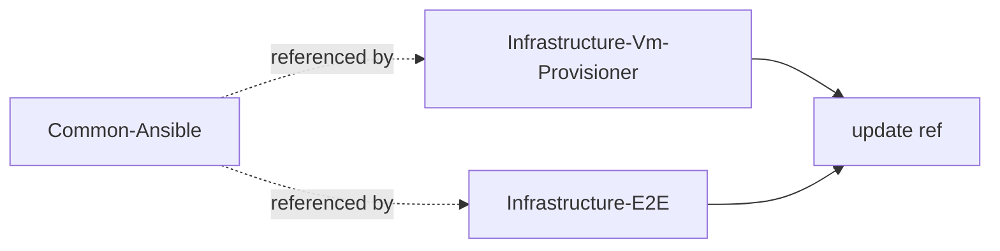

## Section 2 - Decouple the dispatch bridge

Make `ops/_run-playbook.sh` consumer-agnostic before any consumer code
moves out. See
[The bridge coupling to break](problem.md#the-bridge-coupling-to-break).

### Step 2.1 - Define the consumer contract

Specify how a wrapper declares its needs to the bridge: the vaults to
read beyond the always-on `VmProvisioner`, plus any toggles (host file
server, token requirement). Encode as an explicit env contract (e.g.
`CA_EXTRA_VAULTS`, `CA_NEEDS_HOST_FILE_SERVER`, `CA_REQUIRES_TOKEN`) with
a documented default of "none".

- **Reason:** A named contract is the seam that lets the substrate serve
  unknown future consumers without importing their identities.
- **Tests:** bats unit tests asserting the bridge parses each contract
  variable, applies the documented defaults when unset, and errors on an
  inconsistent combination (token required but absent).

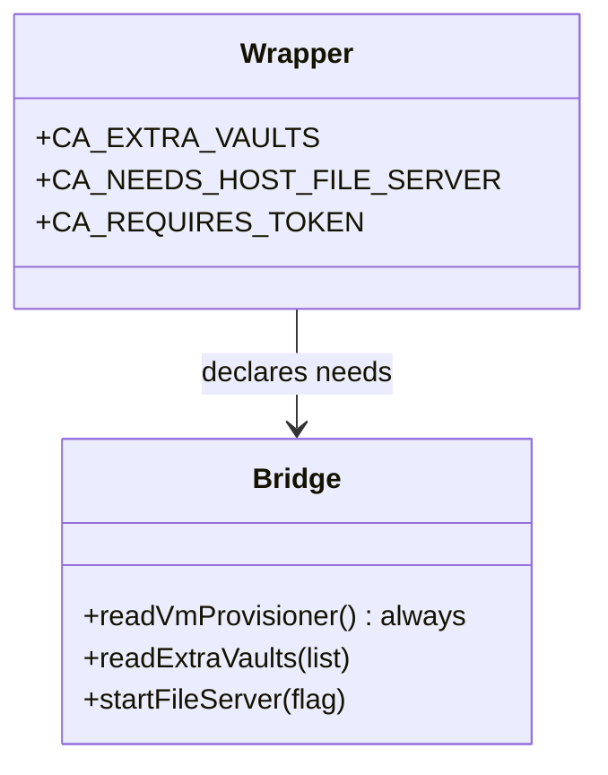

### Step 2.2 - Refactor the bridge to honor the contract

Replace the hardcoded `VmUsers` / `GitHubRunners` reads and the
`NEEDS_GITHUB_RUNNERS` / `GH_TOKEN` / `NEEDS_HOST_FILE_SERVER` logic with
the contract from 2.1. `VmProvisioner` stays an unconditional read.

- **Reason:** Removes the substrate's knowledge of specific consumers -
  the dependency-inversion fix that earns the `Common-` prefix.
- **Tests:** bats over the bridge with simulated contracts; the existing
  create-users and register-runners flows still dispatch correctly via
  their updated wrappers (Step 2.3) under integration tests.

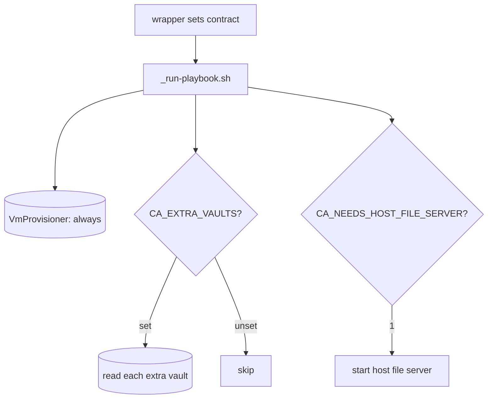

### Step 2.3 - Port the existing wrappers onto the contract

Update `create-users.sh` and `register-runners.sh` (and the remove/status
wrappers) to declare their needs via the contract instead of relying on
removed bridge internals.

- **Reason:** Keeps both shipping flows working on the decoupled bridge,
  proving the contract before any code leaves the repo.
- **Tests:** Integration - create/remove users and register/deregister
  runners still run end to end (molecule + playbook tests unchanged).

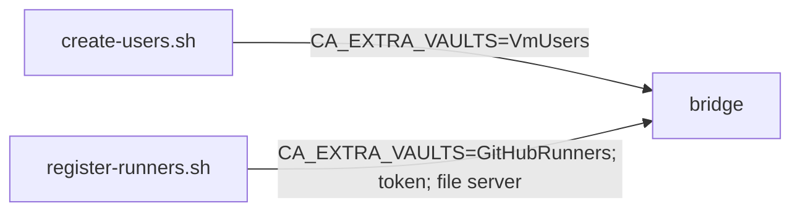

## Section 3 - Extract user provisioning to Infrastructure-Vm-Users

Move bucket B (see
[Common-Ansible partitioning](problem.md#common-ansible-partitioning)) to
its owner, consuming Common-Ansible for the substrate.

### Step 3.1 - Establish the Common-Ansible consumption mechanism

Decide and wire how a consumer pulls Common-Ansible's reusable roles and
ops: package the reusable roles as an Ansible collection (or git-sourced
roles) referenced from the consumer's `requirements.yml`, pinned to a
tag. Document the bootstrap that fetches it.

- **Reason:** Every consumer repo (Sections 3, 4, and the toolchain flow)
  needs one agreed, pinned reuse path; deciding it once here avoids
  per-repo drift.
- **Tests:** A clean controller bootstrap in Infrastructure-Vm-Users
  resolves and installs the pinned Common-Ansible artifact; a smoke
  playbook that includes a substrate role runs.

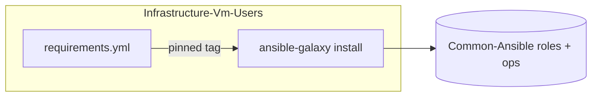

### Step 3.2 - Move the user roles, playbooks, and wrappers into Vm-Users

Relocate `vm_users_entry`, `groups`, `sudoers`, `users` (with molecule),
`create-users.yml`, `remove-users.yml`,
`playbooks/tasks/_ensure-acl-present.yml`, the user wrappers, and
`_build-extra-vars-users.sh`. They consume the substrate via 3.1. The
copies remain in Common-Ansible as a fork until Step 3.5.

- **Reason:** Puts the user domain with its owner while leaving
  Common-Ansible runnable, satisfying the keep-a-fork constraint.
- **Tests:** molecule per moved role in Vm-Users; create/remove-users
  integration against a disposable target.

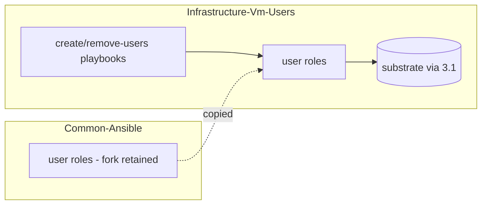

### Step 3.3 - Wire Vm-Users CI and README

Add the reusable lint/test CI to Vm-Users and document the create/remove
flows in its README index.

- **Reason:** The owner repo must enforce the same bar and carry its own
  operator docs.
- **Tests:** Vm-Users CI green (yamllint, shellcheck, molecule).

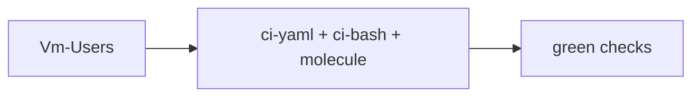

### Step 3.4 - Re-point the E2E users-ansible flow at Vm-Users

Update Infrastructure-E2E so the `ansible` users flow resolves
`create-users.sh` / `remove-users.sh` under `$UsersPath`
(Infrastructure-Vm-Users) instead of the shared `$AnsiblePath` ->
Common-Ansible. Split the "one checkout serves both domains" assumption:
the users-ansible flow now resolves within its owner repo, while the
runners-ansible flow keeps using the Common-Ansible checkout until
Section 4. Prove green before the fork is deleted in 3.5.

- **Reason:** Step 3.5 deletes Common-Ansible's user ops, so E2E must
  already dispatch to the owner repo or the ansible users flow breaks.
  Folding the path into `$UsersPath` also retires the "Ansible is a
  separate third repo" framing now that both user implementations live
  in Vm-Users.
- **Tests:** E2E users layer green on a disposable VM with
  `UsersFlow=ansible` resolving to Vm-Users ops; `custom-powershell`
  unchanged; the runners-ansible flow still resolves to Common-Ansible.

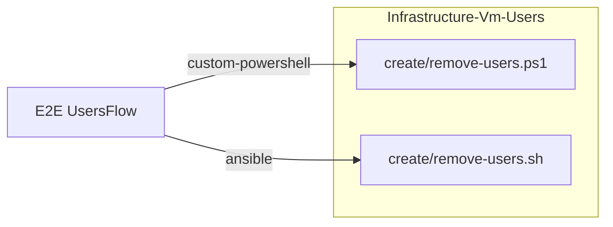

### Step 3.5 - Remove the user fork from Common-Ansible

Once Vm-Users is proven, delete the user roles/playbooks/wrappers from
Common-Ansible and drop the `VmUsers` references from its docs.

- **Reason:** A fork kept past proof becomes a second source of truth.
- **Tests:** Common-Ansible CI green with no user domain present; grep
  confirms no `VmUsers`-specific code remains.

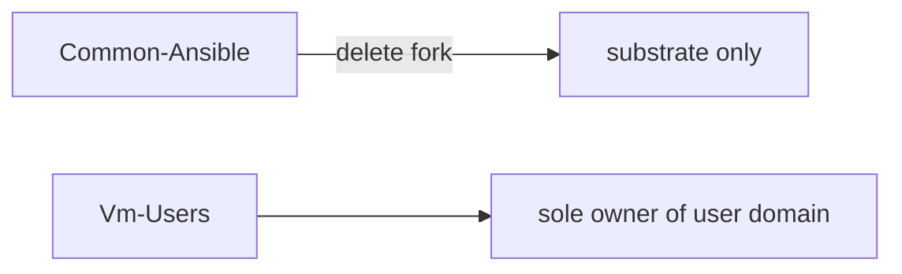

## Section 4 - Extract runner provisioning to Infrastructure-GitHubRunners

Mirror of Section 3 for bucket C.

### Step 4.1 - Move runner roles, playbooks, and wrappers into GitHubRunners

Relocate `runner_entry_resolve`, `runner_binary`, `runner_registration`,
`runner_service` (with molecule), the register/deregister/status
playbooks and their task includes, the runner wrappers,
`_require-gh-token.sh`, `_build-extra-vars-runners.sh`,
`_ensure-runner-tarball.ps1`, `_resolve-runner-version.ps1`, and
`setup-runners-secrets.*`. They consume the substrate (3.1) and declare
`GitHubRunners` + token + host-file-server via the contract (2.1). Fork
retained in Common-Ansible until 4.4.

- **Reason:** Runner domain to its owner; the host file server itself
  stays substrate and is reached through the contract.
- **Tests:** molecule per moved role; register/deregister integration
  against a disposable runner target with a scoped token.

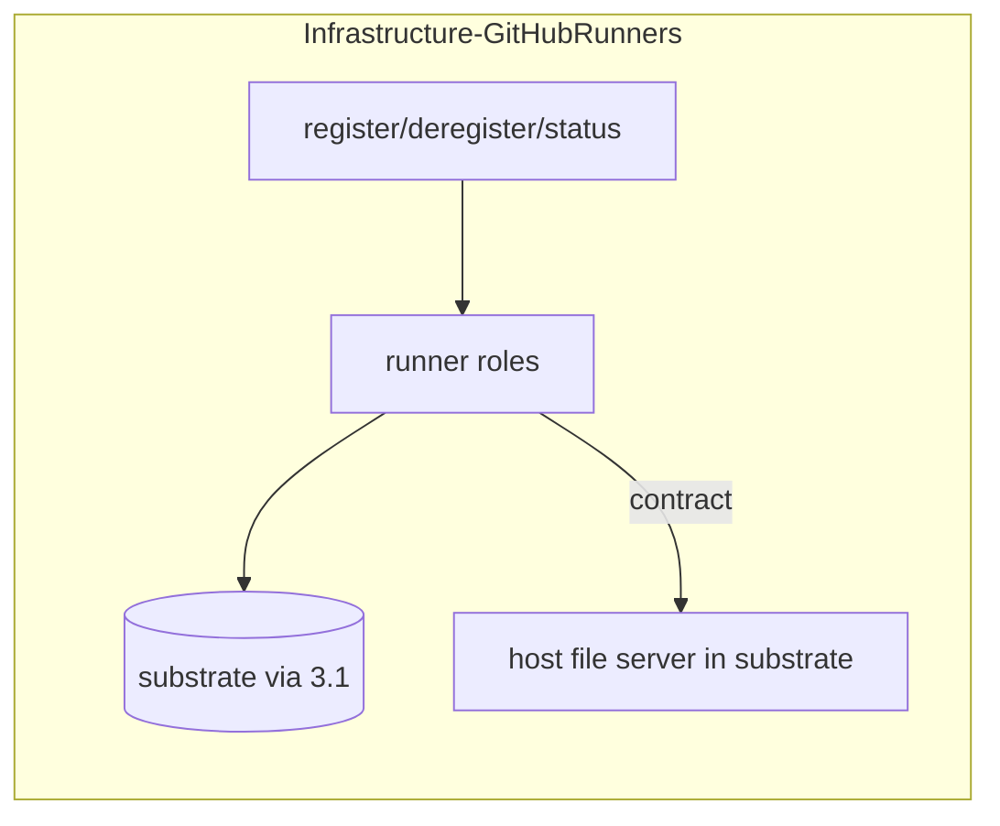

### Step 4.2 - Wire GitHubRunners CI and README

- **Reason:** Same bar and operator docs as the user owner.
- **Tests:** GitHubRunners CI green.

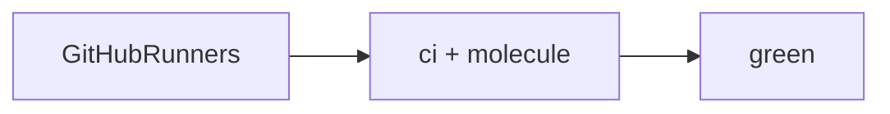

### Step 4.3 - Re-point the E2E runners-ansible flow at GitHubRunners

Update Infrastructure-E2E so the `ansible` runners flow resolves
`register-runners.sh` (and the status / deregister wrappers) under
`$RunnersPath` (Infrastructure-GitHubRunners) instead of `$AnsiblePath`
-> Common-Ansible. With Section 3 already off the shared path, this
removes the last E2E dependency on a Common-Ansible checkout, so
`$AnsiblePath` / `$WslDistro`-as-a-third-repo can be retired. Prove
green before the fork is deleted in 4.4.

- **Reason:** Step 4.4 deletes Common-Ansible's runner ops, so E2E must
  already dispatch to GitHubRunners or the ansible runners flow breaks.
  Completes the collapse of `$AnsiblePath` into the per-domain owner
  paths.
- **Tests:** E2E runner-lifecycle layer green on a disposable runner
  target with `RunnersFlow=ansible` resolving to GitHubRunners ops;
  `custom-powershell` unchanged; no E2E reference to Common-Ansible ops
  remains.

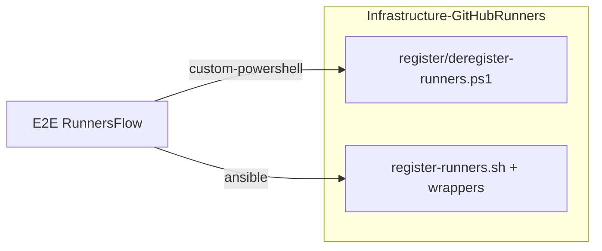

### Step 4.4 - Remove the runner fork from Common-Ansible

- **Reason:** Single source of truth once the owner is proven.
- **Tests:** Common-Ansible CI green as pure substrate; no runner code or
  `GitHubRunners` references remain.


## Section 5 - Migrate existing toolchains to Ansible

Bucket D, section-1 tools. Port the PowerShell reconciler's JDK and .NET
behavior to reusable roles in Common-Ansible. The PowerShell reconciler is
kept as a fork in Infrastructure-Vm-Provisioner until the cutover
criterion in 5.6.

### Step 5.1 - Author the host-push toolchain role pattern

Build the shared mechanics one role models: pull a host-staged tarball
via the substrate file server, unarchive to a versioned install dir,
manage `/usr/local/bin` symlinks and `/etc/profile.d/<tool>.sh`, record
installed versions as a fact, and remove versions no longer desired (the
one capability Ansible does not give for free, per
[Solution approach](problem.md#solution-approach)).

- **Reason:** Establishes the section-1 pattern so JDK/.NET roles differ
  only in their resolve/version logic.
- **Tests:** molecule covering install, idempotent re-run, version swap
  (old symlinks/profile removed), and uninstall-removed-versions.

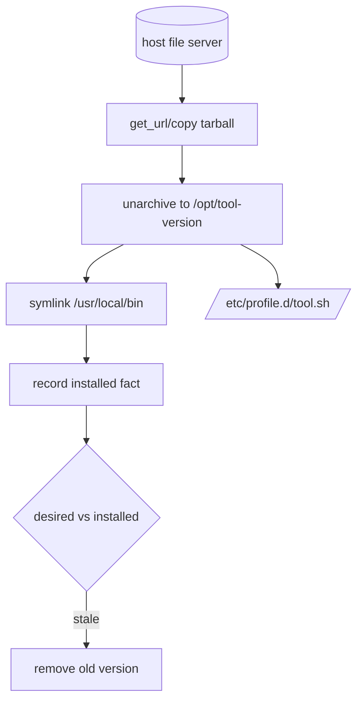

### Step 5.2 - jdk role

Port `JdkProvider` (Adoptium resolve + install/uninstall) onto 5.1.

- **Reason:** First real consumer of the section-1 pattern; proves parity
  with the reconciler.
- **Tests:** molecule - install a pinned JDK, swap versions, uninstall.


### Step 5.3 - dotnet_sdk role

- **Reason:** Second section-1 toolchain; parity with the SDK provider.
- **Tests:** molecule - install, version swap, uninstall.


### Step 5.4 - dotnet_tools role (nested under SDK)

Port the nested global-tools behavior; tools live under the SDK and are
torn down before the SDK on removal.

- **Reason:** Preserves the parent/child teardown ordering the reconciler
  guarantees.
- **Tests:** molecule - install a tool, remove the SDK, assert the tool is
  removed first.

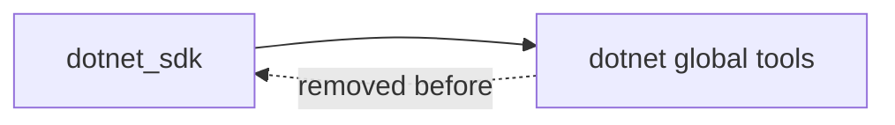

### Step 5.5 - Toolchain targeting flow in a consumer repo

Create the playbook + inventory wiring that targets production VMs with
the toolchain roles. This lives in a consumer (Infrastructure-Vm-Provisioner
or the runner owner), never in Common-Ansible, to keep the substrate
naming honest (see
[Why Common-, not Infrastructure-](problem.md#why-common--not-infrastructure)).

- **Reason:** Separates "reusable roles" (substrate) from "who gets what
  on which box" (a deploying consumer).
- **Tests:** Integration - run the flow against a disposable VM and assert
  the toolchain is present and on PATH.

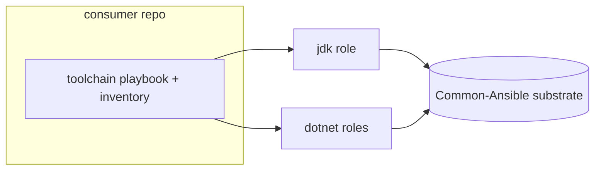

### Step 5.6 - Define the cutover criterion; keep the PS reconciler as a fork

Record the explicit condition under which the PowerShell reconciler is
retired (a later feature): the Ansible toolchain flow proven on a
production runner with parity on install/swap/uninstall.

- **Reason:** Two engines coexist transiently; the retirement trigger must
  be written, not implied.
- **Tests:** Documentation only; no code change. The reconciler stays
  active and tested in its repo.

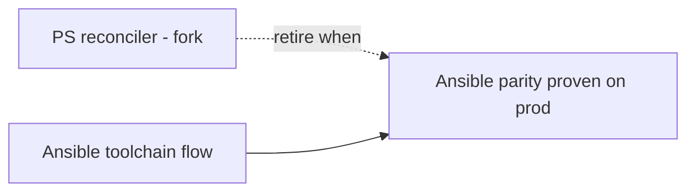

## Section 6 - shellcheck role

Bucket D, section-2 (VM-downloaded).

### Step 6.1 - toolchain_apt role with a shellcheck-pinned use

Author a small section-2 role that installs a pinned apt (or `get_url`
static binary) package on the VM, and use it for shellcheck (apt
candidate `0.9.0-1` on the target's Ubuntu 24.04).

- **Reason:** Unblocks the original failure (`ci-bash` shellcheck step) in
  a durable, re-provision-safe way.
- **Tests:** molecule - shellcheck absent then present and on PATH;
  idempotent re-run.


## Section 7 - bats role

### Step 7.1 - bats via the section-2 role

Install bats-core on the VM through the section-2 role (apt or upstream
tarball + install.sh).

- **Reason:** Makes the `ci-bash` test step self-sufficient on the runner
  rather than depending on the action's runtime install.
- **Tests:** molecule - bats absent then present and on PATH; a trivial
  `.bats` file runs.

```mermaid
flowchart LR
  CFG[section-2 entry: bats] --> INST[apt or tarball+install.sh] --> BIN[/usr/local/bin/bats/]
```

## Section 8 - docker role

Bucket D, section-3 (daemon).

### Step 8.1 - docker role: repo, engine, service, group

Install Docker from the official apt repo, enable the service, and add the
runner service user to the `docker` group.

- **Reason:** `ci-yaml` linters run in containers and `ci-dotnet`
  integration tests need a daemon; the group membership lets the runner
  user reach the socket without sudo.
- **Tests:** molecule - daemon reachable (`docker ps`), the target user is
  in the `docker` group, idempotent re-run. Note the docker-in-docker
  caveat for the molecule driver in the scenario.

```mermaid
flowchart TD
  REPO[official apt repo] --> ENG[docker engine]
  ENG --> SVC[enable+start service]
  SVC --> GRP[add runner user to docker group]
  GRP --> OK[docker ps as runner user]
```

## Section 9 - Config schema, wire the runner VM, verify green

### Step 9.1 - Add the three-section taxonomy to the VM config

Extend the per-VM config (the `VmProvisionerConfig-<suffix>` secret) with
a `toolchains` block carrying the three sections from
[the taxonomy](problem.md#the-three-section-tooling-taxonomy); the Ansible
extra-vars builder surfaces it to the toolchain roles, which validate
their own slice. Keep the config in the existing secret (one per-VM SSOT);
PS validation ignores the new block.

- **Reason:** Declarative desired-state for which tools land on which VM,
  read by the Ansible flow.
- **Tests:** Schema/validation unit tests for the new block; a malformed
  section fails with a clear message.

```mermaid
classDiagram
  class VmConfig {
    +identity/network fields
    +toolchains.hostPushed[]
    +toolchains.vmDownloaded[]
    +toolchains.baseImage[]
  }
  VmConfig --> ExtraVars : built by bridge
  ExtraVars --> Roles : per-section dispatch
```

### Step 9.2 - Declare shellcheck, bats, docker on ubuntu-02-ci and re-provision

Add the three tools to the `ubuntu-02-ci` definition in the
`VmProvisionerConfig-Production` secret and run the toolchain flow against
it.

- **Reason:** Applies the work to the actual red runner.
- **Tests:** Post-run probe on the VM: shellcheck/bats/docker present, on
  PATH, daemon reachable, runner user in docker group.

```mermaid
flowchart LR
  SEC[(VmProvisionerConfig-Production)] -->|ubuntu-02-ci toolchains| FLOW[toolchain flow 5.5]
  FLOW --> VM[ubuntu-02-ci]
```

### Step 9.3 - Re-run the gates and confirm green

Re-trigger `ci-bash`, `ci-yaml`, and `ci-dotnet` on the SynergyOps.TaskManager
PR and confirm all pass on the self-hosted runner.

- **Reason:** Closes the loop on the originating failure.
- **Tests:** The three checks pass on the PR; record the run links in the
  feature README.

```mermaid
flowchart LR
  VM[ubuntu-02-ci ready] --> CB[ci-bash green]
  VM --> CY[ci-yaml green]
  VM --> CD[ci-dotnet green]
```
