# Plan: Common-Ansible extraction and toolchain provisioning

Implementation plan for the change described in
[problem.md](problem.md). Steps are grouped into sections that follow the
roadmap order; the order is strict (see
[Risks and sequencing](problem.md#risks-and-sequencing)). Each step is a
single committable act with its reason, tests, and a diagram.

## Index

- [Conventions](#conventions)
- [Section 1 - Finalize the rename](#section-1---finalize-the-rename)
- [Section 2 - Decouple the dispatch bridge](#section-2---decouple-the-dispatch-bridge)
- [Section 3 - Extract user provisioning to Infrastructure-Vm-Users](#section-3---extract-user-provisioning-to-infrastructure-vm-users)
- [Section 4 - Extract runner provisioning to Infrastructure-GitHubRunners](#section-4---extract-runner-provisioning-to-infrastructure-githubrunners)
- [Section 5 - Migrate existing toolchains to Ansible](#section-5---migrate-existing-toolchains-to-ansible)
- [Section 6 - shellcheck role](#section-6---shellcheck-role)
- [Section 7 - bats role](#section-7---bats-role)
- [Section 8 - docker role](#section-8---docker-role)
- [Section 9 - Config schema, wire the runner VM, verify green](#section-9---config-schema-wire-the-runner-vm-verify-green)
- [Section 10 - Ordered cross-repo merge](#section-10---ordered-cross-repo-merge)

## Conventions

- One branch per step off `master`; merge before the next step. Strict
  order means a step assumes its predecessors are merged.
- Tests run foreground. Role changes are covered by molecule scenarios
  (`Tests/molecule/<role>`); ops/bridge changes by bats
  (`Tests/ops`); playbook compositions by playbook-level integration
  tests (`Tests/ansible`, `Tests/playbooks`).
- Each step updates the README sections it earns as part of that step -
  no terminal docs pass. Every step names its doc deliverable in a
  `README:` bullet (which README, which section); a step with no
  user-facing doc says so explicitly.
- Cross-repo steps note which repo they land in; this plan is the single
  source for all of them (one plan, all repos).
- The pre-migration implementation is kept as a fork in Common-Ansible
  through Sections 3-5 and removed only after the consumer is proven, so
  every intermediate commit leaves a runnable estate.

## Section 1 - Finalize the rename

The GitHub repo, git remote, local folder, and VS Code workspace are
already renamed. These steps finish propagation so no stale name remains.

### Step 1.1 - Update in-repo references to the old name

Replace `Infrastructure-Vm-Ansible` / `Infrastructure-VM-Ansible` in the
README title and index, `requirements.yml` comments, ansible.cfg
comments, the `.github` workflow names, and any ops/script headers.

- **Reason:** A renamed repo with its old name baked into docs and
  workflow display names misleads readers and breaks deep links.
- **Tests:** `scripts/run-lint-yaml-and-bash.sh` green; a repo-wide grep
  for the old name returns only the historical references in
  [problem.md](problem.md) Background and roadmap step 1.
- **README:** Title, index, and prose carry the `Common-Ansible` name;
  no old-name reference remains in this repo's README.

### Step 1.2 - Update the .menu references and rebuild supersets

Update the five `.menu` files that name the repo (`supersets.psd1`,
`menus.psd1`, `cluster-order.psd1`, `manual-dependencies.psd1`,
`Get-ScenarioMenus.ps1`) and rebuild the affected superset graph.

- **Reason:** The menu/superset tooling resolves repos by name; a stale
  name drops Common-Ansible out of cluster ordering and superset graphs.
- **Tests:** The menu loads without error; `Build-Supersets.ps1` for the
  affected superset completes and emits a graph that lists Common-Ansible.
- **README:** None - the `.menu` / superset tooling files carry no
  README of their own.

### Step 1.3 - Update cross-repo references to the repo

Find and update any sibling repo that referenced the old name (remotes,
`requirements.yml`, docs, E2E wiring, provisioner handoff).

- **Reason:** Consumers pinned to the old name break once GitHub stops
  redirecting or once a fresh clone is taken.
- **Tests:** Each touched repo's lint/CI is green; a cross-repo grep for
  the old name is empty.
- **README:** Each touched sibling repo's README/docs name
  `Common-Ansible`; this repo's README is unchanged by this step.

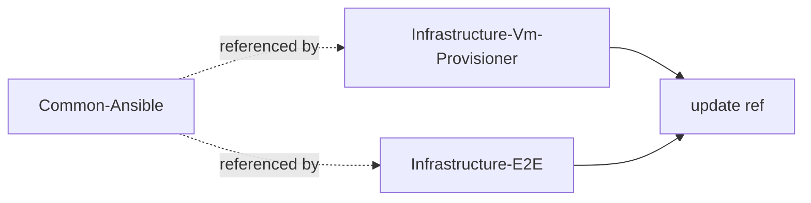

## Section 2 - Decouple the dispatch bridge

Make `ops/_run-playbook.sh` consumer-agnostic before any consumer code
moves out. See
[The bridge coupling to break](problem.md#the-bridge-coupling-to-break).

### Step 2.1 - Define the consumer contract

Specify how a wrapper declares its needs to the bridge: the inventory
vault to read, the extra vaults to read on top of it, plus any toggles
(host file server, token requirement). Encode as an explicit env contract
(`CA_INVENTORY_VAULT`, `CA_EXTRA_VAULTS`, `CA_NEEDS_HOST_FILE_SERVER`,
`CA_REQUIRES_TOKEN`). `CA_INVENTORY_VAULT` is required (the bridge always
needs an inventory and must name no vault itself); the rest default to
"none".

- **Reason:** A named contract is the seam that lets the substrate serve
  unknown future consumers without importing their identities - including
  the identity of whichever vault holds the fleet inventory.
- **Tests:** bats unit tests asserting the bridge parses each contract
  variable, applies the documented defaults when unset, rejects a missing
  required inventory vault, and errors on an inconsistent combination
  (token required but absent).
- **README:** None operator-facing yet - the contract parser is an
  internal bridge helper; its documentation lands with the
  bridge-contract rewrite in 2.2.

### Step 2.2 - Refactor the bridge to honor the contract

Replace the hardcoded `VmProvisioner` / `VmUsers` / `GitHubRunners` reads
and the `NEEDS_GITHUB_RUNNERS` / `GH_TOKEN` / `NEEDS_HOST_FILE_SERVER`
logic with the contract from 2.1. The bridge always reads one inventory
vault, but takes its name from `CA_INVENTORY_VAULT` rather than naming it;
extra vaults flow through as generic `--vault-config Name=path` pairs the
extra-vars composer dispatches by name.

Group the helpers that still know the fleet's shape under an
`ops/virtual-machines/` module: the inventory builder, the inventory
extra-vars fragment, the reachability probe, and the host file server
move there, and the Hyper-V/ICS/netsh-portproxy router resolution is
lifted out of `_run-playbook.sh` into a sourced `_resolve-router.sh` in
that module. The orchestrator sources the resolver instead of inlining
it, so it carries no topology knowledge itself.

- **Reason:** Removes the substrate's knowledge of any specific
  consumer's or provider's vault names - the dependency-inversion fix
  that earns the `Common-` prefix. Concentrating the remaining
  fleet-shape coupling (the `vm_provisioner_config` schema, the
  `<Name>Config-<suffix>` secret convention, the Hyper-V router
  topology) in `ops/virtual-machines/` makes it a visible, contained
  seam rather than scattering it through the otherwise generic bridge -
  the on-ramp for a later move to a fully fleet-agnostic substrate.
- **Tests:** bats over the bridge with simulated contracts; the existing
  create-users and register-runners flows still dispatch correctly via
  their updated wrappers (Step 2.3) under integration tests. The
  per-script bats (inventory, router reachability, staging, inventory
  extra-vars) and the host-file-server Pester suite stay green from
  their new `ops/virtual-machines/` location.
- **README:** Rewrite the "Bridge contract" section onto the `CA_*`
  contract and document the `ops/virtual-machines/` module grouping
  (inventory builder, router resolver, host file server). The
  operator-flow sections stay on the old wording until 2.3.

### Step 2.3 - Port the existing wrappers onto the contract

Update `create-users.sh` and `register-runners.sh` (and the remove/status
wrappers) to declare their needs via the contract
(`CA_INVENTORY_VAULT=VmProvisioner`, `CA_EXTRA_VAULTS`,
`CA_REQUIRES_TOKEN`, `CA_NEEDS_HOST_FILE_SERVER`) instead of the removed
bridge internals (`NEEDS_GITHUB_RUNNERS` / `NEEDS_HOST_FILE_SERVER`).
Step 2.2 left the bridge contract-driven, so until this step the wrappers
still export the dropped variables and the live flows do not dispatch -
this step closes that gap. Also rewrite the operator-flow README sections
(the create / register / deregister / status write-ups that still name
`NEEDS_GITHUB_RUNNERS` as "the bridge's vault-read gate") onto the `CA_*`
contract; 2.2 deliberately left them, since documenting the contract
before the wrappers used it would describe state that did not exist.

- **Reason:** Keeps both shipping flows working on the decoupled bridge,
  proving the contract before any code leaves the repo.
- **Tests:** Integration - create/remove users and register/deregister
  runners still run end to end (molecule + playbook tests unchanged).
- **README:** Rewrite the create / remove / register / deregister
  operator-flow sections and the setup-runners-secrets note onto the
  `CA_*` contract.

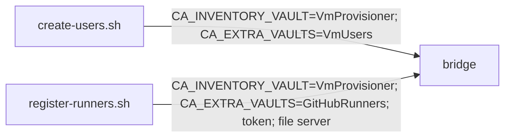

## Section 3 - Extract user provisioning to Infrastructure-Vm-Users

Move bucket B (see
[Common-Ansible partitioning](problem.md#common-ansible-partitioning)) to
its owner, consuming Common-Ansible for the substrate.

### Step 3.1 - Establish the Common-Ansible consumption mechanism

Wire how a consumer pulls Common-Ansible's reusable roles and ops: a
single **sibling checkout**. The roles are not standalone - they read the
dispatch bridge's extra-vars and inventory contract (`vm_users_config`,
`host_file_server_base_url`, the `vm_users_entry` fact, etc.) - so roles
and bridge are one substrate, consumed together from one resolved root
(resolver mirrors `ops/imports/_common-automation-root.sh`, overridable
via `COMMON_ANSIBLE_ROOT`). The consumer adds `<root>/roles` to
`ANSIBLE_ROLES_PATH` and references substrate roles by short name; the
controller venv and ops bridge are reused in place. This covers a
consumer's use of the *reusable substrate* roles. A consumer that owns
roles and a playbook of its own (Sections 3-4) additionally needs the
bridge to run *its* playbook with *its* roles and extra-vars fragment;
that consumer-root resolution is specified in
[Step 3.5](#step-35---resolve-a-consumers-own-playbook-roles-and-extra-vars-fragment-in-the-bridge).
A published Galaxy
collection was rejected because it could carry only the roles (the bridge
cannot ship in one - the controller bootstrap that builds the venv that
runs `ansible-galaxy` is itself part of the bridge), and roles have no
value without the bridge.

- **Reason:** Every consumer repo (Sections 3, 4, and the toolchain flow)
  needs one agreed reuse path; deciding it once here avoids per-repo
  drift. One mechanism for the indivisible roles-plus-bridge substrate
  beats splitting it across two transports.
- **Tests:** A clean controller bootstrap in Infrastructure-Vm-Users
  resolves the substrate sibling and reuses its controller; a smoke
  playbook that includes a substrate role by short name passes
  `ansible-playbook --syntax-check` with the sibling's `roles/` on
  `ANSIBLE_ROLES_PATH`.
- **README:** Document the sibling-checkout consumption path and bootstrap
  in Infrastructure-Vm-Users' README; describe the roles-plus-bridge
  "consume the substrate" model (and why not a Galaxy collection) in this
  repo's README.

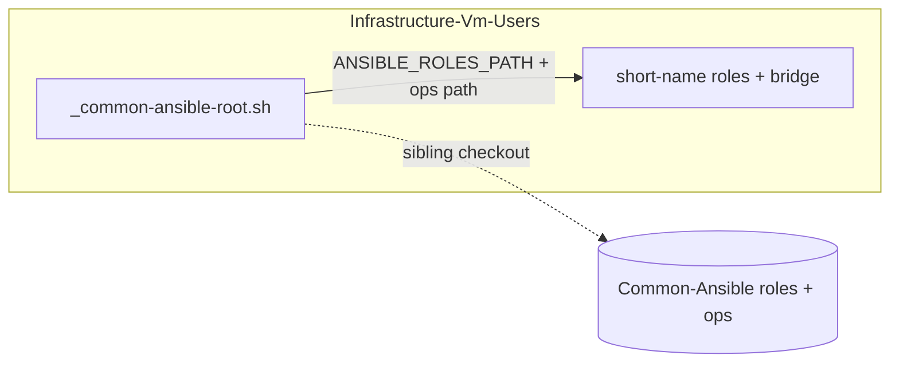

### Step 3.2 - Move the user roles, playbooks, and wrappers into Vm-Users

Relocate `vm_users_entry`, `groups`, `sudoers`, `users` (with molecule),
`create-users.yml`, `remove-users.yml`,
`playbooks/tasks/_ensure-acl-present.yml`, the user wrappers, and
`_build-extra-vars-users.sh`. They consume the substrate via 3.1. The
copies remain in Common-Ansible as a fork until Step 3.6.

- **Reason:** Puts the user domain with its owner while leaving
  Common-Ansible runnable, satisfying the keep-a-fork constraint.
- **Tests:** molecule per moved role in Vm-Users; create/remove-users
  integration against a disposable target.
- **README:** Infrastructure-Vm-Users' README gains the moved user
  roles/playbooks; this repo's README still documents the retained fork
  (removed in 3.6).

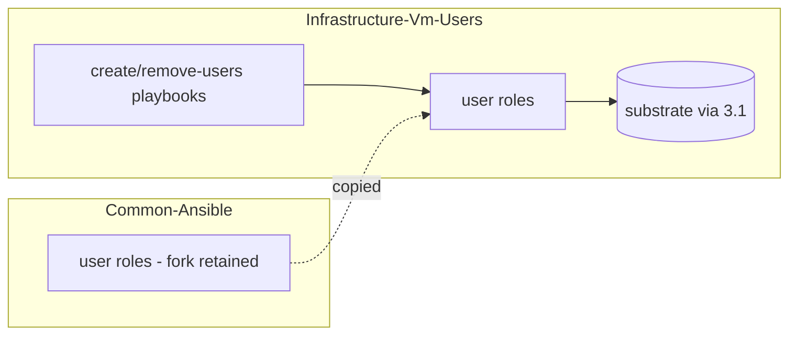

### Step 3.3 - Wire Vm-Users CI and README

Add the reusable lint/test CI to Vm-Users and document the create/remove
flows in its README index.

- **Reason:** The owner repo must enforce the same bar and carry its own
  operator docs.
- **Tests:** Vm-Users CI green (yamllint, shellcheck, molecule).
- **README:** Infrastructure-Vm-Users' README index documents the
  create/remove operator flows and the CI bar this step wires.

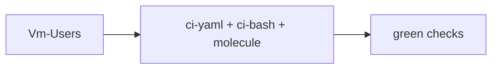

### Step 3.4 - Re-point the E2E users-ansible flow at Vm-Users

Update Infrastructure-E2E so the `ansible` users flow resolves
`create-users.sh` / `remove-users.sh` under `$UsersPath`
(Infrastructure-Vm-Users) instead of the shared `$AnsiblePath` ->
Common-Ansible. Split the "one checkout serves both domains" assumption:
the users-ansible flow now resolves within its owner repo, while the
runners-ansible flow keeps using the Common-Ansible checkout until
Section 4. Prove green before the fork is deleted in 3.6.

- **Reason:** Step 3.6 deletes Common-Ansible's user ops, so E2E must
  already dispatch to the owner repo or the ansible users flow breaks.
  Folding the path into `$UsersPath` also retires the "Ansible is a
  separate third repo" framing now that both user implementations live
  in Vm-Users.
- **Tests:** E2E users layer green on a disposable VM with
  `UsersFlow=ansible` resolving to Vm-Users ops; `custom-powershell`
  unchanged; the runners-ansible flow still resolves to Common-Ansible.
- **README:** Infrastructure-E2E's README/docs describe the
  users-ansible flow resolving under `$UsersPath`, retiring the
  "Ansible is a separate third repo" framing for the user domain.

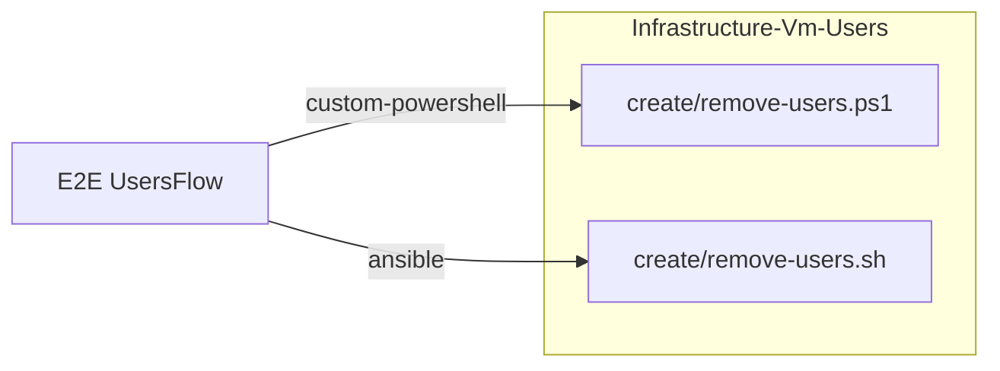

### Step 3.5 - Resolve a consumer's own playbook, roles, and extra-vars fragment in the bridge

Teach the bridge to run a *consumer's* playbook with the *consumer's*
roles and per-domain extra-vars fragment, not only its own. Add
`CA_CONSUMER_ROOT` to the consumer contract (Step 2.1): when set,
`_run-playbook.sh` resolves the playbook path relative to that root,
`_ansible-env.sh` prepends `<consumer-root>/roles` to
`ANSIBLE_ROLES_PATH` (the substrate `roles/` stays on the path so reusable
short-name roles still resolve), and `_build-extra-vars.sh` resolves the
declared vault's `_build-extra-vars-<domain>.sh` fragment from
`<consumer-root>/ops` rather than its own directory. Unset reproduces
today's substrate-root behaviour, so the retained runner fork keeps
dispatching unchanged. Under a Git Bash launch the root is a Windows path,
so it is translated to the `/mnt/...` form and added to `WSLENV` alongside
the other forwarded `CA_*` variables before the WSL re-exec.

Then switch the Vm-Users wrappers onto it: `create-users.sh` /
`remove-users.sh` export `CA_CONSUMER_ROOT` (the Vm-Users repo root) and
pass their own `playbooks/create-users.yml` / `remove-users.yml`, and the
bootstrap's roles-resolution note points at the Vm-Users `roles/`.
Vm-Users then runs its own copy with the substrate fork still present but
unused.

- **Reason:** Without this the bridge assumes every playbook, role, and
  fragment lives under its own root, so a consumer's moved copies are dead
  and the substrate fork is the live one. Resolving consumer-owned
  artifacts from a consumer root is the location half of consumer-
  agnosticism (the vault-name half is Steps 2.1-2.2) and the precondition
  that makes the Step 3.6 deletion safe instead of breaking the live flow.
- **Tests:** bats over the bridge - `CA_CONSUMER_ROOT` set resolves the
  playbook from the consumer root, orders the consumer `roles/` ahead of
  the substrate on `ANSIBLE_ROLES_PATH`, and dispatches the fragment from
  the consumer `ops/`; unset preserves substrate-root resolution (the
  runner fork still dispatches). Vm-Users integration - create/remove-users
  green resolving Vm-Users' own playbook and roles with the substrate fork
  still in place (assert the executed role/playbook path is under the
  Vm-Users root, e.g. via `ansible-playbook --list-tasks` / a `-vv` role
  path).
- **README:** Common-Ansible README "Bridge contract" / "Consume the
  substrate" documents `CA_CONSUMER_ROOT` (consumer-owned playbook, roles,
  and fragment resolution; default substrate-root behaviour). Vm-Users
  README "Consuming Common-Ansible" updates the roles-resolution
  description to the Vm-Users `roles/` directory.

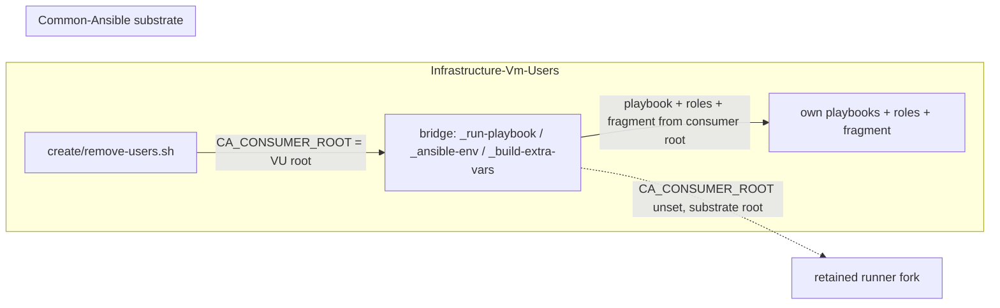

### Step 3.6 - Remove the user fork from Common-Ansible

With Vm-Users running its own copy (Step 3.5), delete the user
roles/playbooks/wrappers from Common-Ansible - the `groups`, `sudoers`,
`users`, `vm_users_entry` roles and their molecule scenarios, the
`create-users.yml` / `remove-users.yml` playbooks, the
`create-users.*` / `remove-users.*` wrappers, the substrate
`_build-extra-vars-users.sh` fragment and its `VmUsers` arm in
`_build-extra-vars.sh` - and drop the `VmUsers` references from its docs.
`playbooks/tasks/_ensure-acl-present.yml` stays: the retained runner
playbooks still include it, so it leaves with the runner fork in Step 4.4.

- **Reason:** A fork kept past proof becomes a second source of truth.
- **Tests:** Common-Ansible CI green with no user domain present (the
  retained runner fork still dispatches); grep confirms no
  `VmUsers`-specific code remains.
- **README:** Remove the create/remove-users operator-flow sections and
  every `VmUsers` reference from this repo's README and index.

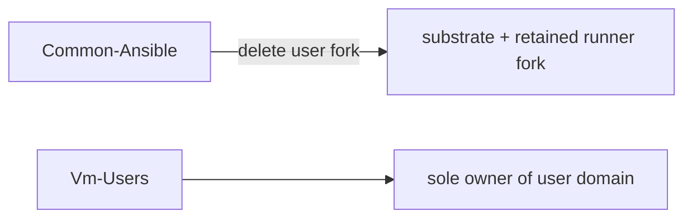

## Section 4 - Extract runner provisioning to Infrastructure-GitHubRunners

Mirror of Section 3 for bucket C.

### Step 4.1 - Move runner roles, playbooks, and wrappers into GitHubRunners

Relocate `runner_entry_resolve`, `runner_binary`, `runner_registration`,
`runner_service` (with molecule), the register/deregister/status
playbooks and their task includes, the runner wrappers,
`_require-gh-token.sh`, `_build-extra-vars-runners.sh`,
`_ensure-runner-tarball.ps1`, and `_resolve-runner-version.ps1`. They
consume the substrate (3.1) and declare `GitHubRunners` + token +
host-file-server via the contract (2.1). The runner wrappers also export
`CA_CONSUMER_ROOT` (the GitHubRunners repo root) and pass their own
playbooks, so the bridge runs the runner roles and the runner extra-vars
fragment from the GitHubRunners root via the mechanism added in Step 3.5 -
no new bridge work here, only the consumer-side adoption. Fork retained in
Common-Ansible until 4.4.

The runner config secret is **not** relocated as an Ansible wrapper. Both
the Ansible flow and GitHubRunners' existing PowerShell flow read the same
`GitHubRunnersConfig-<suffix>` secret from one local SecretStore vault,
written by the PowerShell-impl `hyper-v/ubuntu/setup-secrets.ps1`. The
Common-Ansible fork's `setup-runners-secrets.*` only existed to reach that
writer across repos; co-located in GitHubRunners it would be a redundant
pass-through, so the Ansible flow points operators at the shared writer
directly and no Ansible secrets entry point is added.

Because both impls now coexist in GitHubRunners (and in Infrastructure-Vm-
Users), the tests are split by impl to mirror the production directory
layout: the PowerShell tests live under `Tests/hyper-v/`, the Ansible tests
under `Tests/{ops,molecule,ansible}`. The shared secret store is set up by
the PowerShell-impl writer and read by both.

Decouple the host file server from the runner-tarball resolvers as part
of this move. `ops/virtual-machines/_stage-host-fileserver.sh` stays
substrate but currently calls `../_resolve-runner-version.ps1` and
`../_ensure-runner-tarball.ps1` - the two `.ps1` relocating to
GitHubRunners above. Once they leave, those `../` references dangle, so
the staging helper must stop hardcoding runner-tarball resolution:
parameterize it so the consumer supplies the version and the staged
artifact (the file server itself serves any file; only the "which
runner tarball" knowledge is runner-domain). This coupling pre-dates the
`ops/virtual-machines/` grouping (2.2) - the grouping only made the seam
a concrete cross-`../` one - but it is resolved here, where the
resolvers actually move out.

- **Reason:** Runner domain to its owner; the host file server itself
  stays substrate and is reached through the contract - which requires
  severing its build-time dependency on the runner-tarball resolvers.
- **Tests:** molecule per moved role; register/deregister integration
  against a disposable runner target with a scoped token.
- **README:** Infrastructure-GitHubRunners' README gains the moved
  runner roles/playbooks and documents how the flow reaches the
  substrate host file server through the `CA_*` contract; this repo's
  README still documents the retained fork (removed in 4.4).

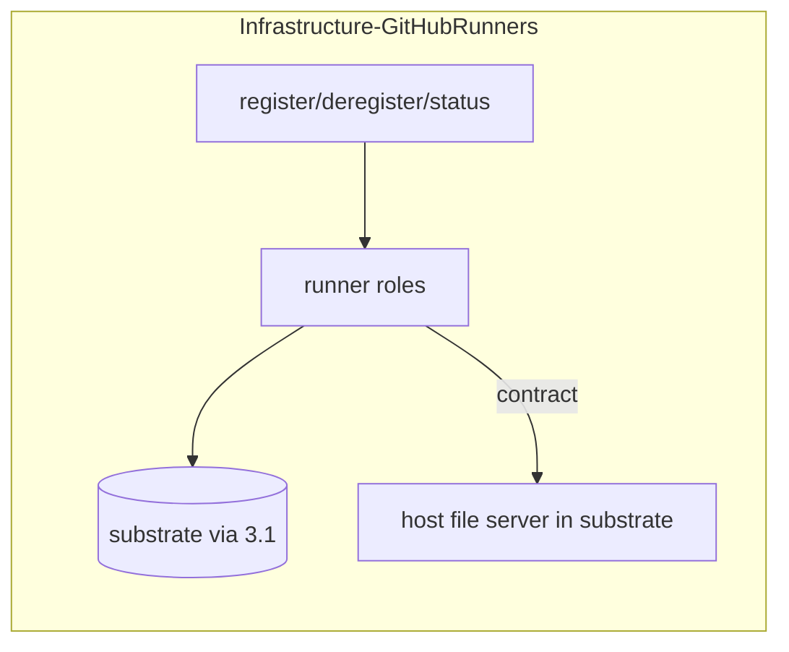

### Step 4.2 - Wire GitHubRunners CI and README

- **Reason:** Same bar and operator docs as the user owner.
- **Tests:** GitHubRunners CI green.
- **README:** Infrastructure-GitHubRunners' README index documents the
  register/deregister/status operator flows and the CI bar.

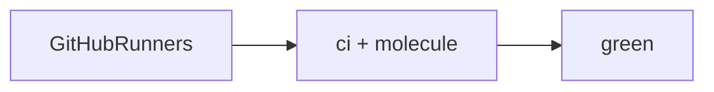

### Step 4.3 - Re-point the E2E runners-ansible flow at GitHubRunners

Update Infrastructure-E2E so the `ansible` runners flow resolves
`register-runners.sh` (and the status / deregister wrappers) under
`$RunnersPath` (Infrastructure-GitHubRunners) instead of `$AnsiblePath`
-> Common-Ansible. With Section 3 already off the shared path, this
removes the last E2E dependency on a Common-Ansible checkout, so
`$AnsiblePath` / `$WslDistro`-as-a-third-repo can be retired. Prove
green before the fork is deleted in 4.4.

- **Reason:** Step 4.4 deletes Common-Ansible's runner ops, so E2E must
  already dispatch to GitHubRunners or the ansible runners flow breaks.
  Completes the collapse of `$AnsiblePath` into the per-domain owner
  paths.
- **Tests:** E2E runner-lifecycle layer green on a disposable runner
  target with `RunnersFlow=ansible` resolving to GitHubRunners ops;
  `custom-powershell` unchanged; no E2E reference to Common-Ansible ops
  remains.
- **README:** Infrastructure-E2E's README/docs describe the
  runners-ansible flow resolving under `$RunnersPath` and the collapse
  of `$AnsiblePath` into the per-domain owner paths; no Common-Ansible
  reference remains.

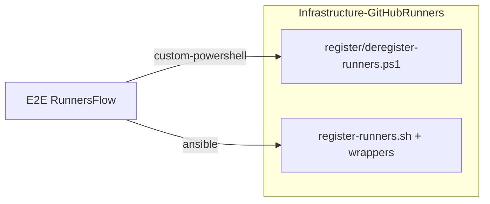

### Step 4.4 - Remove the runner fork from Common-Ansible

With GitHubRunners running its own copy (the Step 3.5 mechanism, adopted
in 4.1), delete the runner roles/playbooks/wrappers, the runner
extra-vars fragment and its `GitHubRunners` arm in `_build-extra-vars.sh`,
and `playbooks/tasks/_ensure-acl-present.yml` (retained in Step 3.6 only
because the runner playbooks still included it - it now leaves with them).

- **Reason:** Single source of truth once the owner is proven.
- **Tests:** Common-Ansible CI green as pure substrate; no runner code or
  `GitHubRunners` references remain.
- **README:** Remove the runner operator-flow sections and every
  `GitHubRunners` reference from this repo's README, leaving substrate +
  toolchains documented.


## Section 5 - Migrate existing toolchains to Ansible

Bucket D, section-1 tools. Port the PowerShell reconciler's JDK and .NET
behavior to reusable roles in Common-Ansible. The PowerShell reconciler is
kept as a fork in Infrastructure-Vm-Provisioner until the cutover
criterion in 5.6.

### Step 5.1 - Author the host-push toolchain role pattern

Build the shared mechanics one role models: pull a host-staged tarball
via the substrate file server, unarchive to a versioned install dir,
manage `/usr/local/bin` symlinks and `/etc/profile.d/<tool>.sh`, record
installed versions as a fact, and remove versions no longer desired (the
one capability Ansible does not give for free, per
[Solution approach](problem.md#solution-approach)).

- **Reason:** Establishes the section-1 pattern so JDK/.NET roles differ
  only in their resolve/version logic.
- **Tests:** molecule covering install, idempotent re-run, version swap
  (old symlinks/profile removed), and uninstall-removed-versions.
- **README:** Document the host-push toolchain role pattern in this
  repo's README (and/or a role README under `roles/`) so the JDK/.NET
  roles can reference it.

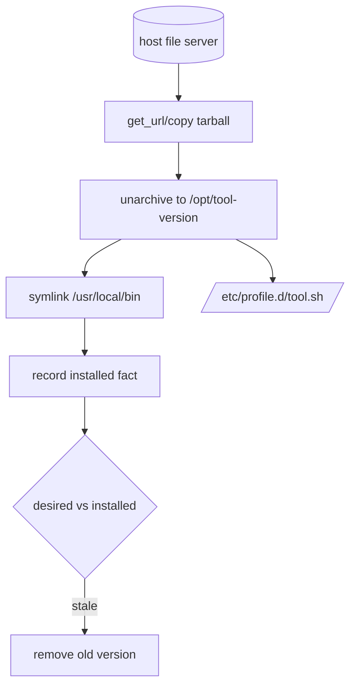

### Step 5.2 - jdk role

Port `JdkProvider` (Adoptium resolve + install/uninstall) onto 5.1.

- **Reason:** First real consumer of the section-1 pattern; proves parity
  with the reconciler.
- **Tests:** molecule - install a pinned JDK, swap versions, uninstall.
- **README:** `jdk` role README (purpose, variables, the Adoptium
  resolve/install behaviour it adds on the 5.1 pattern).


### Step 5.3 - dotnet_sdk role

- **Reason:** Second section-1 toolchain; parity with the SDK provider.
- **Tests:** molecule - install, version swap, uninstall.
- **README:** `dotnet_sdk` role README (resolve/install behaviour on the
  5.1 pattern).


### Step 5.4 - dotnet_tools role (nested under SDK)

Port the nested global-tools behavior; tools live under the SDK and are
torn down before the SDK on removal.

- **Reason:** Preserves the parent/child teardown ordering the reconciler
  guarantees.
- **Tests:** molecule - install a tool, remove the SDK, assert the tool is
  removed first.
- **README:** `dotnet_tools` role README, noting the parent/child
  teardown ordering (tools removed before the SDK).

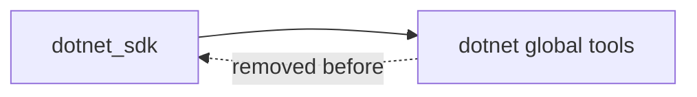

### Step 5.5 - Toolchain targeting flow in a consumer repo

Create the playbook + inventory wiring that targets production VMs with
the toolchain roles. This lives in a consumer (Infrastructure-Vm-Provisioner
or the runner owner), never in Common-Ansible, to keep the substrate
naming honest (see
[Why Common-, not Infrastructure-](problem.md#why-common--not-infrastructure)).

- **Reason:** Separates "reusable roles" (substrate) from "who gets what
  on which box" (a deploying consumer).
- **Tests:** Integration - run the flow against a disposable VM and assert
  the toolchain is present and on PATH.
- **README:** Document the toolchain targeting flow (playbook +
  inventory) in the consumer repo's README; this repo's README only
  references the reusable roles it consumes.

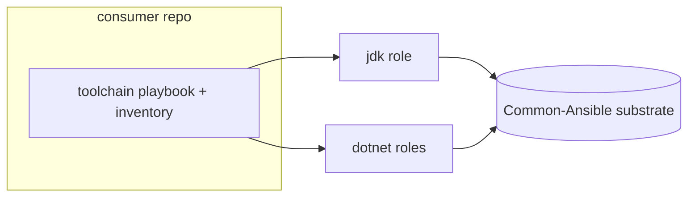

### Step 5.6 - Define the cutover criterion; keep the PS reconciler as a fork

Record the explicit condition under which the PowerShell reconciler is
retired (a later feature): the Ansible toolchain flow proven on a
production runner with parity on install/swap/uninstall.

- **Reason:** Two engines coexist transiently; the retirement trigger must
  be written, not implied.
- **Tests:** Documentation only; no code change. The reconciler stays
  active and tested in its repo.
- **README:** Record the cutover criterion in this feature's docs
  (problem.md/README); the reconciler's retirement is a later feature,
  so its repo README is unchanged here.

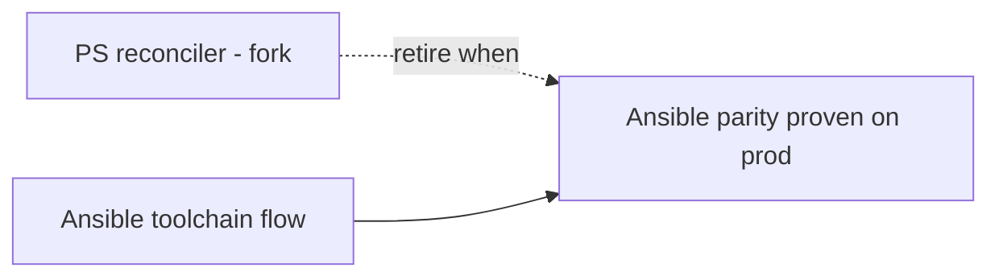

## Section 6 - shellcheck role

Bucket D, section-2 (VM-downloaded).

### Step 6.1 - toolchain_apt role with a shellcheck-pinned use

Author a small section-2 role that installs a pinned apt (or `get_url`
static binary) package on the VM, and use it for shellcheck (apt
candidate `0.9.0-1` on the target's Ubuntu 24.04).

- **Reason:** Unblocks the original failure (`ci-bash` shellcheck step) in
  a durable, re-provision-safe way.
- **Tests:** molecule - shellcheck absent then present and on PATH;
  idempotent re-run.
- **README:** `toolchain_apt` role README (the section-2 pattern and the
  shellcheck-pinned use it ships with).


## Section 7 - bats role

### Step 7.1 - bats via the section-2 role

Install bats-core on the VM through the section-2 role (apt or upstream
tarball + install.sh).

- **Reason:** Makes the `ci-bash` test step self-sufficient on the runner
  rather than depending on the action's runtime install.
- **Tests:** molecule - bats absent then present and on PATH; a trivial
  `.bats` file runs.
- **README:** Document the bats install via the section-2 role (the
  `toolchain_apt` role README's use list, or a short note where the
  section-2 roles are described).


## Section 8 - docker role

Bucket D, section-3 (daemon).

### Step 8.1 - docker role: repo, engine, service, group

Install Docker from the official apt repo, enable the service, and add the
runner service user to the `docker` group.

- **Reason:** `ci-yaml` linters run in containers and `ci-dotnet`
  integration tests need a daemon; the group membership lets the runner
  user reach the socket without sudo.
- **Tests:** molecule - daemon reachable (`docker ps`), the target user is
  in the `docker` group, idempotent re-run. Note the docker-in-docker
  caveat for the molecule driver in the scenario.
- **README:** `docker` role README (repo/engine/service/group steps and
  the docker-in-docker molecule caveat).

```mermaid
flowchart TD
  REPO[official apt repo] --> ENG[docker engine]
  ENG --> SVC[enable+start service]
  SVC --> GRP[add runner user to docker group]
  GRP --> OK[docker ps as runner user]
```

## Section 9 - Config schema, wire the runner VM, verify green

### Step 9.1 - Add the three-section taxonomy to the VM config

Extend the per-VM config (the `VmProvisionerConfig-<suffix>` secret) with
a `toolchains` block carrying the three sections from
[the taxonomy](problem.md#the-three-section-tooling-taxonomy); the Ansible
extra-vars builder surfaces it to the toolchain roles, which validate
their own slice. Keep the config in the existing secret (one per-VM SSOT);
PS validation ignores the new block.

- **Reason:** Declarative desired-state for which tools land on which VM,
  read by the Ansible flow.
- **Tests:** Schema/validation unit tests for the new block; a malformed
  section fails with a clear message.
- **README:** Document the three-section `toolchains` config block (its
  shape and per-section validation) where the per-VM config schema is
  described.

```mermaid
classDiagram
  class VmConfig {
    +identity/network fields
    +toolchains.hostPushed[]
    +toolchains.vmDownloaded[]
    +toolchains.baseImage[]
  }
  VmConfig --> ExtraVars : built by bridge
  ExtraVars --> Roles : per-section dispatch
```

### Step 9.2 - Declare shellcheck, bats, docker on ubuntu-02-ci and re-provision

Add the three tools to the `ubuntu-02-ci` definition in the
`VmProvisionerConfig-Production` secret and run the toolchain flow against
it.

- **Reason:** Applies the work to the actual red runner.
- **Tests:** Post-run probe on the VM: shellcheck/bats/docker present, on
  PATH, daemon reachable, runner user in docker group.
- **README:** Note the `ubuntu-02-ci` toolchain declaration in the
  consumer repo's README/config docs that own the production VM
  definitions.

```mermaid
flowchart LR
  SEC[(VmProvisionerConfig-Production)] -->|ubuntu-02-ci toolchains| FLOW[toolchain flow 5.5]
  FLOW --> VM[ubuntu-02-ci]
```

### Step 9.3 - Re-run the gates and confirm green

Re-trigger `ci-bash`, `ci-yaml`, and `ci-dotnet` on the SynergyOps.TaskManager
PR and confirm all pass on the self-hosted runner.

- **Reason:** Closes the loop on the originating failure.
- **Tests:** The three checks pass on the PR; record the run links in the
  feature README.
- **README:** Record the green `ci-bash` / `ci-yaml` / `ci-dotnet` run
  links in this feature's README, closing the loop on the originating
  failure.

```mermaid
flowchart LR
  VM[ubuntu-02-ci ready] --> CB[ci-bash green]
  VM --> CY[ci-yaml green]
  VM --> CD[ci-dotnet green]
```

## Section 10 - Ordered cross-repo merge

The closing step. Up to here each repo's branch carries its own step
commits; this is where every repo's PR is finalized and merged in
dependency order. Scoped checkout consumes the substrate from a
Common-Ansible sibling on `master`, so there is no artifact to publish -
the ordering is what matters.

### Step 10.1 - Finalize and merge each repo PR in dependency order

Merge Common-Ansible first so the substrate (roles + bridge) is on
`master`, then the consumers - Infrastructure-Vm-Users,
Infrastructure-GitHubRunners, the toolchain consumer, and
Infrastructure-E2E - each of which resolves the substrate from a
Common-Ansible sibling checked out to `master`.

- **Reason:** Consumers consume Common-Ansible as a sibling checkout of
  `master` (no published artifact), so substrate changes must land on
  `master` before a consumer relies on them - otherwise a consumer's
  ansible-lint / flows cannot resolve the substrate roles and bridge.
  Ordered merge is the sequencing the cross-repo dependency forces.
- **Tests:** Each repo's CI is green post-merge; with Common-Ansible on
  `master`, every consumer's ci-yaml ansible-lint resolves the substrate
  roles from the sibling checkout (the consumer CI checks out
  Common-Ansible alongside and puts its `roles/` on `ANSIBLE_ROLES_PATH`,
  wired in each consumer's CI step).
- **README:** Record the final ordered-merge run links in this feature's
  README. There is no release/publish doc - scoped checkout has no
  published artifact.

```mermaid
flowchart LR
  CA[Common-Ansible PR] -->|merge to master| M[(substrate on master)]
  M --> VU[Vm-Users PR]
  M --> GR[GitHubRunners PR]
  VU --> CONS[toolchain + E2E PRs]
  GR --> CONS
```
